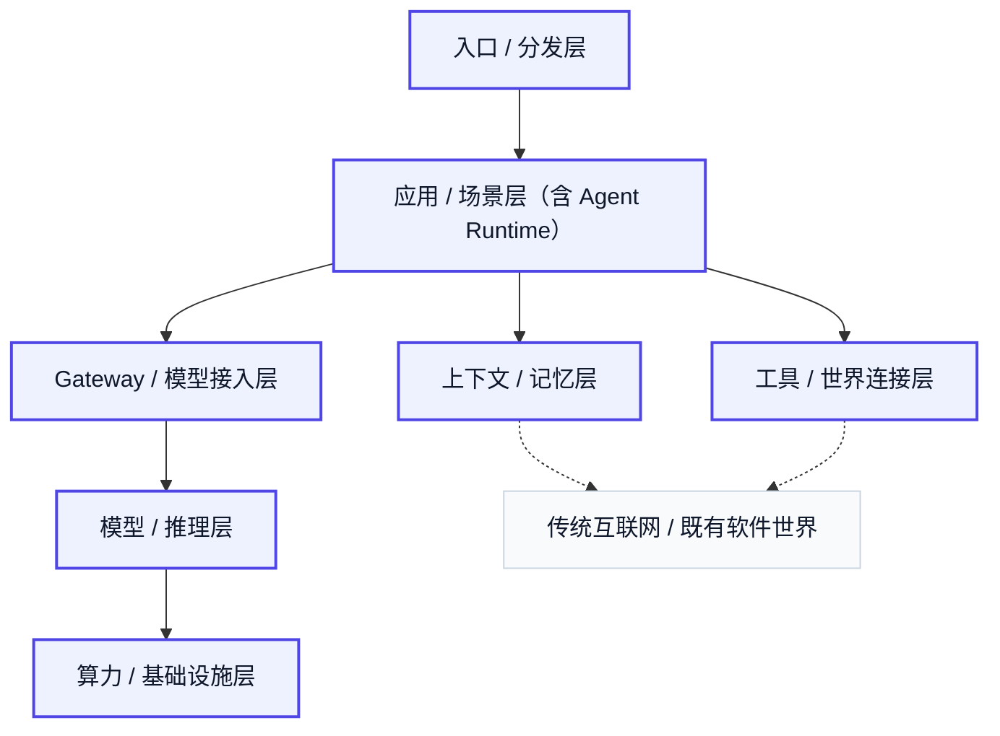

# 0. 开场问题 / 总体主线

过去两年，AI 最明显的变化，并不只是模型参数继续增大，或者排行榜继续刷新，而是产品形态发生了实质转移。自 2022 年底 ChatGPT 进入大众视野以来，公众最先熟悉的是聊天式 AI：提问、回答、总结、润色、翻译。到了 2025 到 2026 年，越来越多主流产品开始把 AI 放进更长的任务链条中：编码、调研、浏览器操作、会议记录、个人记忆、企业流程。这意味着一个更深的变化已经发生：AI 正在从“生成一个回复”走向“推进一件事情”。

因此，今天真正值得追问的问题，不是“哪个模型更强”，也不是“哪个新名词更热”，而是：**当 AI 开始进入任务、系统与组织之后，它会长出怎样的商业世界？**

这场分享的核心观点有三条。

第一，Agent 不是一个神秘的新物种。它更准确的定义，是把大模型从一次性回答系统，组织成一个可以持续推进任务的系统。这里增加的，不只是少量智能，而是大量系统负担：上下文要管理，工具要接入，状态要保存，执行要回退，结果要交付。也正因为如此，Agent 真正有价值的地方，往往不在提示词本身，而在它如何被组织进真实软件系统。

第二，Agent 不会只停留在模型层。一个能落地的 Agent，至少会向下牵动多层结构：它需要上下文与记忆，来决定每一步看见什么；需要工具与世界连接，来决定它能碰到什么系统；需要模型接入与推理层，来决定它调用什么能力、承担什么成本；需要更底层的算力与基础设施，来决定这一切能否以可接受的价格、速度和稳定性被持续供给。换句话说，Agent 不是单点技术，而是一条正在形成的价值链。

第三，商业世界最重要的变化，往往先出现在产品表面，再向下传导到系统和基础设施。今天用户最先看见的，不是协议、框架或机房，而是 Cursor、Codex、Deep Research、会议记录、智能眼镜、个人代理这类具体产品形态。但这些产品一旦成立，就会反过来拉动底下的运行时、记忆层、工具层、网关层、推理层和算力层。Agent 商业世界并不是先有一张完美技术栈图，再长出应用；它更像是上层需求和下层能力相互牵引、共同重组的结果。

所以，今天这场分享不会把 Agent 理解成一个孤立名词，而会把它放回一条更完整的链条里去看：**从模型原理出发，理解它为什么能工作；再从任务、系统、产品与基础设施出发，理解它为什么会长成今天这个样子。**

如果把整场分享压缩成一句总主线，那就是：**Agent 真正值得关注的，不是它又多了多少新词，而是它正在把大模型、软件系统、行业流程和商业需求重新接起来。**

## 本章事实核查引用

- ChatGPT 公开发布于 `2022-11-30`，用于支撑“自 2022 年底 ChatGPT 进入大众视野”的时间线：OpenAI, [Introducing ChatGPT](https://openai.com/index/chatgpt/).
- Codex 正在从 coding agent 扩展到更贴身的工作代理，`2026-04-16` OpenAI 宣布 Codex 支持 computer use、memory preview、跨应用工具和自动继续任务：OpenAI, [Codex for (almost) everything](https://openai.com/index/codex-for-almost-everything/).
- Deep Research 作为调研型 Agent 产品形态的例子：OpenAI, [Introducing deep research](https://openai.com/index/introducing-deep-research/); Perplexity, [Deep Research](https://www.perplexity.ai/hub/blog/introducing-perplexity-deep-research); Google, [Gemini Deep Research](https://blog.google/products/gemini/google-gemini-deep-research/).
- `MCP`、`A2A` 等协议层变化用于支撑“产品表面向下牵动系统和基础设施”的产业链判断：Anthropic, [Model Context Protocol](https://www.anthropic.com/news/model-context-protocol); Google Developers Blog, [Agent2Agent protocol](https://developers.googleblog.com/en/a2a-a-new-era-of-agent-interoperability/).

---

## 图片生成 Prompts

先继承这份全局风格控制文档中的所有要求：  
[agent_business_world_slide_image_style.md](/Users/timzhong/msc202604/agent_business_world_slide_image_style.md)

### 图 0.1 开场转变

在此基础上，为这一部分生成一张横版 slide like image，风格优先做成 **high-fidelity product UI comparison**。主题是：**AI 从聊天走向行动**。画面做成 split-screen：左侧是一个简洁的聊天式 AI 界面，只有消息气泡、输入框、单轮问答结构；右侧是一个任务推进式 AI 工作台，有任务列表、状态栏、工具调用记录、文件区、结果区。中间用清晰的演化箭头或结构过渡连接两边。整体像真实产品截图，而不是抽象海报；文字要少而准，适合叠加 PPT 标题。

### 图 0.2 Agent 不是单点技术

在此基础上，为这一部分生成一张横版 slide like image，风格优先做成 **clean enterprise systems canvas**。主题是：**Agent 是一条正在形成的价值链**。画面像一个现代软件白板或战略系统面板：最上层是 product entry / apps，中层是 memory / tools / gateway / task system，底层是 model / inference / compute。每层用清晰模块卡片表示，层与层之间有明显连接线。整体像高级产品战略图嵌入在软件界面里，而不是纯信息图。

### 图 0.3 商业世界的生长方式

在此基础上，为这一部分生成一张横版 slide like image，风格优先做成 **product landscape dashboard**。主题是：**商业世界先在产品表面出现，再向下牵动系统与基础设施**。上半部分像一个产品矩阵页，展示 coding agent、research agent、meeting agent、wearable AI 这类产品卡片；下半部分是它们所牵动的 system dependencies map。重点表现“上层需求向下传导、下层能力向上支撑”的双向牵引。画面要像真实产品战略 dashboard，可以有卡片、标签、轻量表格和连接图。

### 图 0.4 全场总主线

在此基础上，为这一部分生成一张横版 slide like image，风格优先做成 **high-end strategy interface**。主题是：**大模型、软件系统、行业流程和商业需求重新接起来**。画面像一个大型数字战略地图页面，四个区域分别代表 models、software systems、industry workflows、commercial demand，中间由清晰的流线和模块重组关系连接。整体像真实高端咨询式产品地图，允许少量简短英文标签，但不要塞长文案，重点是“重连”和“重组”的视觉结构。
