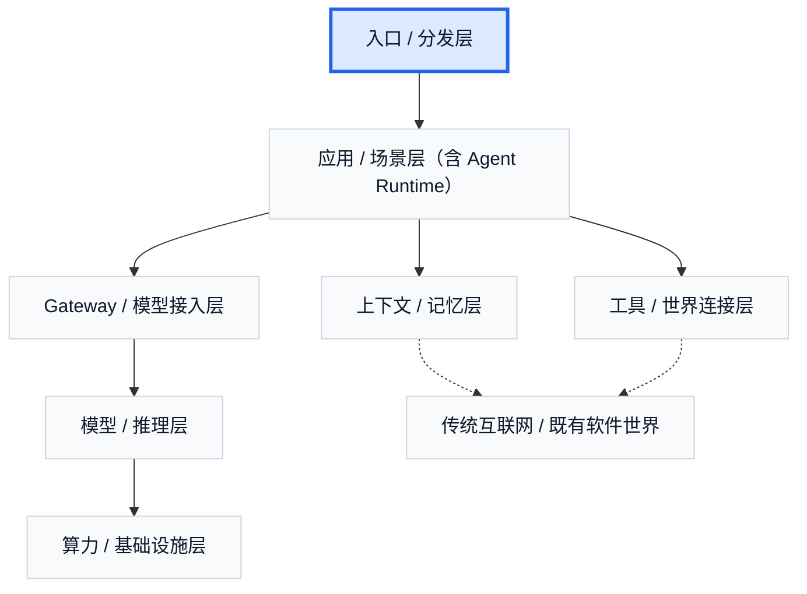

# 10. 入口 / 分发层：用户最先在哪里遇到 Agent

如果说 Agent 商业世界最先是以应用的形态被用户看见，那么在应用之上，还有一个更前置的问题：**用户到底是在哪里遇到 Agent 的？**

这个问题之所以重要，是因为入口从来不只是一个流量位置。它同时决定三件事：用户愿不愿意发起任务，系统能不能持续获得上下文，以及产品最终会长成什么样。一个放在聊天框里的 Agent，和一个长在 IDE、浏览器、会议室、眼镜或企业工作台里的 Agent，即使底下调用的是相似模型，用户对它的期待也会完全不同。

因此，入口层回答的不是“Agent 能做什么”，而是“用户会在什么地方把任务交给它”。这也是为什么很多产品表面上看像在比模型，实际上首先在比入口位置。谁先占住一个用户本来就愿意交任务的地方，谁就更容易先拿到任务流、上下文流和使用频率。

这层可以分成四类。第一类是主动入口，也就是用户明确打开一个界面，再把任务交给系统。典型例子是 ChatGPT、Claude、Copilot 这类通用聊天入口。它们的优势是低门槛、启动快、覆盖广，但代价是任务边界相对松散，很多上下文仍然要由用户手动组织。第二类是贴身入口，例如智能眼镜、智能手表、智能耳机、手机上的常驻 AI。它们的价值不在界面更复杂，而在于 AI 不再只是“等你打开”，而开始更持续地待在你身边。第三类是环境入口，例如会议室记录、车载助手、智能家居、办公室环境设备。这里的 AI 不再只是一个 app，而是开始随着空间一起存在。第四类是沉浸式或未来入口，例如 VR、AR 和脑机接口。它们离大规模普及仍有距离，但入口的终局未必是聊天框，而可能是更接近感知通道本身的界面。

如果把这些入口放回现实产品里看，会发现一些非常清楚的差异。IDE 与终端入口天然适合 coding agent，因为任务、文件、命令、错误反馈和结果验证本来就在同一个工作环境里。浏览器入口天然适合 research、form filling 和 computer use，因为网页本身就是用户正在工作的场所。企业工作台、文档系统、IM、CRM 和内部 portal 更适合企业流程 agent，因为真实协作和流程本来就在这些系统中发生。消息与语音入口则更贴近日常行为，但交互带宽更窄，复杂任务常常仍要切回其他界面。

过去两年里，这一层最值得注意的变化是：入口正在从“请求式”走向“常驻式”和“环境式”。过去更像用户打开一个聊天框，临时给 AI 一个任务；现在越来越像 AI 持续待在用户工作、沟通、记录和感知现实的地方。会议室 AI 记录、智能眼镜、桌面持续上下文、设备级录音与总结，实际上都在推动同一个趋势：AI 不再只在被呼叫时出现，而是在入口处先行驻留。

这也是为什么入口层不仅决定流量，还决定上下文。谁最先占住入口，谁就更接近获得第一手任务意图、持续环境信息和长期使用关系。反过来说，入口也会深刻塑造产品形态。一个长在会议室里的 Agent，很自然会围绕记录、识别、提炼和行动项沉淀来设计；一个长在浏览器里的 Agent，很自然会围绕网页观察、表单操作和任务执行来设计；一个长在眼镜里的 Agent，则更容易围绕第一人称上下文、提醒、感知和陪伴来设计。

从商业视角看，入口层的价值还在于它天然会和分发、留存和品牌绑定。很多产品的长期壁垒并不是“模型更强”，而是它待在一个用户本来就愿意交任务的地方。谁拥有稳定的任务入口，谁就更容易把后面的记忆层、工具层和应用层一起拉起来。

入口层不是 Agent 世界的外围装饰，而是它真正开始接触用户意图和持续上下文的地方。后面要讲的应用、记忆和工具，很多时候都是在入口成立之后才开始有了可持续价值。

---

## 图片生成 Prompts

先继承这份全局风格控制文档中的所有要求：  
[agent_business_world_slide_image_style.md](/Users/timzhong/msc202604/agent_business_world_slide_image_style.md)

### 图 4.1 入口不只是流量位

在此基础上，为这一部分生成一张横版 slide like image，风格优先做成 **executive product landscape UI**。主题是：**入口决定任务流、上下文流和使用频率**。画面像一个高端产品分析界面，中间是一个 Agent 产品卡片，周围连接 task intent, context flow, retention, frequency 这些模块。整体像真实战略软件截图，不要做成普通信息图。

### 图 4.2 四类入口

在此基础上，为这一部分生成一张横版 slide like image，风格优先做成 **clean category dashboard**。主题是：**主动入口、贴身入口、环境入口、沉浸式入口**。画面做成四列卡片式布局，每列都有典型设备或界面示意：chat UI, smart glasses/watch/earbuds, meeting room / car / smart home, AR/VR / neural interface。整体像高质量产品类别页。

### 图 4.3 为什么不同入口会长出不同产品

在此基础上，为这一部分生成一张横版 slide like image，风格优先做成 **interface-to-product mapping dashboard**。主题是：**IDE 长出 coding agent，浏览器长出 research agent，会议室长出 meeting agent**。画面左侧是入口，右侧是对应产品形态，之间用结构化连接线串起来。页面质感要像真实产品战略图。

### 图 4.4 入口正在从请求式走向常驻式

在此基础上，为这一部分生成一张横版 slide like image，风格优先做成 **future-facing ambient AI product board**。主题是：**AI 从聊天框走向常驻、环境化和贴身化入口**。画面左侧是传统 chat box，右侧是 glasses, meeting room recorder, desktop memory, wearable assistant 这些常驻入口。用清晰视觉转变表现“request-based -> ambient-based”。
