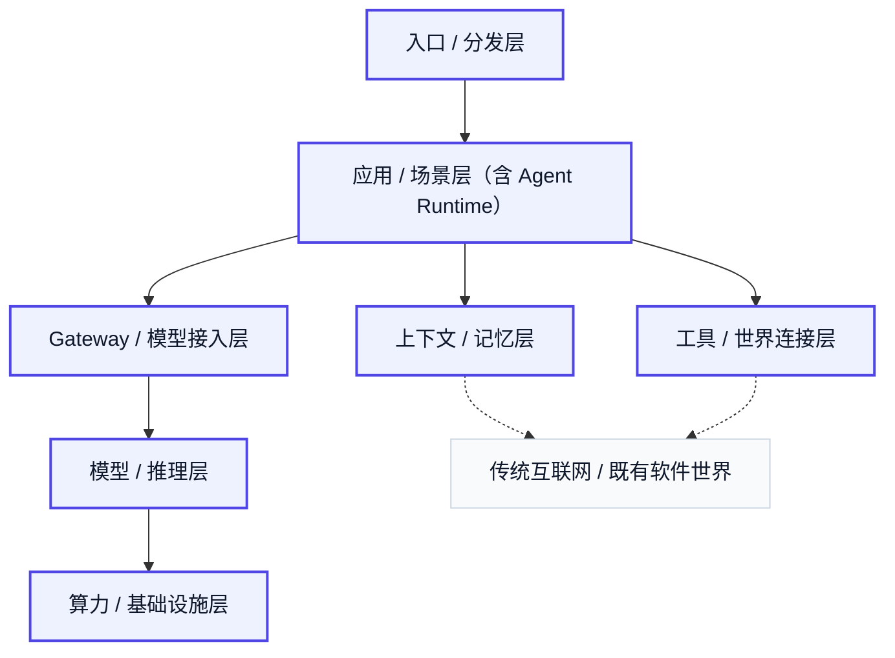

# 11. 行业观察、去魅与收束

讲完入口、应用、工具、记忆、模型、推理和基础设施之后，问题会自然变成另一种形式：这个世界确实很大，但新名词也确实很多，哪些是底层变化，哪些只是包装？这一章处理的正是这个问题。

过去一年里，最容易让业内产生 FOMO 的，通常不是最底层的词，而是最像“一个新控制点正在长出来”的词。按焦虑强度排序，更接近现实的顺序通常是：

1. `skills`  
它最会贩卖接口层焦虑：把“如何指导 agent 操作世界”包装成一个门槛突然下降的新层。尤其在 MCP 刚出来没多久之后再次出现，更容易制造“不用 skills 就会错过一整个能力时代”的感觉。

2. `agent team`  
它会让人误以为“不多 spawn 几个 agent 就已经远远落后于时代”；但现实里真正适合并行的任务并不多，隔离上下文和通信汇总的代价常常会吃掉并行优势，最后主 agent 的上下文几乎一点也没少。

3. `harness engineering`  
它把焦点从“如何定义行为”推向“如何定义目标”，制造一种近似 AGI 的错觉：人类只要说出目标，系统就会自己把过程全部组织出来。

4. `memory`  
它借用了人类记忆这个概念，暗示 agent 一旦接上 memory 就会像真人一样长期连续、准确召回、无限对话；而真实系统里，记忆抽取、去重、更新、过期、冲突和召回噪音依然是具体的工程难题。

5. `MCP`  
相比之下，它带来的焦虑更窄一些，更像标准化和生态兼容焦虑：开发者担心的不是“少了 MCP 就没有智能”，而是“如果未来接口标准逐渐统一，自己会不会被排除在默认生态之外”。

如果再说得直接一点，Anthropic 几乎总是最擅长把一层真实能力重新命名、重新包装，再配上一整套极强传播性的概念叙事；结合 `2026 年 4 月` 围绕 Claude Code 默认推理调整、性能争议、套餐与访问策略变化的公开风波，这种营销姿态只会更让人反感。只是 Claude 在相当长一段时间里确实是 Agent 场景下的优选模型，只能捏着鼻子批判性使用。

这些词之所以会火，并不是没有理由，但真正值得警惕的，不是这些词的热度，而是把某一层能力补丁误认成“底层规律已经彻底改写”。

去魅并不意味着否定热词，而是把它们拆开看。每个热点都可以问三个问题：它到底解决了哪个具体痛点？底层内核是什么？为什么会在这个时间点爆红？有些爆红来自真实技术进步，有些来自产品封装变好了，有些来自命名和传播做得足够强，还有一些来自市场恰好需要一个更容易理解的新标签。

Personal AI 是最好的例子之一。OpenClaw、Hermes 这一条线，并不是凭空发明了一种全新的底层结构。它真正做的，是把“个人代理可以常驻、可以记住、可以跨入口存在、可以持续和你一起成长”这套体验包装得足够完整、足够诱人，也足够会传播。Hermes 借 memory、self-improving、grows with you 这类叙事继续放大热度，并不是完全换了一个物种，而是在已有 personal agent 形态上把记忆、技能和身份连续性往前推了一层。Codex 目前更准确地说仍是 coding agent / software engineering agent，但它正在往更贴身的 personal agent 方向发展；`2026-04-16` OpenAI 发布的 memory preview、background computer use、跨应用工具和自动继续任务能力，就是很明显的证据。

Replit 和 Palantir 更适合被放在两种完全不同的位置上看。Replit 更像一个比较干净的正面样本：先是浏览器开发工具和在线协作环境，随后逐步 SaaS 化，长出订阅、团队版、企业版和云上开发底座，最后才在这个已有平台之上叠出 Agent。因此它转向 AI-native 软件生产入口，更像顺着原有资产按部就班往前走，而不是靠新概念制造 FOMO。

Palantir 则更像 FOMO 叙事的反例之一。它的核心产品一直是 `Gotham`、`Foundry`、`Apollo` 和后来的 `AIP`，主要客户是政府、军工、大制造、能源、医药和少数超大企业。它卖的从来不只是软件许可，而是把数据、流程、部署和组织动作深度嵌进客户现场。`Ontology` 最值得批判的地方，是它把并不新鲜的数据建模、对象关系、动作绑定和权限体系，包装成了一个听起来像底层突破的新层。`AIP` 也类似：它不是空气，但更像“让原有平台更容易卖、更容易交付、更容易讲成 AI 故事”，而不是一个已经高渗透、可以单独撑起超高 SaaS 倍数的新软件物种。财务上它当然很强，`FY2025` 收入约 `44.75 亿美元`，但客户总数只有 `954`，前二十名客户的过去十二个月平均收入约 `9390 万美元`；这个结构更像深嵌大客户的高接触式平台公司，而不是靠广泛自助复制长出来的典型 SaaS。更稳的结论是：`Ontology` 更像概念包装，`AIP` 更像真实产品加上被放大的市场叙事。

Palantir 这类案例还有一个更有用的启发：容易引发 FOMO 的概念，往往有几个共同特征。第一，它会把一个真实但复杂的工程问题压缩成一个很短、很大、很像新层的词；第二，它会把局部能力提升讲成系统性范式跃迁；第三，它会让非技术决策者也能一眼看懂“如果不跟进就会错过什么”；第四，它会故意站在一个已经有预算、有人群、也有焦虑的位置上。换句话说，一个概念越容易让人 FOMO，越说明它往往同时命中了真实痛点、传播效率和预算入口。

如果反过来看，一个“容易 FOMO 的概念”通常也是这样被制造出来的：先从一个真实但分散的工程痛点出发，把它重新命名成一个足够大的词；再把这个词放在一个“像新层、像新标准、像新入口”的位置上；接着用少量成功案例证明它并非空气；最后刻意强化时间压力，让团队觉得“现在不做，半年后就会被生态抛下”。这不意味着所有概念都只是包装，而是意味着：越容易激发群体焦虑的词，越应该优先拆回它到底在解决什么底层问题、技术原理到底是什么，以及相对成熟方案它真正优化的方向是什么。真正重要的，是抓住行业方向，而不是急着追逐每一个新名字。

回到学生视角，关键不是立刻给自己套一条职业路线，而是先形成一种参与方式。最值得优先建立的能力，不一定是追逐最前沿模型，而是学会从任务、状态、工具、反馈和系统边界的角度理解 Agent。多理解系统层，而不只盯着模型层；从外部工具接入开始做一些真实的小系统；找一个自己真正理解的场景去落地；保留对新名词的去魅能力。对不是天才的普通计算机学生来说，更高回报的起点往往不是“发明一个更大的模型”，而是学会把模型接进真实系统。

整场分享最后留下来的，不应是一个新名词清单，而应是对标题本身更清楚的回答：**Agent 正在长出的，并不是一个孤立技术点，而是一个由算力、模型、接入层、工具层、记忆层、应用层和入口层共同构成的商业世界。** 这个世界真正有价值的地方，不在于它又多了多少热词，而在于它正在把原本分散的能力、流程、软件入口和商业需求重新组织成新的分工、新的产品形态和新的价值链。

## 本章事实核查引用

- Anthropic `Claude Code` 在 `2026-04` 的性能与使用策略争议：Anthropic, [Claude Code April 23 postmortem](https://www.anthropic.com/engineering/april-23-postmortem).
- Codex 正在从 coding agent 往更贴身的个人工作代理演化，依据是 `2026-04-16` OpenAI 发布的 computer use、memory preview、自动继续任务和跨应用工具能力：OpenAI, [Codex for (almost) everything](https://openai.com/index/codex-for-almost-everything/).
- Replit Agent 用于支撑“从原有开发入口长出 AI-native 软件生产入口”的案例：Replit Blog, [Introducing Replit Agent](https://blog.replit.com/introducing-agent).
- Palantir 核心产品 `Gotham`、`Foundry`、`Apollo`、`AIP` 的产品线：Palantir, [Products](https://www.palantir.com/platforms/).
- Palantir FY2025 收入约 `$4.475B`、客户数 `954`、top 20 客户过去十二个月平均收入约 `$93.9M`：Palantir, [FY2025 Form 10-K PDF](https://investors.palantir.com/files/2025%20FY%20PLTR%2010-K.pdf).
- `Ontology` / `AIP` 的批判性判断属于讲稿作者分析，不是单一来源可裁决的事实；证据层面只支撑 Palantir 的公开产品结构、客户结构和财务指标。

---

## 图片生成 Prompts

先继承这份全局风格控制文档中的所有要求：  
[agent_business_world_slide_image_style.md](/Users/timzhong/msc202604/agent_business_world_slide_image_style.md)

### 图 11.1 FOMO 热点不等于底层规律

在此基础上，为这一部分生成一张横版 slide like image，风格优先做成 **trend deconstruction dashboard**。主题是：**skills、agent team、harness engineering、memory、MCP 是过去一年最容易让业内 FOMO 的几个词**。画面左侧按从上到下的顺序放五张 hot concept cards：skills、agent team、harness engineering、memory、MCP。右侧给每一张卡配一条 very short anxiety label：skills 对应 interface-layer anxiety，agent team 对应 parallelism anxiety，harness engineering 对应 goal-automation anxiety，memory 对应 human-like continuity anxiety，MCP 对应 standardization anxiety。整体像真实市场分析 UI，不要做花哨海报。

### 图 11.2 Personal AI 为什么会爆

在此基础上，为这一部分生成一张横版 slide like image，风格优先做成 **personal agent product timeline UI**。主题是：**OpenClaw, Hermes 这类产品把 personal agent 的体验和叙事推到了更前面**。画面是一条清晰产品演化时间线，带 memory, continuity, always-on, local context 这些关键词。

### 图 11.3 Replit 与 Palantir 的两种 AI 转型

在此基础上，为这一部分生成一张横版 slide like image，风格优先做成 **two-path transformation strategy dashboard**。主题是：**Replit 更像顺着原有入口长出 AI 产品，Palantir 更像真实产品与强叙事同时放大**。左侧是 Replit path，突出 IDE, online runtime, developer workflow, AI-native build入口；右侧是 Palantir path，突出 ontology, AIP, enterprise deployment, services, data platform, market narrative。整体是对照式战略分析图，不要把两边都画成正面样板。

### 图 11.4 新术语、旧技术与商业包装

在此基础上，为这一部分生成一张横版 slide like image，风格优先做成 **concept deconstruction interface**。主题是：**一个容易引发 FOMO 的概念，通常是如何被包装出来的**。画面中央是一张 big concept card，向下拆成四层：real engineering pain point, renamed concept, market narrative, budget / adoption pressure。右侧再加一个 small checklist，写 short signals：sounds like a new layer, easy for CXO to understand, implies time pressure, has a few visible success stories。页面像分析工具。

### 图 11.5 最后收束

在此基础上，为这一部分生成一张横版 slide like image，风格优先做成 **high-end concluding strategy interface**。主题是：**Agent 正在把大模型、软件系统、行业流程和商业需求重新接起来**。画面中央是一条被重新连通的价值链，整体像整场分享的最终收束页，适合叠加结尾大字标题。

---

## 事实核查证据

以下证据用于支撑全稿中的事实性描述，核查日期为 `2026-04-24`。涉及实时变化的价格、估值、融资和产品能力，后续引用前仍建议再次复核。检索时使用了 `grok-search` 做第一轮发现，并回到官方文档、公司公告、SEC / IR 文件和主流科技媒体交叉确认。

### 基础时间线与模型机制

- ChatGPT 公开发布于 `2022-11-30`：OpenAI, [Introducing ChatGPT](https://openai.com/index/chatgpt/).
- `ReAct: Synergizing Reasoning and Acting in Language Models` 论文发布于 `2022-10`，用于支撑 `reason -> act -> feedback` 这类 agent 闭环讲法：arXiv, [2210.03629](https://arxiv.org/abs/2210.03629).
- `cl100k_base` 的 tokenization 例子来自 OpenAI `tiktoken`：OpenAI GitHub, [tiktoken openai_public.py](https://github.com/openai/tiktoken/blob/main/tiktoken_ext/openai_public.py).
- `input / cached input / output` 分开定价，以及 `GPT-5.4` 每百万 token `2.50 / 0.25 / 15.00 美元`，来自 OpenAI 官方价格页：OpenAI, [API Pricing](https://openai.com/api/pricing/); OpenAI Developers, [GPT-5.4 model docs](https://developers.openai.com/api/docs/models/gpt-5.4/).

### Agent、工具与入口

- MCP 作为模型上下文和工具连接协议的官方来源：Anthropic, [Model Context Protocol](https://www.anthropic.com/news/model-context-protocol).
- Google `Agent2Agent / A2A` 协议用于支撑工具 / agent 互操作方向：Google Developers Blog, [Agent2Agent protocol](https://developers.googleblog.com/en/a2a-a-new-era-of-agent-interoperability/).
- Codex 正在从 coding agent 往更贴身的个人工作代理演化：`2026-04-16` OpenAI 宣布 Codex 支持 background computer use、memory preview、跨应用工具、自动继续任务和更多插件。来源：OpenAI, [Codex for (almost) everything](https://openai.com/index/codex-for-almost-everything/).
- Anthropic `Claude Code` 在 `2026-04` 的性能与使用策略争议，来源：Anthropic, [Claude Code April 23 postmortem](https://www.anthropic.com/engineering/april-23-postmortem).
- Zoom AI Companion / 会议入口方向，来源：Zoom, [Zoom AI Companion](https://www.zoom.com/en/products/ai-assistant/).
- Replit Agent 发布与 hosted app agent 产品化方向，来源：Replit Blog, [Introducing Replit Agent](https://blog.replit.com/introducing-agent).

### 算力与基础设施

- NVIDIA GB200 NVL72 的 `72 Blackwell GPUs`、`13.4 TB HBM3e`、`576 TB/s HBM bandwidth`、`130 TB/s NVLink` 等规格，来源：NVIDIA, [GB200 NVL72](https://www.nvidia.com/en-us/data-center/gb200-nvl72/).
- Google Cloud TPU v5p 的 `64 chips` cube、`8960 chips` pod、最大 `6144 chips` single slice 等，来源：Google Cloud, [TPU v5p documentation](https://docs.cloud.google.com/tpu/docs/v5p).
- xAI Colossus 的 `200k GPUs`、`194 PB/s` total memory bandwidth、`>1 EB` storage capacity、继续扩展路线，来源：xAI, [Colossus](https://x.ai/colossus/). NVIDIA 也披露过 Colossus 使用 NVIDIA Spectrum-X 并从 `100,000` Hopper GPUs 向 `200,000` GPUs 扩张：NVIDIA Newsroom, [xAI Colossus and Spectrum-X](https://nvidianews.nvidia.com/news/spectrum-x-ethernet-networking-xai-colossus).

### Gateway 与模型接入层

- OpenRouter 作为公共模型路由器和 provider / pricing / latency 比较入口，来源：OpenRouter, [Models](https://openrouter.ai/models).
- Portkey 作为企业 AI gateway / control plane 的例子，`2026-02-19` 披露 Series A，并称管理超过 `$180M` annualized LLM spend：Portkey, [Series A funding](https://portkey.ai/blog/series-a-funding). 其后续开源 gateway 公告继续披露 `1T+ tokens`、`120M+ AI requests/day`、`$180M+` annualized AI spend：Portkey, [The Gateway Grew Up](https://portkey.ai/blog/gateway-2-0).
- LiteLLM 作为开源 / 自托管 gateway 例子，来源：BerriAI GitHub, [LiteLLM](https://github.com/BerriAI/litellm).
- Cloudflare AI Gateway 作为云平台吃进 gateway 层的例子，来源：Cloudflare Docs, [AI Gateway](https://developers.cloudflare.com/ai-gateway/).

### 工具 / 世界连接层与接口公司

- Browserbase `2025-06-18` 宣布 `$40M` Series B，用于支撑浏览器执行基础设施赛道；估值约 `$300M` 的说法来自二级市场 / 研究资料，公开官方文未披露估值。来源：Browserbase, [Building the future of web automation](https://www.browserbase.com/blog/series-b-and-beyond); Contrary Research, [Browserbase company profile](https://research.contrary.com/company/browserbase).
- Plaid `2026-02` 员工股份交易 / liquidity round 对应约 `$8B` 估值，来源：TechCrunch, [Plaid valued at $8B in employee share sale](https://techcrunch.com/2026/02/26/plaid-valued-at-8b-in-employee-share-sale/); Bloomberg, [Plaid Scores $8 Billion Valuation](https://www.bloomberg.com/news/articles/2026-02-26/fintech-plaid-nabs-8-billion-valuation-in-latest-funding-round).
- Stripe / PayPal / Plaid / GitHub / Lark / Salesforce 等作为现实世界接口和企业流程入口的例子，主要用于行业归类判断；具体产品边界以各自官方文档为准：Stripe, [Developers](https://docs.stripe.com/); Plaid, [Docs](https://plaid.com/docs/); GitHub, [Docs](https://docs.github.com/); Salesforce, [Agentforce](https://www.salesforce.com/agentforce/).

### 上下文 / 记忆层

- Glean 代表企业知识入口，`2025-06` 报道估值约 `$7.2B`：TechCrunch, [Enterprise AI startup Glean lands a $7.2B valuation](https://techcrunch.com/2025/06/10/enterprise-ai-startup-glean-lands-a-7-2b-valuation/).
- Perplexity 代表“检索 + 推理 + 上下文组织”的产品化，`2025-09` 报道估值约 `$20B`：TechCrunch, [Perplexity reportedly raised $200M at $20B valuation](https://techcrunch.com/2025/09/10/perplexity-reportedly-raised-200m-at-20b-valuation/).
- Mem0 作为 memory pipeline / long-term memory layer 的工程化例子，来源：Mem0, [Docs](https://docs.mem0.ai/); GitHub, [mem0ai/mem0](https://github.com/mem0ai/mem0).
- Rewind 作为 personal memory / personal context 例子，来源：Rewind, [Product site](https://www.rewind.ai/).

### 应用 / 场景层

- Cursor / Anysphere 在 `2025-11` 融资后估值约 `$29.3B`，`2026-03` 报道称其年化收入超过 `$2B`，`2026-04` 报道称正洽谈 `$50B` 估值融资：TechCrunch, [Cursor raises $2.3B at $29.3B valuation](https://techcrunch.com/2025/11/13/coding-assistant-cursor-raises-2-3b-5-months-after-its-previous-round/); TechCrunch, [Cursor reportedly surpassed $2B annualized revenue](https://techcrunch.com/2026/03/02/cursor-has-reportedly-surpassed-2b-in-annualized-revenue/); TechCrunch, [Cursor in talks at $50B valuation](https://techcrunch.com/2026/04/17/sources-cursor-in-talks-to-raise-2b-at-50b-valuation-as-enterprise-growth-surges/).
- Claude Code、OpenAI Codex、Replit Agent 作为 coding agent 例子，来源：Anthropic, [Claude Code](https://www.anthropic.com/claude-code); OpenAI, [Codex](https://openai.com/codex/); Replit, [Replit Agent](https://blog.replit.com/introducing-agent).
- ChatGPT Deep Research、Perplexity Deep Research、Gemini Deep Research 作为 research agent 例子，来源：OpenAI, [Introducing deep research](https://openai.com/index/introducing-deep-research/); Perplexity, [Deep Research](https://www.perplexity.ai/hub/blog/introducing-perplexity-deep-research); Google, [Gemini Deep Research](https://blog.google/products/gemini/google-gemini-deep-research/).
- Sierra `2025-09` 报道融资后估值约 `$10B`，来源：CNBC, [Bret Taylor's Sierra is the latest $10 billion AI startup](https://www.cnbc.com/2025/09/04/bret-taylor-sierra-ai-startup-salesforce-openai.html); TechCrunch, [Sierra raises $350M at a $10B valuation](https://techcrunch.com/2025/09/04/bret-taylors-sierra-raises-350m-at-a-10b-valuation/).
- Moveworks 在 `2025-03` 被 ServiceNow 宣布以约 `$2.85B` 现金加股票收购，并在后续完成交易：ServiceNow IR, [ServiceNow completes acquisition of Moveworks](https://investor.servicenow.com/news/news-details/2025/ServiceNow-completes-acquisition-of-Moveworks/default.aspx); Axios, [ServiceNow paying $2.85B to buy Moveworks](https://www.axios.com/2025/03/10/servicenow-moveworks-acquisition).
- Manus 在 `2025-04` 报道融资估值约 `$500M`，`2025-12` 有报道称 Meta 以 `$2B+` 收购 / 交易估值区间进入 `$2B-$2.5B`：TechCrunch, [Manus reportedly gets funding at $500M valuation](https://techcrunch.com/2025/04/25/chinese-ai-startup-manus-reportedly-gets-funding-from-benchmark-at-500m-valuation/); Axios, [Meta's deal for Manus AI could be worth $2.5B](https://www.axios.com/2025/12/30/meta-manus-ai).
- Zoom FY2026 整体毛利约 `77%`、GAAP operating margin 约 `23%`，来源：Zoom Investor Relations, [FY2026 financial results PDF](https://investors.zoom.us/node/14151/pdf).

### Palantir 与企业 AI 转型

- Palantir 核心产品 `Gotham`、`Foundry`、`Apollo`、`AIP` 的产品线，来源：Palantir, [Products](https://www.palantir.com/platforms/).
- Palantir FY2025 收入约 `$4.475B`、客户数 `954`、top 20 客户过去十二个月平均收入约 `$93.9M`，来源：Palantir, [FY2025 Form 10-K PDF](https://investors.palantir.com/files/2025%20FY%20PLTR%2010-K.pdf).
- `Ontology` / `AIP` 的批判性判断属于讲稿作者分析，不是单一来源可裁决的事实；证据层面只支撑 Palantir 的公开产品结构、客户结构和财务指标。
