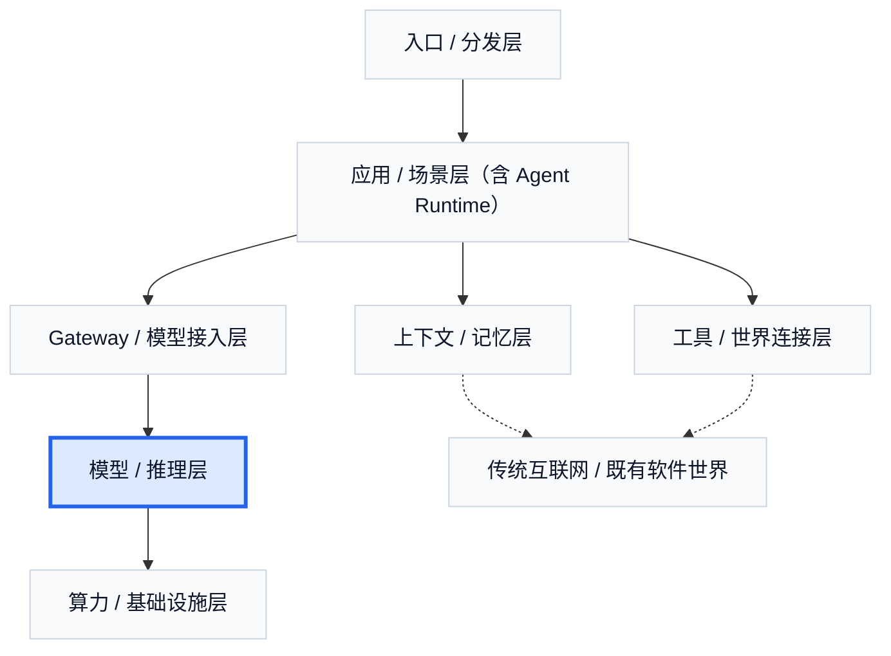

# 1. 大语言模型的抽象基础能力

如果要理解 Agent 为什么会成立，首先不能把大语言模型看成一个只会聊天的黑箱。更准确的理解是：它是一种把海量语言、代码、知识结构和行为模式压缩进参数中的通用生成系统。它最基础的能力，不在于“像人”，而在于它第一次把语言理解、知识压缩、模式匹配和统一接口能力，放进了同一个可编程系统里。

这一点可以先从最现实的地方切入：价格。今天主流模型的计费方式，通常会把 `input`、`cached input`、`output` 分开定价。这件事本身已经在提示一个重要事实：模型内部并不是一个统一成本的过程。输入被读入、处理、压缩，和输出被逐 token 生成，是两种不同的推理阶段；它们对应不同的计算形态，也决定了为什么上层产品会出现缓存、长上下文成本、响应时间差异、模型选择策略这些工程问题。换句话说，**价格表并不只是商业信息，它本身也在暴露模型运行方式的一部分。**

从输入开始看，大语言模型并不直接处理“文字”，而是先处理 token。以 OpenAI 常见的 `cl100k_base` 为例，它可以被直觉地理解为：先用 256 个 byte 作为最底层兜底单位，再在其上学习约 10 万个高频片段，所以最终形成大约 100,256 个基础 token 单位。文本进入模型之前，先被切成一串 token id；这些 id 再去 embedding matrix 中查表，映射成向量。到这一步，模型真正处理的对象已经不再是自然语言本身，而是向量空间中的表示。

这也是理解 Transformer 的最好入口。很多人第一次接触 Transformer 时，会被 `Q / K / V` 的故事化解释带偏，仿佛这里有三个神秘容器在“理解语言”。其实从推理视角看，更稳的理解是：输入向量先经过几组线性投影，被改写成不同的表示；其中一部分负责产生组合权重，另一部分负责提供被组合的基底向量。所谓 attention，本质上只是一次“先算权重，再做加权组合”的过程。`Q / K` 改变的是注意模式，`V` 提供的是最终被组合起来的新表示。这里真正发生的，不是玄学推理，而是线性代数意义上的信息重组。

对大语言模型来说，还必须再补上一层约束：它用的不是任意 attention，而是**因果注意力**。意思很简单：当前位置只能看左边已经出现的 token，不能偷看右边未来还没生成出来的 token。它最本质的成功，是把训练目标和生成方式统一成同一件事：**永远基于前缀去预测下一个 token**。而它非常重要的工程副产物，则是让 `KV cache` 和 `prefix cache` 这类增量复用变得自然可行，因为历史前缀一旦算过，就不会再被未来 token 反向改写。也正因为这样，在固定模型、固定前缀和固定 mask 的前提下，同一个前缀在每一层里算出来的中间表示是稳定可复用的；这句话看起来很小，但后面整个 `prefill / decode / cache` 的工程结构，其实都建立在这个事实之上。

如果再往前推进一步，就会明白为什么 Transformer 不是只做一次这样的组合，而是要一层一层堆叠。因为一个 token 的初始 embedding 只提供了一个粗糙起点，它真正的语义要在上下文中被不断重写。句子里的“苹果”可以是水果，也可以是公司；一次信息混合不够，模型必须反复根据周围 token 去修正它在当前上下文中的作用。于是，多层网络的意义并不是“变得更深所以更厉害”，而是：**每一层都在重新校正 token 在当前上下文中的含义。**

位置问题也由此变得关键。因为 attention 本身只处理 token 之间的关系，如果不引入位置机制，模型并不知道这些 token 是按什么顺序排列的。RoPE 的价值就在这里。它不是简单给 token 贴一个位置标签，而是把位置信息写进向量几何结构里。二维直觉下，它就像让向量在平面上按位置旋转；如果有人追问“那转一圈不就重合了吗”，答案也很重要：真实 RoPE 从来不是一个圆，而是很多不同频率的小圆组合。正因为这些频率不同，整体位置状态不会轻易整体重合。这个思想也很适合作为听众从二维直觉走向高维表示的桥梁。

理解完“输入如何变成表示”，下一步就要看“表示如何变成输出”。这里最容易被忽略的一点是：大语言模型并不是一次性把整段输出整体想好，再统一吐出来。对 decoder-only 模型来说，它在每一个时刻做的，其实都是同一件事：基于当前已经看到的全部上下文，计算“下一个 token 的概率分布”，再从中选出或采样出一个 token。也就是说，模型之所以能够写出一句完整的话，不是因为它脑中先有整句，而是因为它在每一步都把“前面已经确定的 token”继续并入上下文，再去预测下一个 token。于是，预测第 101 个 token 时，模型看到的是前 100 个 token 的表示；预测第 102 个 token 时，它看到的就是前 101 个 token 的表示。所谓“生成”，本质上就是这个过程不断重复。

这就引出了推理里的两段：`prefill` 和 `decode`。`prefill` 负责把整段输入一次性吃进去，先把 prompt 中所有 token 过一遍模型，算出每一层 attention 需要的中间状态；`decode` 则是在这些状态之上，每次只新增一个 token，再继续往后生成。两者看上去都属于推理，但代价完全不同。之所以 `prefill` 常被说成计算瓶颈，是因为它第一次处理一个长 prompt 时，必须对 prompt 中的每个 token 都做完整前向计算：embedding、各层投影、attention、FFN、位置编码，全部都要跑一遍，而且 attention 在这一阶段面对的是整段输入的成片矩阵运算。输入越长，这一轮“第一次把整段上下文算明白”的工作量就越大，所以它天然更像大矩阵乘法主导的计算密集过程。

也正是在这个阶段，`KV cache` 才第一次被建立起来。更准确地说，模型在 prefill 时会为每一层、每个已经处理过的 token 计算出 attention 里的 key 和 value 表示，并把这些中间张量存下来。它们不是最终输出文本，也不是某种用户可见摘要，而是 attention 层后续继续读取旧上下文时所需的中间结果。没有这一步，模型每生成一个新 token，都得把整个历史上下文重新过一遍。

`decode` 为什么会变成另一种瓶颈，也就由此变得清楚了。到了生成阶段，每一步新增的其实只有一个 token，所以新算的算子并不大；但为了预测这个 token，模型仍然要在每一层把当前这个新 token 的 query，拿去和历史上所有 token 的 key / value 做比对和组合。也就是说，decode 的核心压力不再是“重新算一大段 prompt”，而是“反复把已经存下来的大量 KV 从显存里读出来，再与当前 token 组合”。序列越长，历史 KV 越大，这一步就越容易受显存容量和带宽限制。因此 decode 更像访存瓶颈，而不是纯计算瓶颈。

这也解释了 `KV cache` 在 decode 阶段真正发挥的作用。它并不是让模型“少想一点”，而是让模型避免把历史 token 的 key / value 一遍遍重复计算。模型只需要为刚刚生成的新 token 计算新的 K 和 V，再把它追加到已有缓存后面；旧 token 对应的 KV 可以直接重用。于是，decode 的主要问题从“重复算整段历史”变成了“如何高效读取和管理这段越来越长的历史缓存”。这也是为什么业界一边在讨论 KV cache，一边又会不断碰到显存占用、带宽压力和长序列退化问题。

这里还要顺手区分一个经常被混用的概念：`prefix cache` 和 `KV cache` 并不是同一层东西。`KV cache` 更像一次请求内部的运行时缓存，它解决的是“在同一轮生成里，已经处理过的 token 不要反复重算”；而 `prefix cache` 更像跨请求复用同一段 prompt 前缀的缓存，它解决的是“如果很多请求共享同一个长前缀，就不要每次都从零做 prefill”。从本质上说，prefix cache 复用的常常也是 prefill 产出的 KV 结果，但它服务的是跨请求重用同一段前缀，而 KV cache 服务的是单次生成过程中对历史上下文的递增复用。前者主要在省重复 prefill，后者主要在省重复 decode 历史。

所以，对于上层产品来说，用户看到的“响应时间”往往不是一个简单的模型速度，而是排队时间、prefill 时间和 decode 时间的叠加。长 prompt 会先把 prefill 压重；长输出和长上下文又会把 decode 里的访存压力逐步放大；而各种 cache，本质上都在试图减少这两类重复劳动。这也是为什么行业里会反复讨论缓存、批处理、长上下文成本，以及为什么同一个模型的输入和输出价格往往差得很大。

一旦这套机制被放到多轮对话和长任务里，问题就会更明显。每一轮都把前文完整带回去，会让输入成本和时间迅速膨胀；对 Agent 来说，这不是边角细节，而是结构性约束。因为 Agent 不只是对话，它要保留任务状态、调用工具、读回结果、继续推进。如果没有 cache、prefix reuse、上下文压缩这些工程手段，链路一长，系统就会越来越慢，甚至排队和 prefill 会反过来主导体验。这也是为什么从 Chatbot 走向 Agent 时，系统问题会突然爆炸：**你以为增加的是“智能”，但很多时候真正增加的是上下文负担和运行负担。**

所以，对大语言模型最值得保留的一个抽象，不是“它像不像人”，而是：它提供了一个统一的语言接口，把知识压缩、模式匹配、上下文重写和逐步生成组织成了可编程能力。Agent 之所以可能，不是因为模型突然有了人格，而是因为这套能力第一次足够稳定，能够被放进更长的任务链条里，继续向下接工具、接记忆、接系统、接世界。

---

## 图片生成 Prompts

先继承这份全局风格控制文档中的所有要求：  
[agent_business_world_slide_image_style.md](/Users/timzhong/msc202604/agent_business_world_slide_image_style.md)

### 图 1.1 统一能力底座

在此基础上，为这一部分生成一张横版 slide like image，风格优先做成 **AI model system dashboard**。主题是：**大语言模型把语言、代码、知识和模式压缩成统一能力底座**。画面像一个高拟真的模型工作台界面：左侧是不同类型输入源卡片，例如 text, code, knowledge, behavior patterns；中间是一个统一模型核心区域；右侧是压缩后的能力输出面板。整体像真实产品控制台，而不是抽象海报。

### 图 1.2 从价格看到推理结构

在此基础上，为这一部分生成一张横版 slide like image，风格优先做成 **realistic pricing and inference dashboard**。主题是：**价格表背后暴露了模型内部的不同推理阶段**。画面像一个 OpenAI / OpenRouter 风格的 pricing page 或 inference control panel，顶部是模型名和 usage summary，中间是一张非常清楚的表格，至少包含 `Input`、`Cached Input`、`Output` 三列，以及价格、latency、usage notes 这类短标签；旁边用简洁的流向结构表示这三类成本对应不同推理阶段。要求界面真实、文字清楚、布局专业。

### 图 1.3 文本如何进入模型

在此基础上，为这一部分生成一张横版 slide like image，风格优先做成 **educational technical UI**。主题是：**以 `cl100k_base` 为例，文本先变成 token，再进入向量空间**。画面像一个教学型软件界面，并明确分成三栏。左侧是 text input panel，放一小段短文本，并标出这是原始文本输入；中间是 tokenizer panel，明确写出 `cl100k_base`，并用简洁方式说明 `100,256` 这个词表规模来自 `256 bytes + about 100,000 learned merges`，下面展示一条 token sequence strip，包含 token 片段和对应 token id；右侧是 embedding lookup panel，显示 token id 如何在 embedding matrix 里查表，进入 vector space。版面清楚、结构明确，可以有少量短英文标签如 `text`, `cl100k_base`, `token id`, `embedding lookup`, `vector space`，用于解释 tokenizer 和 embedding 的流程。不要把画面做成抽象科技海报，要像一张真正能拿来教学的技术解释页。

### 图 1.4 Transformer 的核心直觉

在此基础上，为这一部分生成一张横版 slide like image，但风格改成 **高质量数学动画静帧风格**，强调抽象、清晰、强解释力，同时保留整套 deck 的冷白、深蓝、青色体系。请明确采用一个**教学化简假设**：把 token 表示画成 **2 维或 3 维向量空间** 里的点和箭头，让观众一眼能看出“投影、比较、加权组合、生成新表示”这条路径。主题是：**表示经过投影、比较和加权组合，被重写成新的表示**。画面不要做成产品 UI，而要像一张精致的数学可视化教学画面：左侧是 2D/3D 中的几个输入向量和点，中央是投影后的几何空间、连接线、相似度比较、加权关系、流动箭头，右侧是聚合后的新表示。可以出现少量清晰数学可视化元素，如坐标轴、向量箭头、点云、矩阵块、连接权重，但不要塞复杂公式，不要过多文字。可以参考模型已知的 **3Blue1Brown 式数学解释视频** 所常见的视觉语言：克制背景、清楚几何层次、优雅运动感、强解释性的空间布局，但不要模仿具体某一帧，不要出现 logo 或频道元素。重点是把 attention 讲成一种优雅的几何与线性代数过程，画面应当抽象、克制、结构清楚，像一张顶级数学解释视频中的关键静帧。

### 图 1.5 叠层与位置机制

在此基础上，为这一部分生成一张横版 slide like image，风格优先做成 **layered model inspector UI**。主题是：**token 的表示在层与层之间被持续重写，位置被编码进几何结构**。画面像一个分层 inspector：中间是 vertically stacked layers，某一个 token 在每一层的表示都不同；右侧有抽象旋转位置结构、不同频率的环形几何图，用于隐含 RoPE 直觉。整体重点是“逐层重写”和“位置进入几何结构”。

### 图 1.6 Prefill、Decode 与 Agent 负担

在此基础上，为这一部分生成一张横版 slide like image，风格优先做成 **inference operations dashboard**。主题是：**输入阶段和输出阶段有不同的计算代价，长任务会把这种差异放大**。画面像一个推理运维面板：左侧是 long input context and queue，中央是 heavy prefill compute block，右侧是 token-by-token decode stream，旁边有 cache hits、latency strip、context growth indicators。整体像真实推理监控 / analysis dashboard，突出 Agent 时代的运行负担，而不是抽象光效。
