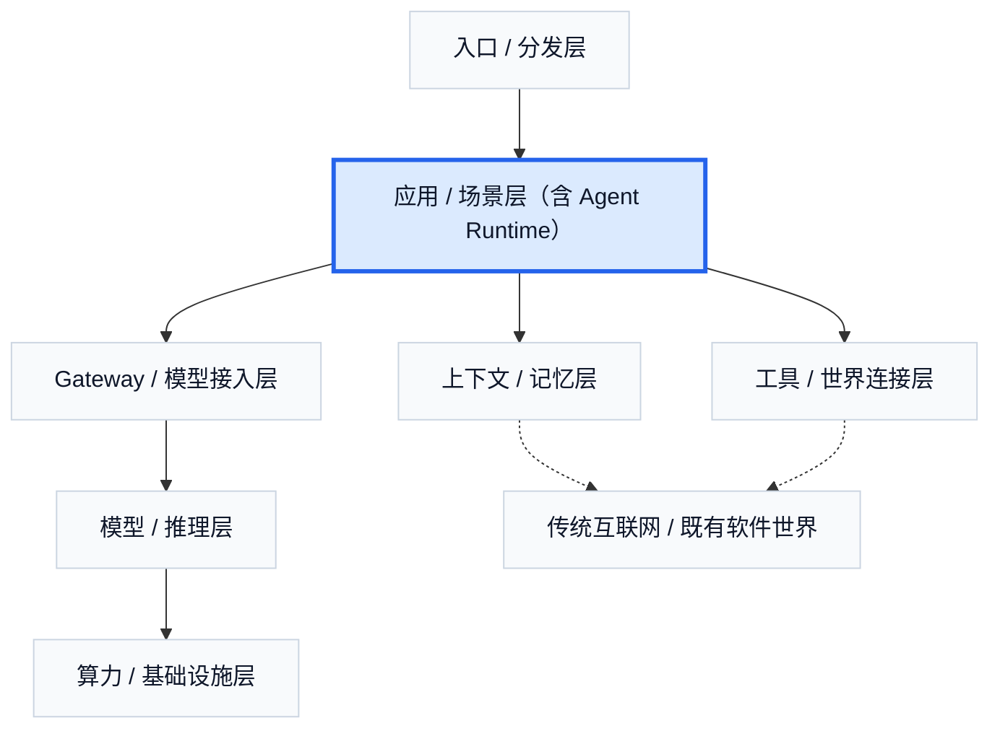

# 2. 从 Chatbot 到 Agent：变化到底发生在哪

如果只看界面，Chatbot 和 Agent 的差别并不总是显眼。两者都可能有一个输入框、一段自然语言、一块结果区域，甚至都可以表现得足够“聪明”。但如果从系统结构看，它们的基本单位并不相同。Chatbot 的基本单位更接近一次性回复：用户提出一个问题，模型给出一段回答，价值主要体现在内容生成本身。Agent 的基本单位则更接近任务推进：系统不仅要生成一句话，还要判断下一步做什么、调用什么能力、等待什么反馈、在何处继续执行，以及在什么条件下交付结果。

这意味着，从 Chatbot 到 Agent，增加的并不只是少量智能，而是整整一层新的系统负担。一个聊天系统只要在局部回合里把内容生成得足够自然，就已经能形成体验；而一个 Agent 系统必须持续面对状态、工具、反馈、多步执行和失败恢复。它要进入的，不再只是语言空间，而是任务空间。

这一变化可以先从最直观的产品形态理解。早期聊天式 AI 的主价值，在于把问答、总结、润色、翻译、检索这类动作统一到一个自然语言界面里。用户输入一个问题，模型输出一段文本，流程到这里通常就结束了。即使产品加入对话历史，它本质上仍然更接近“带上下文的回答系统”。而在 2025 到 2026 年迅速扩张的这一波 Agent 产品中，用户越来越多地交付的是目标而不是问题，例如“改完这一组文件并跑测试”“帮我做一轮调研并整理成报告”“去浏览器里完成这几步操作”“记录会议并沉淀后续行动项”。在这种场景里，单次回答已经不是最终交付物，真正的交付物是被推进的任务。

如果要给这种结构一个最经典的抽象，可以轻轻提一下 2022 年提出的 `ReAct`。它的重要性不在于论文名字本身，而在于它把一件事情讲清楚了：Agent 的基本结构不是“先想完，再统一执行”，也不是“只执行，不思考”，而是在 `reason -> act -> feedback` 的循环中持续推进任务。系统先根据当前上下文作出判断，再调用动作，再根据外部结果更新内部状态，然后继续下一步。这个循环一旦成立，模型就不再只是内容生成器，而是开始变成一个会观察、会行动、会根据反馈继续调整的系统部件。

也正因为这一点，Agent 和 Chatbot 的差别，绝不只是“上下文更长”。真正的差别在于：Agent 开始把模型接到外部世界上。这里的外部世界可以是浏览器、文件系统、代码执行环境、数据库、企业 API、SaaS 系统，也可以是会议室、桌面、可穿戴设备与持续输入流。Chatbot 处理的是语言问题；Agent 一旦接上工具，就开始进入现实任务。它需要面对的问题，也随之从“这句话如何回答”扩大为“这个目标如何被拆解、执行、校验和交付”。

这一变化会立刻把工程竞争点改写掉。很多人第一次接触 Agent 时，会直觉地把竞争力归结为 prompt 写得更细、更长、更巧妙。但在真实系统里，prompt 往往只是入口。系统真正的竞争力，常常体现在更不显眼的地方：工具是否接得足够深、状态是否维护得足够稳、上下文是否被压缩得足够好、缓存是否命中、任务链路是否可回退、失败是否能被吸收，以及调度策略是否能让长任务不把系统拖垮。换句话说，Agent 不是一个“更会聊天的模型”，而是一个被组织进任务系统、执行系统和反馈系统的模型。

前一章已经讲过，大语言模型的运行代价并不是均匀的。多轮对话里，系统常常需要把之前的大量上下文重新带回来；长输入会推高 prefill 时间，输出阶段又有自己的访存负担。到了 Agent 场景，这个问题会更严重，因为 Agent 不只是记聊天记录，它还要记目标、阶段状态、工具调用结果、系统提示、工作记忆和中间产物。如果没有 prefix cache、prompt reuse、状态压缩和合理的上下文控制，链路一长，用户体感里最重的部分往往就不再是“模型思考得慢”，而是系统在排队、搬运和重复读取上下文。

这也是一个非常反直觉的地方。很多人以为从 Chatbot 到 Agent，意味着模型更强、更深、更像人。但在工程现实里，Agent 经常首先表现为：更重的上下文，更长的链路，更多的工具依赖，更复杂的失败路径，更高的调度要求。也正因此，很多 Agent 产品真正的壁垒，并不在模型本身，而在于它们如何处理这些负担。有些产品看上去只是一个聊天框，但只要它背后接上了任务状态、工具系统、缓存策略和执行环境，它就已经不再是普通 Chatbot。

所以，这一章真正想建立的判断是：从 Chatbot 到 Agent，并不是出现了一个神秘新物种，而是软件系统开始把大模型组织进一个持续推进任务的闭环里。这个闭环一旦形成，后面几章里要讲的上下文与记忆、工具与世界连接、网关与模型接入、推理与算力约束，都会顺理成章地出现。它们不是附加层，而是 Agent 成立之后自然长出来的系统层。

如果把这一章压缩成一句话，那么最准确的表达是：**Chatbot 输出的是回复，Agent 推进的是任务；从前者走向后者，真正增加的不是一点点智能，而是大量系统负担。**

## 本章事实核查引用

- `ReAct` 作为 `reason -> act -> feedback` agent 循环的经典抽象来源：Yao et al., [ReAct: Synergizing Reasoning and Acting in Language Models](https://arxiv.org/abs/2210.03629).
- MCP 用于支撑“模型接入外部工具和世界”的协议化趋势：Anthropic, [Model Context Protocol](https://www.anthropic.com/news/model-context-protocol).
- Codex 的 computer use、memory、automation、跨应用工具能力用于支撑“从回答走向任务推进”的产品趋势：OpenAI, [Codex for (almost) everything](https://openai.com/index/codex-for-almost-everything/).
- 推理价格、缓存和长上下文成本用于支撑“Agent 带来上下文和运行负担”的工程判断：OpenAI, [API Pricing](https://openai.com/api/pricing/); Portkey, [AI cost observability](https://portkey.ai/blog/ai-cost-observability-a-practical-guide-to-understanding-and-managing-llm-spend/).

---

## 图片生成 Prompts

先继承这份全局风格控制文档中的所有要求：  
[agent_business_world_slide_image_style.md](/Users/timzhong/msc202604/agent_business_world_slide_image_style.md)

### 图 2.1 回复与任务推进的差别

在此基础上，为这一部分生成一张横版 slide like image，风格优先做成 **high-fidelity product UI comparison**。主题是：**Chatbot 输出回复，Agent 推进任务**。画面做成左右对照。左侧是典型聊天产品界面，结构简单，只有用户消息、模型回复、输入框；右侧是任务型 Agent 工作台，包含目标栏、任务步骤列表、状态标签、工具调用记录、中间结果和最终交付区。整体必须像真实产品截图，重点表现“单次回答”与“持续推进”的结构差异。

### 图 2.2 ReAct 闭环

在此基础上，为这一部分生成一张横版 slide like image，风格优先做成 **agent workflow control panel**。主题是：**Agent 在 reason, act, feedback 的循环中推进任务**。画面像一个真实的任务执行控制台：左侧是 current context and reasoning summary，中间是 action runner 和 tool call timeline，右侧是 feedback / observation panel 和 next step decision。页面里可以有短标签如 `reason`, `act`, `feedback`, `state`, `tool result`。重点是把闭环做成一个可观察、可追踪的执行系统，而不是抽象箭头图。

### 图 2.3 Agent 为什么开始更重

在此基础上，为这一部分生成一张横版 slide like image，风格优先做成 **context and latency dashboard**。主题是：**Agent 的上下文、工具调用和长链路让系统负担迅速变重**。画面像一个真实运维或分析界面：左侧是 conversation / task history growth，中间是 system prompt、memory、tool outputs、working state 这些上下文模块，右侧是 queue time、prefill time、decode time 三段延迟图。突出“链路越长，系统越重”的感觉。

### 图 2.4 Prompt 不是主要壁垒

在此基础上，为这一部分生成一张横版 slide like image，风格优先做成 **AI product architecture dashboard**。主题是：**Agent 产品真正的竞争力不只在 prompt，而在系统组织能力**。画面像一个内部架构面板：左上角只有一小块 prompt configuration，而更大的区域分别是 tool integration、state manager、context control、cache layer、task orchestration、failure recovery、serving strategy。要求画面明显传达“prompt 只是入口，不是主体”。

### 图 2.5 从 Chatbot 过渡到后续系统层

在此基础上，为这一部分生成一张横版 slide like image，风格优先做成 **layered product-to-system transition map**。主题是：**一旦形成任务闭环，后续系统层会自然长出来**。上半部分是一个看似普通的 Agent 产品界面，下半部分向下展开成 memory、tools、gateway、model inference、compute 这些模块层。整体像一张高质量产品战略页，适合用来作为本章到后面章节的过渡图。
