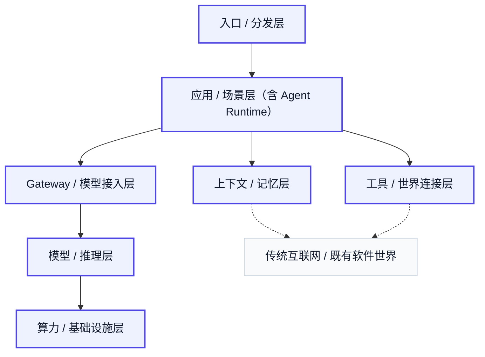

# 3. Agent 商业世界的整体层次

如果前两章解决的是“模型为什么能工作”以及“为什么它会从聊天走向任务”，那么这一章要解决的就是另一个问题：**当用户说自己在用一个 Agent 产品时，他实际买到的到底是什么？**

这并不是一个修辞问题。因为从用户视角看，一个 Agent 产品往往表现得像一个整体：它会回答，会调用工具，会读写文件，会操作浏览器，会调用模型，会记住一些上下文，也会在界面里显示得很像一个统一助手。但从商业世界看，这个“整体”并不是天然存在的。它背后实际上是一层层能力的叠加：有人拿入口，有人卖结果，有人做上下文，有人做工具连接，有人做模型接入，有人提供推理能力，有人承担底层算力与供给约束。所谓“Agent 商业世界”，本质上就是这些层开始分化、组合、专业化，并形成各自的产品、公司和估值逻辑。

因此，理解 Agent，不应该只停留在“某个产品会不会做事”，而要进一步理解：它所依赖的世界是怎样被组织起来的。对用户来说，看到的是一个 Agent；对产业来说，看到的是一条价值链。

这条价值链最上面，是入口与分发层。用户并不是在真空中遇见 Agent，而总是在某个具体入口里遇见它：聊天界面、IDE、浏览器侧边栏、办公套件、企业工作台、消息应用、智能眼镜、会议室、桌面常驻助手。这一层之所以重要，不是因为它最“智能”，而是因为它离用户最近。很多产品的真正优势，首先不在模型，而在它占住了一个用户本来就愿意交付任务的位置。谁掌握入口，谁就更容易获得任务流、上下文流和长期使用权。

入口层下面，是应用与场景层。真正让用户愿意付钱、愿意持续使用的，通常不是“一个模型”，而是一类被完成得更快、更省心的任务。Coding agent 帮开发者改代码、跑测试、维护工作区；research agent 帮用户搜集资料、整合信息、输出调研结果；meeting agent 把会议记录、行动项和后续跟进接起来；企业 workflow agent 则进一步接入客服、销售、内部审批、知识查询和组织流程。也就是说，用户买的往往不是模型能力本身，而是**任务结果**。这一点非常关键，因为它决定了商业世界最先被看见的地方，不是底层协议，也不是推理引擎，而是具体的产品形态。

但只理解应用层还不够。因为一个 Agent 产品之所以能持续工作，往往并不是因为它只是“套了一层 UI”，而是因为它内部吃进了很重的任务系统能力。这一层在很多产品里未必单独露出来，但它真实存在。它负责把目标变成步骤，把步骤变成状态，把状态变成可以回退、可以重试、可以继续推进的任务链。它要处理多步执行、回合控制、失败恢复、中间结果管理、人类接管和执行环境。现实里，应用层和这一层经常耦合得很深：很多强应用之所以成立，恰恰是因为它们内部已经吃进了大量 runtime 能力。所以理解 Agent 商业世界时，很容易看到一个重要现象：表面上是在卖应用，实际上很多产品肚子里装着半个运行时系统。

再往下，就是上下文与记忆层。对 Agent 来说，能力强不强只是问题的一部分，另一部分同样关键的问题是：**它在每一步到底能看到什么？** 这一层包括 RAG、memory、session state、context engineering、长期状态保存和状态压缩。它并不等于“AI 真的像人一样记住了世界”，更准确地说，它是在决定哪些信息会被带到当前回合，哪些历史会被调出来，哪些状态会被保留，哪些上下文会被丢掉。2025 到 2026 年很多看起来很新的概念，本质上都在争这个位置。因为谁控制了上下文入口，谁就更接近控制 Agent 的视野。

接下来是工具与世界连接层。这一层的意义很直接：它决定 Agent 能不能真正碰到外部世界。搜索、浏览器、代码执行、数据库、文件系统、SaaS 接口、企业 API、支付、办公平台、金融接口、CLI、skill、MCP、A2A，这些都可以被放在这一层看待。大模型本身提供的是认知能力，工具层提供的则是进入现实系统的通行权。一个不接外部世界的 Agent，仍然只是相对封闭的系统；一旦它接上这些接口，它才开始真正进入任务。也正因为如此，这一层并不是配角，而是价值兑现层。它让模型不只“会说”，而是开始“会做”。

再下一层，是 Gateway 与模型接入层。这一层的重要性，是在多模型时代才真正显现出来的。今天很多应用团队并不是直接连某一家模型厂，而是先连一层中间商：负责多模型统一接入、路由、fallback、缓存、预算控制、统一 billing、统一 tracing 与日志。这一层自己不一定训练最强模型，但它会拿走一层关键价值，因为它开始决定：上层产品怎么选模型、何时切模型、如何控制成本、如何在多家 provider 之间保持弹性。在 Agent 商业世界里，这类“模型中间商”之所以成立，正是因为模型供给已经足够丰富，而应用侧又不愿意把自己的命运绑死在单一供应商上。

继续往下看，就进入模型与推理层。这里提供的是能力边界、速度边界和价格表。不同模型在推理能力、代码能力、长上下文、多模态、工具调用、稳定性、速度和价格上的差异，会直接决定上层产品的形态。也正因为如此，模型层并不是一个抽象背景，而是商业世界里非常具体的一层：它决定用户最终看到的智能上限，也决定企业最终要承担的调用成本。模型厂卖的是能力源头，推理厂卖的是把能力跑起来、跑得稳、跑得便宜，而上层应用则不断在这之上做重新封装。

最底下，是算力与基础设施层。GPU、TPU、推理集群、部署、资源调度、网络互联和容量供给都在这里。这一层在整场分享里不需要展开成机房课程，但必须让听众知道：Agent 世界不是飘在空中的。它下面有非常重的基础设施约束，而这些约束会不断向上传导，变成价格、速度、供给、排队、缓存策略和产品设计问题。换句话说，上层商业模式看起来在卖软件，底下却始终被硬件和推理成本往回牵引。

如果把这些层放在一起看，就会发现一个很重要的事实：很多看起来都属于“AI Agent 行业”的公司，其实站在完全不同的位置。有的争的是用户入口，有的争的是场景结果，有的争的是上下文，有的争的是世界接口，有的争的是模型控制面，有的争的是推理供给。它们未必在同一层竞争，也未必用同一种方式赚钱。真正理解 Agent 商业世界，不只是认识几个热门名字，而是知道这些名字长在哪一层、依赖谁、向谁收费、为什么会在那个位置上成立。

这里还需要补充两个图外因素。第一，交付与集成并不适合被画成 stack 里的一块方块。它更像一种穿透多层的现实力量。很多 Agent 商业化并不是产品一上线就自然成立，而是要把多层能力一起接进具体组织、具体流程、具体数据和具体系统里。第二，传统互联网与既有软件世界也不应该被误看成已经消失的旧背景。相反，Agent 世界之所以能长出来，恰恰是因为它站在旧网页、旧 SaaS、旧数据库、旧 API、旧办公系统和旧工作流之上。很多看起来全新的能力，并不是凭空创造了一个新世界，而是在旧世界之上重新加了一层调用、组织与包装方式。

因此，这一章想建立的最终判断是：**Agent 商业世界不是一个点，而是一条层层相扣、不断重组的价值链。** 用户看到的是一个会做事的 Agent，但产业真正发生变化的地方，是这些层开始被重新分工、重新估值、重新组合。后面几章要讲的入口、应用、工具、记忆、模型、推理与基础设施，并不是一堆并列名词，而是这条链上不同位置的具体展开。

## 本章事实核查引用

- 模型价格、缓存输入、输出价格差异用于支撑“模型 / 推理层向上输出价格、速度和成本结构”的判断：OpenAI, [API Pricing](https://openai.com/api/pricing/).
- Gateway / 模型接入层的现实玩家示例：OpenRouter, [Models](https://openrouter.ai/models); Portkey, [Series A funding](https://portkey.ai/blog/series-a-funding); BerriAI GitHub, [LiteLLM](https://github.com/BerriAI/litellm); Cloudflare Docs, [AI Gateway](https://developers.cloudflare.com/ai-gateway/).
- 工具与世界连接层的协议和接口依据：Anthropic, [Model Context Protocol](https://www.anthropic.com/news/model-context-protocol); Google Developers Blog, [Agent2Agent protocol](https://developers.googleblog.com/en/a2a-a-new-era-of-agent-interoperability/).
- 算力基础设施例子：NVIDIA, [GB200 NVL72](https://www.nvidia.com/en-us/data-center/gb200-nvl72/); Google Cloud, [TPU v5p documentation](https://docs.cloud.google.com/tpu/docs/v5p); xAI, [Colossus](https://x.ai/colossus/).

---

## 图片生成 Prompts

先继承这份全局风格控制文档中的所有要求：  
[agent_business_world_slide_image_style.md](/Users/timzhong/msc202604/agent_business_world_slide_image_style.md)

### 图 3.1 用户买到的到底是什么

在此基础上，为这一部分生成一张横版 slide like image，风格优先做成 **executive product strategy dashboard**。主题是：**用户看到的是一个 Agent，背后买到的是多层能力的叠加**。画面上方是一个统一的 Agent 产品界面，下方逐层展开成 stacked capability cards，显示 entry, apps, memory, tools, gateway, models, compute。整体像一张高级战略分析页，不是纯信息图，重点是“一个整体产品背后有很多层”。

### 图 3.2 Agent 商业世界的主分层

在此基础上，为这一部分生成一张横版 slide like image，风格优先做成 **clean layered systems map**。主题是：**Agent 商业世界是一条价值链，不是一项单点技术**。画面按层排列：entry / distribution, applications, context / memory, tools / world access, gateway / model access, model / inference, compute / infrastructure。要求层级清楚，颜色统一，连接关系简洁明确，像一张高质量软件产业地图。

### 图 3.3 应用层与内部 runtime 的耦合

在此基础上，为这一部分生成一张横版 slide like image，风格优先做成 **product architecture cutaway view**。主题是：**很多强应用表面上在卖结果，内部却吃进了很重的 runtime 能力**。画面像一个产品剖面图：上层是 coding agent / research agent / meeting agent 这类应用界面，下层是 task state, orchestration, tool coordination, execution environment 这些内部模块。重点表现“外面是应用，里面是系统”。

### 图 3.4 图外背景：旧互联网与既有软件世界

在此基础上，为这一部分生成一张横版 slide like image，风格优先做成 **ecosystem dependency canvas**。主题是：**Agent 世界站在旧互联网和旧软件系统之上重新组织能力**。画面下层是 webpages, SaaS, APIs, enterprise systems, databases, office software 这类传统数字世界模块，上层覆盖新的 Agent layers，表现为“不是替代旧世界，而是在旧世界上加了一层组织方式”。整体像真实生态图谱页面。

### 图 3.5 从这一章过渡到后续章节

在此基础上，为这一部分生成一张横版 slide like image，风格优先做成 **narrative transition slide image**。主题是：**后面每一章，都是这条价值链某一层的具体展开**。画面中央是一条清晰的 Agent value chain，沿线高亮后续将分别展开的几层：entry, applications, context, tools, gateway, model, compute。整体像一张章节导航图，但仍然保持真实产品战略界面的质感，而不是普通目录页。
