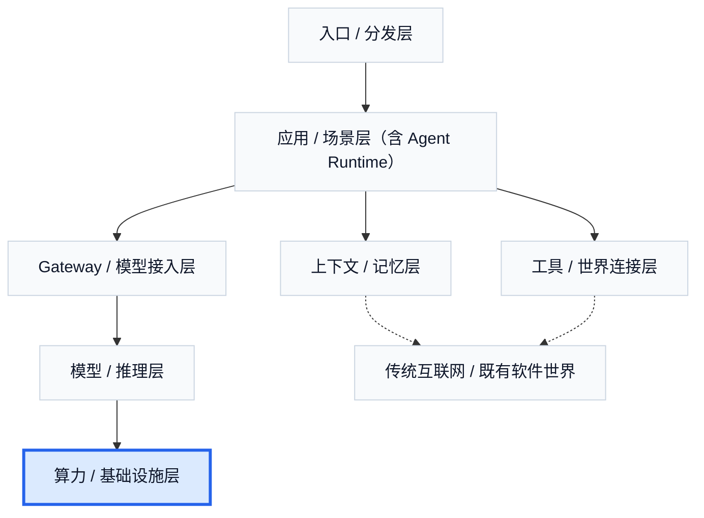

# 4. 算力 / 基础设施层：底层重量如何向上传导

在 Agent 商业世界里，算力与基础设施层离用户最远，却持续决定着整个系统的速度、价格和供给。用户在上面看到的是产品、任务和结果，底下实际发生的却是另一套完全不同的现实：卡、网络、机柜、调度、利用率、排队、功耗和成本。**底座不是无限的，而底座的重量会不断向上传导。** 模型能力、推理速度、上下文长度、调用价格，看起来像产品属性，实际上背后都站着真实的算力、网络、机房和供给约束。

因此，算力层最重要的不是器件细节，而是三件事。第一，底座不是无限的。没有任何一个产品可以脱离底层供给独立存在。上下文窗口越长，推理越贵；吞吐越高，资源越重；延迟越低，调度越难。第二，成本会沿价值链往上传。应用层卖的是结果，但毛利会被模型调用成本、推理成本和基础设施成本不断牵引。第三，供给约束会塑造产品形态。如果底层算力昂贵、稀缺或不稳定，上层就更容易长出短链路产品、更强缓存、模型路由、便宜模型与贵模型混用，以及 seat、credit、usage 混合定价。

这也是为什么应用层看上去很会讲“效率革命”，但毛利并不天然漂亮。一个非常简化的商业公式是：应用层毛利等于用户付费减去模型调用成本、工具执行成本和交付成本。而模型调用成本进一步往下拆，又大致可以分成能源成本、计算卡折旧、机房与网络均摊、运维与调度成本、缓存与利用率损耗，以及供应商毛利。对大多数上层公司来说，看到的也许只是 API 价格表，但价格表背后永远站着这整套底层成本结构。

如果从推理系统内部看，这一层还有一个很重要的工程现实：输入阶段和输出阶段并不是同一种负载。前一章讲过，prefill 更偏计算密集，decode 更偏访存密集。这正是为什么行业里会出现 PD 分离：把 prefill 和 decode 放到不同 worker 池，匹配不同卡、不同资源画像和不同调度策略。**Prefill 要“算得猛”，Decode 要“装得下、喂得动”。** 一旦进入这套体系，问题就不再只是“有没有卡”，而是“有没有足够匹配的卡、网络和调度能力”。

网络在这里也不是配角。机柜内互联负责把 GPU 绑成高带宽、低延迟的近场域，机柜间网络则负责把多个 rack 继续拼成更大集群。尤其在 PD 分离场景下，网络还要承担 prefill 池和 decode 池之间的状态和 KV 传递。也就是说，底层不只是算力问题，而是算力、网络和调度的联合问题。

NVIDIA CUDA / GPU 和 Google TPU 是这层最典型的两条路线。GPU 更通用，生态更成熟，适合快速迭代和广泛部署；TPU 更专用，在 hyperscale 训练和推理里经常有更高的效率表现。底层技术路线会通过价格、速度和供给约束，反过来塑造上层产品的形态。

今天的推理已经不是一张卡的问题，而是整个机柜甚至整个集群的问题。以 NVIDIA GB200 NVL72 为例，一个机柜就是 72 块 GPU、13.4 TB HBM3e、576 TB/s HBM 带宽和 130 TB/s NVLink 带宽；Google TPU v5p 的一个 cube 则是 64 chips、约 29.4 PFLOPS BF16 和约 6.1 TB HBM。再往上看，Google Cloud TPU v5p 的一个 full pod 是 8960 chips，最大的单 slice 可达 6144 chips；xAI 在 2026 年公开页面上则直接把 Colossus 写成 200,000 GPUs、194 PB/s 总内存带宽、超过 1 EB 存储容量，并给出了通向 100 万 GPU 的路线图。上层产品的设计空间并不是凭空给定的，而是被这些机柜级、pod 级和数据中心级的现实能力边界持续约束。

算力与基础设施层虽然离用户最远，却始终在决定 Agent 商业世界里最现实的东西：速度、价格、供给和利润空间。上层产品看起来在做创新，实际上也一直在和底层成本结构博弈。谁能更好地吸收、转嫁或压缩这部分成本，谁的商业模式就更容易成立。

## 本章事实核查引用

- NVIDIA GB200 NVL72 的 `72 Blackwell GPUs`、`13.4 TB HBM3e`、`576 TB/s HBM bandwidth`、`130 TB/s NVLink` 等规格：NVIDIA, [GB200 NVL72](https://www.nvidia.com/en-us/data-center/gb200-nvl72/).
- Google Cloud TPU v5p 的 `64 chips` cube、`8960 chips` pod、最大 `6144 chips` single slice 等规格：Google Cloud, [TPU v5p documentation](https://docs.cloud.google.com/tpu/docs/v5p).
- xAI Colossus 的 `200k GPUs`、`194 PB/s` total memory bandwidth、`>1 EB` storage capacity 和扩展路线：xAI, [Colossus](https://x.ai/colossus/); NVIDIA Newsroom, [xAI Colossus and Spectrum-X](https://nvidianews.nvidia.com/news/spectrum-x-ethernet-networking-xai-colossus).
- `prefill / decode` 负载差异、成本可观测和缓存策略的工程背景：OpenAI, [API Pricing](https://openai.com/api/pricing/); Portkey, [AI cost observability](https://portkey.ai/blog/ai-cost-observability-a-practical-guide-to-understanding-and-managing-llm-spend/).

---

## 图片生成 Prompts

先继承这份全局风格控制文档中的所有要求：  
[agent_business_world_slide_image_style.md](/Users/timzhong/msc202604/agent_business_world_slide_image_style.md)

### 图 6.1 底层重量如何向上传导

在此基础上，为这一部分生成一张横版 slide like image，风格优先做成 **stacked cost transmission dashboard**。主题是：**底层算力、网络和机房成本不断向上传导到模型、应用和价格**。画面底层是 compute / network / datacenter，向上连接 inference, models, apps, pricing。整体像高端经济结构图。

### 图 6.2 应用层毛利公式

在此基础上，为这一部分生成一张横版 slide like image，风格优先做成 **AI product economics interface**。主题是：**应用层毛利背后站着模型调用、执行和基础设施成本**。画面中央是一条简洁公式和几块成本卡片，结构清楚，像真实企业分析 dashboard。

### 图 6.3 Prefill 与 Decode 的不同负载

在此基础上，为这一部分生成一张横版 slide like image，风格优先做成 **inference system operations dashboard**。主题是：**Prefill 更偏算力，Decode 更偏访存**。画面左侧是 prefill compute-heavy block，右侧是 decode memory-heavy block，中间有 queue, cache, KV movement indicators。

### 图 6.4 GPU 与 TPU 的路线差异

在此基础上，为这一部分生成一张横版 slide like image，风格优先做成 **hardware strategy comparison UI**。主题是：**GPU 赢在灵活与生态，TPU 赢在专用与 hyperscale 效率**。左右对照显示 two compute ecosystems with short labels for flexibility, ecosystem, specialization, efficiency。整体像高端基础设施产品页。
