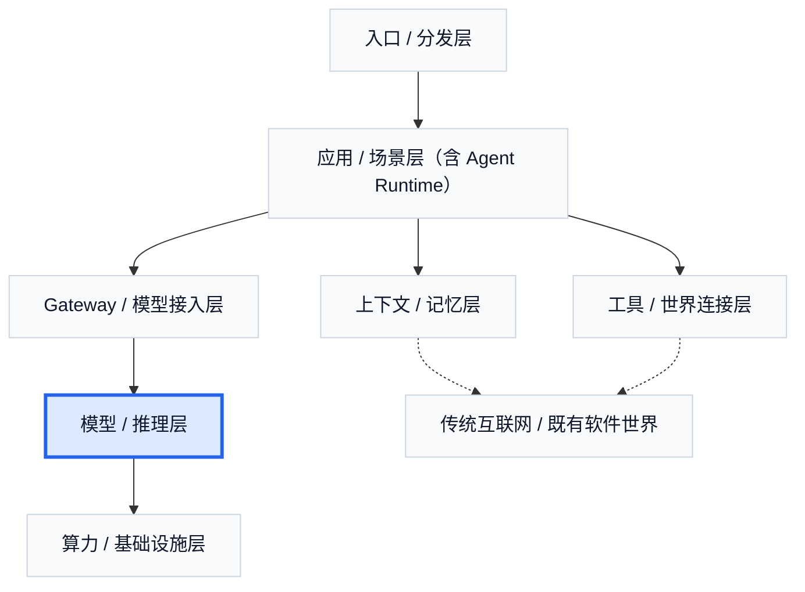

# 5. 模型 / 推理层：能力边界、价格表与产品形态

如果前面一章讲的是最底层的算力重量，那么这一章讲的就是：这些重量如何被进一步加工成“可被上层购买的能力”。在 Agent 商业世界里，模型与推理层向上提供的，并不是一个抽象的“智能黑箱”，而是一整包可以被产品直接感知的边界：能力强弱、上下文长度、推理速度、稳定性、工具调用支持、多模态能力，以及 input、output、cached input 分别如何定价。

当应用层在卖结果时，它到底在向下买什么？答案通常不是“一次模型调用”这么简单，而是一整套能力包。这个能力包决定系统能不能处理长上下文，能不能稳定做 tool use，能不能做复杂 reasoning，首 token 快不快，每秒 token 稳不稳，结构化输出好不好用，以及成本最终会以什么方式暴露给上层产品。

这也是为什么模型层决定能力边界，而推理层决定体验边界。模型厂决定很多上限：复杂推理是否成立、代码能力是否够强、多模态是否真的可用、长上下文是否还能维持质量。推理厂则决定这些能力能不能以足够便宜、足够快、足够稳的方式被持续交付。现实里，用户最终感知到的，并不是 benchmark 本身，而是一次任务到底快不快、稳不稳、贵不贵。

价格表在这里扮演的角色也很特别。它不是单纯的商业信息，而是产品设计的一部分。不同的 input、output 和 cached input 定价结构，会直接改变上层产品怎么设计上下文、任务链路和商业模式。长上下文产品、deep research 产品、高频 copilot 产品、企业 workflow 产品，看起来都在用模型，但背后承受的成本结构并不相同。也正因为如此，模型层不是静态背景，而是在持续塑造应用层的产品形态。

从商业角色上看，这一层至少可以分成两类。第一类是模型厂。它们更像“能力制造业”，卖的不是一个界面，而是一整包可被上层反复调用、再封装、再零售的能力：推理、生成、编码、多模态理解、长上下文和 tool use。模型厂创造的，不是某个具体产品，而是一种上层可以批量复用的“智能原料”或“能力上限”。它们的成本结构也因此极重：顶级研究与系统工程人才、数据采集与后训练、训练和推理所需的巨量算力，使得模型厂更像“研究 + 制造 + 基础设施”的混合体，而不是轻资产软件公司。

第二类是推理厂。它们不一定主打自己训练最强 frontier model，而是主打把模型跑得动、跑得稳、跑得便宜、跑得可大规模交付。它们卖的是托管推理、部署能力、路由能力、成本优化、延迟与吞吐管理，或者更广义的推理控制平面。模型厂更像在“造能力”，推理厂则更像在“把能力工业化和商品化”。在今天的市场里，很多大云平台、推理云和模型云都可以被放在这条线上理解。

这一层最值得强调的一个现实是：没有一家模型会同时最强、最快、最便宜、最稳，也没有一家推理供给能覆盖所有区域、所有价格带和所有 SLA。正因如此，多模型与模型路由几乎是必然结果。小模型做高频，大模型做关键步骤；便宜模型做筛选，贵模型做难题；某家 provider 做默认，另一家做 fallback。这一层天然会继续向下长出 gateway / router / control plane，而向上则不断被应用层重新封装。

从市场叙事上看，模型厂天然很容易获得“大故事”估值，因为它们像整个价值链的能力源头。但它们也最容易面对高资本开支、价格战、能力追平和利润外溢。推理厂则没有那么强的“智能突破”光环，却可能成为成本下降和规模化交付的关键受益者。OpenAI、Anthropic、Google/DeepMind、xAI 代表的是模型能力源头；Together AI、Fireworks AI、Groq、Cerebras、SambaNova 代表的则是把模型跑得更快、更稳、更便宜的推理供给。**模型厂最像能力源头，但不一定最像利润终点；推理厂不一定最显眼，却经常在决定这份能力能不能真正变成一个稳定生意。**

中国市场也很适合放进这个框架里看。Qwen 更适合先被看成模型能力品牌，而阿里云 / 百炼是另一块推理与分发业务；Seed 与火山引擎也应当拆开看。GLM、MiniMax、Kimi、DeepSeek 更适合被理解为“模型厂兼推理厂”，因为它们既在做模型，也在直接通过 API 和开放平台把能力卖出来。在 Agent 商业世界里，很多公司并不是一个统一角色，而是分别在几层上赚钱。

这一层里最容易被忽略的，是价格表本身就是产品设计的一部分。以 OpenAI 当前公开定价为例，`GPT-5.4` 的 `input` 是每百万 token `2.50 美元`，`cached input` 是 `0.25 美元`，`output` 是 `15.00 美元`。同一个模型，输入、缓存输入和输出之间已经有数量级差异。上层产品是否重用前缀、是否走长上下文、是否做深链路研究型任务、是否把部分步骤下沉到便宜模型，都会直接响应这类价格结构。

模型 / 推理层向上输出的，不只是智能能力，还包括价格、速度、稳定性和可组合性。这些因素一起决定了上层产品到底能长成什么样，也决定了后面为什么会自然长出 gateway、runtime 和多模型策略。

## 本章事实核查引用

- OpenAI 官方价格页用于支撑 `GPT-5.4` 的 `input / cached input / output` 分开定价，以及“价格表本身影响产品设计”的判断：OpenAI, [API Pricing](https://openai.com/api/pricing/); OpenAI Developers, [GPT-5.4 model docs](https://developers.openai.com/api/docs/models/gpt-5.4/).
- OpenRouter 模型市场用于支撑“多模型、多 provider、价格和能力并存比较”的现实：OpenRouter, [Models](https://openrouter.ai/models).
- Portkey 的 LLM spend / pricing 数据用于支撑“模型价格、成本归因和企业控制面变复杂”的判断：Portkey, [LLM pricing is 100x harder than you think](https://portkey.ai/blog/llm-pricing-2/).
- 中国模型 / 推理平台的角色拆分可参考各自官方入口：阿里云百炼, [Model Studio](https://www.alibabacloud.com/help/en/model-studio/); 火山引擎, [火山方舟](https://www.volcengine.com/product/ark); DeepSeek, [API Docs](https://api-docs.deepseek.com/).

---

## 图片生成 Prompts

先继承这份全局风格控制文档中的所有要求：  
[agent_business_world_slide_image_style.md](/Users/timzhong/msc202604/agent_business_world_slide_image_style.md)

### 图 7.1 应用层到底在向下买什么

在此基础上，为这一部分生成一张横版 slide like image，风格优先做成 **AI capabilities marketplace UI**。主题是：**应用层向下购买的是一整包能力边界、速度和价格结构**。画面上方是 app cards，下方是 capability bundles with context window, speed, tool use, multimodal, pricing columns。整体像真实模型能力市场页。

### 图 7.2 模型层与推理层的分工

在此基础上，为这一部分生成一张横版 slide like image，风格优先做成 **layered provider comparison dashboard**。主题是：**模型层决定上限，推理层决定体验**。左侧显示 model capability block，右侧显示 inference delivery block，中间用 clear dependency arrows 连接。像高级产品/infra 控制台。

### 图 7.3 模型厂与推理厂

在此基础上，为这一部分生成一张横版 slide like image，风格优先做成 **business role comparison interface**。主题是：**模型厂造能力，推理厂把能力工业化**。左右对照展示 two company archetypes：model lab vs inference factory。用简洁卡片展示 talent, data, compute, API, latency, scale 这些元素。

### 图 7.4 多模型时代为什么必然长出路由

在此基础上，为这一部分生成一张横版 slide like image，风格优先做成 **multi-model routing dashboard**。主题是：**没有一家模型同时最强、最快、最便宜、最稳**。画面有多个 provider cards with different strengths and prices，上层应用通过 routing policy 选择。像真实 control plane 界面。

### 图 7.5 中国模型市场的拆分方式

在此基础上，为这一部分生成一张横版 slide like image，风格优先做成 **regional AI market map**。主题是：**模型品牌、推理平台和云平台在中国市场应该拆开理解**。页面用 category cards 展示 Qwen / GLM / MiniMax / Kimi / DeepSeek 与 阿里云 / 百炼、火山引擎等的不同位置。画面要像行业分析软件界面。
