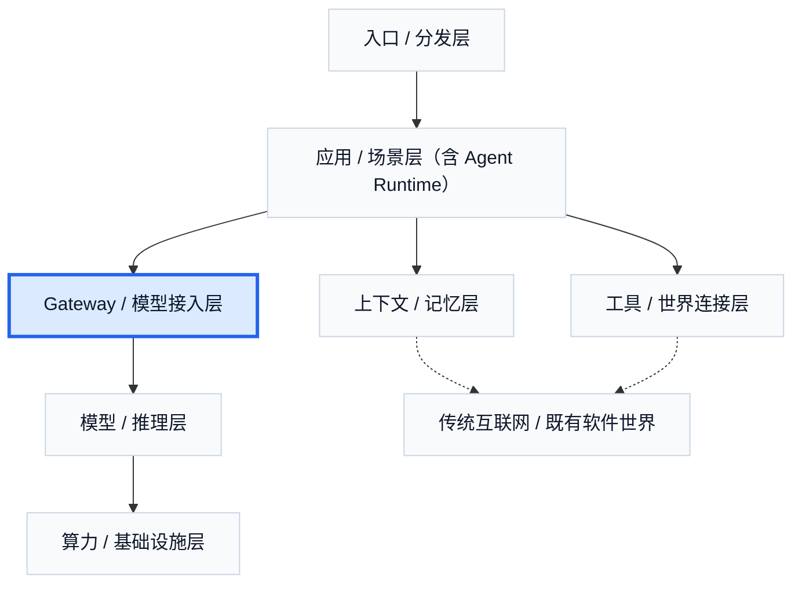

# 6. Gateway / 模型接入层：多模型时代自然长出来的中间商

当模型越来越多、推理厂越来越多、价格结构越来越复杂时，应用团队很快就会遇到一个现实问题：它们不可能自己逐个去接、逐个去控、逐个去切。也正因为如此，Gateway / 模型接入层不是一个边缘配件，而是多模型时代自然长出来的控制平面。

这一层最容易被误解成“只是转发请求”。但在现实里，它卖的远不止转发。它卖的是统一接入、统一路由、统一策略、统一观察和统一结算。它决定请求发给谁、什么时候 fallback、什么时候缓存、用哪把 key、走哪个区域、花多少钱，以及不同 provider 之间的参数和工具调用兼容如何被处理。换句话说，它重新组织的不是模型能力本身，而是模型供给的控制权。

这也是 Gateway 层最重要的三个判断。第一，它不是简单的转发层，而是模型时代的控制平面。第二，它是多模型时代的自然产物：没有一家模型或 provider 可以在所有场景上同时胜出，上层自然需要 router、BYOK、fallback、sticky routing、统一 billing 与 tracing。第三，它在重新分配三样东西：成本、控制权和可替换性。谁掌握 Gateway，谁就更有能力决定应用层最终如何消费底层模型和推理供给。

从商业模式上看，这一层大致可以分成三类。第一类是公共模型路由器，给开发者一个统一 API，背后接很多模型和 provider。第二类是企业 AI gateway，重点是策略、预算、日志、团队管理和区域控制。第三类是开源或自托管 gateway，重点在可迁移性、自控性和统一协议。它们的共同点在于：都在帮助上层减少对底层单一供应商的依赖。

这一层不创造新模型能力，也不直接创造新推理能力。它创造的是更低的切换成本、更强的弹性、更好的成本控制和更统一的开发体验。模型厂卖的是能力，推理厂卖的是把能力跑出来，而 Gateway 卖的是“今天到底用哪份能力，以及出了问题怎么切”。也正因为如此，它在整个 Agent 商业世界里有一种非常典型的“中间商价值”：未必最性感，却经常最接近真实控制面。

当然，这一层也有自己的成本。首先是兼容成本：不同模型、不同 provider 的 API、工具调用、response format、区域策略并不一致。其次是路由与状态成本：fallback、cache、provider health、sticky routing 和 BYOK 都需要持续维护。最后是企业化成本：预算、分项目计费、审计、日志、权限和 tracing 都不是“顺手就有”的功能。Gateway 看上去比模型轻，但绝不是一个很薄的 HTTP 转发层。

这一层的现实玩家非常典型。OpenRouter 代表公共模型路由器；Portkey 更偏企业 AI gateway；LiteLLM 更像开源 / 自托管 gateway；Cloudflare AI Gateway 则说明云平台会如何把这一层吃进自己的基础设施体系。Portkey 在 `2026-02` 公开披露自己已经管理超过 `1.8 亿美元` annualized LLM spend，这说明 Gateway 的价值并不是“又多了一层转发”，而是它开始控制越来越大的模型支出与路由决策。OpenRouter 则把模型厂、推理厂和云平台压成统一的 provider 市场，让价格、延迟和稳定性放在同一个入口里被直接比较。

这一层还有一个非常现实、也非常中国化的延伸问题：一旦供给存在地域限制、价格差异和分发鸿沟，它还会继续长出灰色中转市场。对中国大陆用户来说，OpenAI、Anthropic、Google Gemini 等官方支持边界本来就形成了一道门槛；再叠上 credits、促销、区域价差和漏洞窗口，就会自然长出各种小作坊中转站、代充、token 搬运和模型镜像。这些生意的本质通常不是技术创新，而是套利。它们赚的不是“造出更强模型”的钱，而是墙、价差、补贴和制度缝隙的钱。用更通俗的比喻说，它们像是 AI 世界里的“搬砖套利者”。

Gateway 不是配件，而是多模型时代的控制平面。它决定上层应用怎样连接、比较、切换和约束底层供给；而一旦供给足够复杂，它也会进一步长出价格套利、区域中转和灰色分发市场。

## 本章事实核查引用

- OpenRouter 作为公共模型路由器和 provider / pricing / latency 比较入口：OpenRouter, [Models](https://openrouter.ai/models).
- Portkey 作为企业 AI gateway / control plane 的例子，`2026-02-19` 披露 Series A，并称管理超过 `$180M` annualized LLM spend：Portkey, [Series A funding](https://portkey.ai/blog/series-a-funding). 其后续开源 gateway 公告继续披露 `1T+ tokens`、`120M+ AI requests/day`、`$180M+` annualized AI spend：Portkey, [The Gateway Grew Up](https://portkey.ai/blog/gateway-2-0).
- LiteLLM 作为开源 / 自托管 gateway 例子：BerriAI GitHub, [LiteLLM](https://github.com/BerriAI/litellm).
- Cloudflare AI Gateway 作为云平台吃进 gateway 层的例子：Cloudflare Docs, [AI Gateway](https://developers.cloudflare.com/ai-gateway/).

---

## 图片生成 Prompts

先继承这份全局风格控制文档中的所有要求：  
[agent_business_world_slide_image_style.md](/Users/timzhong/msc202604/agent_business_world_slide_image_style.md)

### 图 8.1 为什么会长出 Gateway

在此基础上，为这一部分生成一张横版 slide like image，风格优先做成 **multi-provider control plane dashboard**。主题是：**模型和 provider 太多，上层需要统一入口和统一策略**。画面上方是 apps，下方是 multiple providers，中间是 gateway layer handling route, fallback, cache, billing, tracing。整体像真实 AI infra 产品页面。

### 图 8.2 Gateway 卖的不是模型，而是控制权

在此基础上，为这一部分生成一张横版 slide like image，风格优先做成 **AI operations control center UI**。主题是：**Gateway 重新分配成本、控制权和可替换性**。画面用 clear panels 展示 policy routing, budgets, sticky routing, BYOK, provider health。看起来像企业 AI 控制台。

### 图 8.3 三类 Gateway 玩家

在此基础上，为这一部分生成一张横版 slide like image，风格优先做成 **market category dashboard**。主题是：**公共模型路由器、企业 AI gateway、开源 / 自托管 gateway**。画面三列分类，分别有对应典型界面风格，像真实 SaaS 分类页。

### 图 8.4 墙、价差与小作坊中转站

在此基础上，为这一部分生成一张横版 slide like image，风格优先做成 **cross-border pricing and routing dashboard**。主题是：**地域限制、补贴和价差会长出灰色中转市场**。画面左侧是 official providers and regional restrictions，右侧是 small relay sites and price gaps，中间有 arbitrage flow。整体要像行业分析页面，不要画成违法教程。
