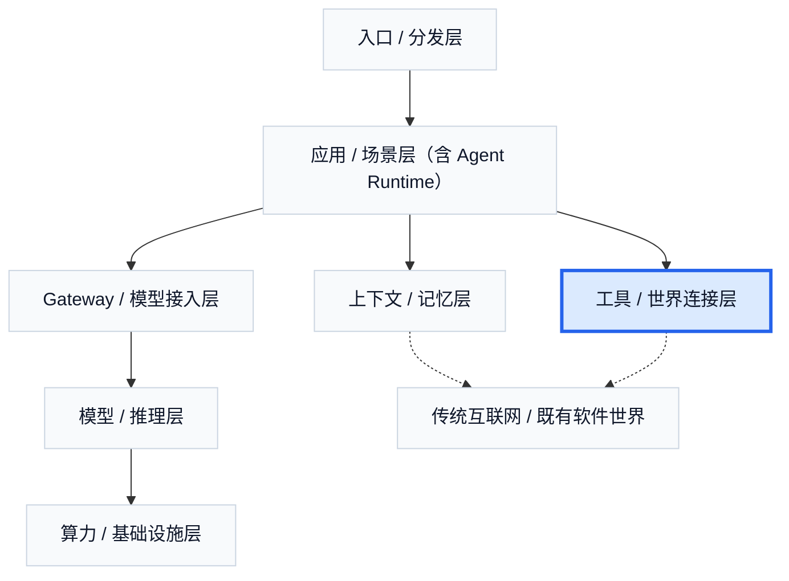

# 7. 工具 / 世界连接层：Agent 真正碰到世界的地方

如果模型层提供的是“会想、会说”的能力，那么工具 / 世界连接层提供的就是另一件完全不同的东西：**它到底能碰到什么世界。** 搜索、浏览器、文件系统、数据库、SaaS、企业 API、CLI、支付、办公平台、金融接口，看起来彼此分散，但在 Agent 商业世界里，它们共同解决的是同一个问题：一个模型如何真正进入现实任务。

这层的意义就在这里。一个不接外部世界的 Agent，仍然只是相对封闭的系统。它可以推理、总结、规划，但一旦要查外部信息、改真实数据、操作真实系统，就必须通过工具层进入现实世界。所以工具层并不是配角，而是能力兑现层。模型决定上限，工具层决定它能不能真的做事、能做多深、能做到多接近业务结果。

这也是为什么这层特别适合作为计算机学生入场 Agent 的起点。因为它最接近现实价值，又不要求先训练模型。一个人只要认真做过几个工具接入，很快就会意识到：真实难点并不在“AI 会不会回答”，而在状态、权限、参数设计、失败处理、回退、日志和结果验证。换句话说，工具层让人第一次真正碰到 Agent 的地面。

从更抽象的角度看，这条线真正的主角其实只有两个：**世界操作端点**，以及**说明书**。前者是程序或系统真实能做的事，例如查数据库、读文件、发请求、运行命令、操作浏览器；后者则是模型要想把这些事做对，所必须知道的语义说明，包括什么时候该用、参数怎么传、结果怎么读、失败怎么处理、边界在哪里。过去几年里，变化最大的并不是“要不要接工具”，而是这两个部分如何组合、如何封装、如何向模型暴露。

`system prompt + tool call` 是最直接的一种封装方式。端点本身以函数、schema 或 API 的形式暴露出来，说明书则主要放在 system prompt、tool description 和少量 examples 里。它的优势是轻量、直接、实现快，尤其适合工具数量不多、边界比较稳定的场景。它的问题也同样明确：一旦工具变多，说明书会迅速膨胀；不同产品、团队和平台通常会各写一遍；同一个端点换一个模型、换一个宿主环境，往往又得重新解释一遍。

`MCP` 更像是在处理“暴露方式不统一”这个问题。它并没有改变世界操作端点和说明书这两个本体，而是尝试把它们标准化：让资源、工具、上下文的暴露格式更一致，让模型宿主、客户端和服务端不必每次重新发明一套接口层。它的优势是跨系统复用更容易、生态连接更顺、工具暴露更标准；对应的代价则是协议、宿主和服务端之间会多一层抽象。

`动态加载 MCP` 解决的核心问题，是一个通用 agent 不可能在启动时就把全部能力都挂上。现实世界里的可用工具会随着任务、权限、环境和用户上下文变化；如果每次都把完整工具集合一股脑暴露给模型，端点太多，说明书太厚，选择成本和误用概率都会迅速上升。动态加载的价值就在这里：按需发现、按需连接、按权限挂载。它处理的不是“某个工具怎么写”，而是“通用 agent 在不同任务里应该临时挂载哪些能力”。

`skill + CLI` 处理的是同一个大问题，但走的是另一条更灵活的路。CLI 的优势在于，它天然就是一个边界清晰、可脚本化、可组合、可观测的世界操作端点，而且通常比动态加载 MCP 更容易实现、更容易调试、更容易直接接进现有系统。skill 的最大价值，则不在于多包了一层端点，而在于它可以**预加载一段短说明**，再动态加载完整 prompt、约束、经验、典型步骤、失败回退方式和可调用端点信息。这样一来，模型拿到的就不只是“这里有几个命令”，而是“遇到这类任务时，通常应该按什么方式调用这些能力”。也正因为如此，skill 更像能力预设层，而 CLI 更像灵活的执行面。

这些方案之间并不是简单的前后取代关系，而是几种长期并存的封装模式。用一个更直观的类比，它们更像功能手机和智能手机的关系：功能手机没有被“完全消灭”，因为在很多场景里，简单、稳定、低成本本身就是优势；智能手机也不是单纯取代了一切，而是把更多能力组织成了更通用的平台。`system prompt + tool call`、`MCP`、`动态加载 MCP`、`skill + CLI` 也是类似关系：有的适合小而稳的能力集合，有的适合标准化复用，有的适合通用 agent 按需挂载能力，有的适合把经验和执行面一起打包。真正稳定不变的，不是某个名字，而是底下这件事：**如何把现实世界中的操作端点和它们的说明书，以稳定、可复用、可组合的方式暴露给模型。**

这也解释了为什么不必被 `skill` 这个词本身带偏。包括 Anthropic 在内的很多公司，都很擅长用新概念去命名和推广一层产品能力；但无论名字怎么换，最后都还是要回到那两个核心部分：一是世界操作端点本身，二是让模型稳定调用这些端点的说明书。`skill` 最终值不值钱，不取决于名字是否新，而取决于它是否真的把这两部分组织得更好。

也正因为如此，很多人第一次接触 Agent 时会先去追协议名词，但更稳的路径其实正相反。作为计算机学生，首先应当具备的是写一个完整程序去和世界交互的能力，其次才是把这个程序接进 AI。真正值得做的，不是上来造一个“万能 AI 工具”，而是先写几个能稳定工作的小程序：抓网页并清洗后入库、读目录并生成结果、调用校园或实验室 API 做汇总、操作浏览器并校验回执。先把“程序如何碰到世界”做好，再把它封成 AI 可调用能力，后面的 MCP、skill、CLI 和 protocol 才会有落点。

这也引出另一个很重要的判断：不是所有程序都值得写。如果一个问题本质上更像文本分类、开放式总结、复杂抽取、语义匹配，而且复杂度已经高到更适合直接交给大模型，那么额外重造一套传统逻辑往往不值得。真正值得做的程序，通常是那些 AI 解决认知问题，而程序解决状态、流程、接口、校验、落库和回执的问题。换句话说，最值得做的，不是“AI 已经能快速做完的那部分”，而是它还不能替你负责的那部分世界交互。

从设计角度看，一个好 tool 也有非常朴素的标准。能力边界要窄，输入输出要结构化，结果要可验证，副作用要可控，语义描述要够用，失败路径要被明确设计。一个好的工具，并不是“功能强大”，而是模型不容易用错。很多真正稳定的 Agent 系统，赢的不是某个模型更聪明，而是它下面那一层工具被设计得足够干净、足够可验证、足够可回退。

这一层的商业内容也很现实。很多公司并不靠训练模型赚钱，而是靠卡住现实世界入口赚钱。支付、金融数据、浏览器、办公 SaaS、企业内部系统，只要其中某一个接口足够高频、足够刚需、足够难替换，就可能被估成一层很值钱的入口控制权。Stripe、PayPal、Plaid、Lark、Alipay、GitHub、Browserbase，这些名字有些不是纯 AI 公司，但它们一旦把自己的能力封成 agent-friendly interface，就会立刻变成工具连接层的重要玩家。谁拿到了 AI 进入现实世界时必须经过的那道口子，谁就更容易形成接口税、usage-based 收费或平台型估值。

这也是为什么浏览器基础设施、computer use 平台、connector 平台和支付世界接口在 Agent 时代会被重新抬升。它们卖的不是模型，而是“让 AI 可靠地进入某个现实世界”。很多看起来不像 AI 公司的公司，在这一层反而拥有比纯 AI 创业公司更厚的护城河，因为它们本来就掌握着那个世界的接口权。

这一层的估值逻辑，和模型厂、应用层都不太一样。市场通常不是按“模型有多强”给它估值，而是按它控制了哪个现实世界入口、这个入口有多高频、是否足够刚需、是否足够难替换来定价。支付接口、金融数据接口、浏览器执行接口、办公 SaaS 接口、企业内部系统接口，只要其中某一个已经成为 Agent 进入现实世界时必须经过的口子，它就有机会被看成一层新的基础设施税。一个 MCP server 本身未必值钱，但一个 connector platform、browser infrastructure platform 或 payment interface layer 就完全不同，因为前者只是单点功能，后者是在卡住持续调用和持续流量。

几家真实公司的信号很能说明这种定价方式。`Browserbase` 在 `2025-06` 的 Series B 后，公开资料普遍指向约 `3 亿美元估值`；这个数字本身并不夸张，但它背后对应的想象力非常明确：谁如果能把浏览器执行环境、身份、会话、回放、观测这些能力做成默认底座，谁就可能吃到 computer use 时代的 usage-based 基础设施收入。`Portkey` 在 `2026-02` 披露已管理约 `1.8 亿美元 annualized LLM spend`，官方没有公开估值，但这类公司的估值思路也很清楚：它们不一定直接控制模型，却控制了模型调用如何被路由、审计、限额和计费。`Plaid` 在 `2026-02` 的员工股份交易中对应估值约 `80 亿美元`，它不是纯 AI 公司，却非常适合说明一件事：一旦一家公司握住了金融数据入口，市场给的并不是“接口软件”估值，而是“现实世界入口控制权”估值。

毛利结构在这一层也很有特点。如果一家公司的产品更像协议、控制平面、connector 平台或抽象层，它的毛利通常更接近软件公司，因为它卖的是编排、管理、审计和工作流位置；如果它更像 browser infrastructure、computer use substrate、实时执行平台，毛利就会明显受到云资源、执行环境、存储、带宽和会话时长影响。也就是说，这层最好的业务并不是“每次都亲自把动作做完”，而是尽量把自己放在持续调用的控制位置上，让收入随着 Agent 使用频率增加而增长，但成本不要随着每次执行等比例膨胀。对这层公司来说，最理想的结构不是重服务，而是轻执行、重控制、重默认入口。

真正的护城河也因此非常具体。第一种护城河是**入口权与嵌入深度**：谁既掌握支付、金融数据、办公 SaaS、代码仓库、浏览器环境这类现实世界的原生接口，又已经深埋在企业流程和日常操作里，谁就天然站在更高的位置。`Stripe`、`PayPal`、`Plaid`、`Alipay` 属于支付与金融入口，`GitHub` 属于代码与协作入口，`Lark`、`Salesforce` 属于办公与企业系统入口。这类公司最强的地方，不只是“有接口”，而是接口已经长期稳定地嵌在真实流程里，权限清晰、失败可回退、调用可观测、替换成本很高。第二种护城河是**生态默认位**：如果一个平台成为很多 agent、很多团队、很多产品默认使用的连接方式，它就会从单点工具变成生态控制点。`GitHub`、`Stripe`、`LangChain / LangGraph`、`Browserbase` 都可以用来理解这种默认位：它们不一定控制全部价值，却可能成为大量上层系统默认经过的一层。第三种护城河是**数据与行为反馈**：谁更了解 Agent 在真实环境里如何调用接口、如何失败、如何回退，谁就更容易继续优化自己的产品和定价。`Browserbase`、`Portkey`、`OpenRouter`、`GitHub` 这样的公司，都更容易在“真实调用行为”上积累反馈闭环。也正因为这样，这一层既容易长出高毛利的软件公司，也容易长出看上去“不像 AI 公司”、但在 Agent 时代重新被重估的老牌接口公司。

工具 / 世界连接层决定 Agent 能不能从“会说”变成“会做”。它既是最接近现实价值的一层，也是最接近真实系统摩擦的一层。模型负责认知，程序负责世界交互；两者拼在一起，才像一个真正落地的 Agent 系统。

## 本章事实核查引用

- MCP 用于支撑“世界操作端点和说明书的标准化暴露”：Anthropic, [Model Context Protocol](https://www.anthropic.com/news/model-context-protocol).
- A2A 用于支撑 agent / 工具 / 服务之间互操作趋势：Google Developers Blog, [Agent2Agent protocol](https://developers.googleblog.com/en/a2a-a-new-era-of-agent-interoperability/).
- Browserbase `2025-06-18` 宣布 `$40M` Series B，用于支撑浏览器执行基础设施赛道；估值约 `$300M` 的说法来自二级市场 / 研究资料，公开官方文未披露估值：Browserbase, [Building the future of web automation](https://www.browserbase.com/blog/series-b-and-beyond); Contrary Research, [Browserbase company profile](https://research.contrary.com/company/browserbase).
- Portkey `2026-02` 披露管理超过 `$180M` annualized LLM spend，用于支撑 gateway / control plane 作为真实调用控制点：Portkey, [Series A funding](https://portkey.ai/blog/series-a-funding).
- Plaid `2026-02` 员工股份交易 / liquidity round 对应约 `$8B` 估值，用于支撑金融数据入口价值：TechCrunch, [Plaid valued at $8B in employee share sale](https://techcrunch.com/2026/02/26/plaid-valued-at-8b-in-employee-share-sale/).
- Stripe / Plaid / GitHub / Salesforce 等接口平台的官方开发者入口：Stripe, [Developers](https://docs.stripe.com/); Plaid, [Docs](https://plaid.com/docs/); GitHub, [Docs](https://docs.github.com/); Salesforce, [Agentforce](https://www.salesforce.com/agentforce/).

---

## 图片生成 Prompts

先继承这份全局风格控制文档中的所有要求：  
[agent_business_world_slide_image_style.md](/Users/timzhong/msc202604/agent_business_world_slide_image_style.md)

### 图 9.1 Agent 真正碰到世界的地方

在此基础上，为这一部分生成一张横版 slide like image，风格优先做成 **world access systems dashboard**。主题是：**Agent 真正碰到世界时，看到的是一组可调用端点，而不是抽象能力名词**。画面中间是一个 clean agent core panel，周围环绕 file system, browser, database, enterprise SaaS, payment, API, shell, office suite, knowledge base 等模块，每个模块都像真实产品架构卡片，并明确标出 action-oriented labels，例如 read file, query records, open browser, send payment, run command。整体像一张高质量系统总览页。

### 图 9.2 工具接入的发展史

在此基础上，为这一部分生成一张横版 slide like image，风格优先做成 **conceptual systems comparison slide**。主题是：**工具接入的本质，是如何组织“世界操作端点”和“说明书”这两个部分，并把它们暴露给模型**。不要画成时间线，不要画成前后替代关系。画面分成四列比较卡片：system prompt + tool call、MCP、dynamic MCP、skill + CLI。每一列都用同样的结构展示三层：top 是 world endpoints，middle 是 description / prompt / semantic contract，bottom 是 how model sees it。用 very short labels 标出各自组织方式，例如 loosely bound, standardized exposure, on-demand mounting, preloaded description + flexible execution。整体像高质量产品架构比较页，而不是历史路线图。

### 图 9.3 endpoint 与 semantic contract

在此基础上，为这一部分生成一张横版 slide like image，风格优先做成 **technical teaching interface**。主题是：**一个工具由两部分组成：世界操作端点，以及让模型稳定调用它的说明书**。画面左右分栏：左侧是 endpoint schema panel，包含 action name, params, return types, side effects；右侧是 semantic contract panel，包含 when to use, when not to use, fallback, examples, boundary notes；中间是一条 model invocation flow，明确显示 model reads description -> chooses endpoint -> fills arguments -> executes -> receives structured result。整体是清晰、教学化、解释性很强的技术图。

### 图 9.4 什么是好的 tool

在此基础上，为这一部分生成一张横版 slide like image，风格优先做成 **tool quality rubric dashboard**。主题是：**好的 tool 不是功能堆得多，而是端点清楚、说明书清楚、模型不容易用错**。画面像一个 product quality scorecard，包含 narrow scope、structured I/O、clear semantic contract、clear errors、dry run / preview、observable outputs 六张卡片，整体像高质量产品评审页。

### 图 9.5 现实世界入口为什么值钱

在此基础上，为这一部分生成一张横版 slide like image，风格优先做成 **interface economy market map**。主题是：**支付、金融、浏览器、办公 SaaS 这些现实世界入口，在 Agent 时代会被重新估值**。画面分成四个大板块：payment interface、financial data interface、browser execution infrastructure、office SaaS interface。每个板块都像真实产品卡片，板块上可以用很短的示意标签写出 Stripe, Plaid, Browserbase, Lark, Alipay, GitHub。右侧增加一个小面板，标题是 valuation signals，列出少量真实信号：Browserbase ~ $300M valuation, Portkey managing $180M annualized LLM spend, Plaid ~ $8B valuation。整体像高端市场地图加估值注释页。

### 图 9.6 毛利结构与护城河

在此基础上，为这一部分生成一张横版 slide like image，风格优先做成 **business analysis dashboard**。主题是：**工具 / 世界连接层的公司，估值取决于入口控制权、毛利结构和护城河深度**。画面分成三个清晰区域。左侧是 gross margin structure，对比 control plane / connector platform 与 browser infrastructure / execution platform，两列卡片分别写 software-like margin profile 和 resource-heavy margin profile。中间是 moat panel，列出 three moats，并在每个 moat 下配 very short example labels：entry control + deep embedding with Stripe, Plaid, Alipay, GitHub, Lark, Salesforce; default ecosystem position with GitHub, Browserbase, LangGraph, Stripe; usage feedback loop with Browserbase, Portkey, OpenRouter, GitHub。右侧是 pricing logic panel，写 interface tax, usage-based revenue, platform multiple, replacement difficulty。整体要像顶级投行或高端 SaaS 战略分析 slide，信息密度高，但版式清楚，文字短、可读性强。
