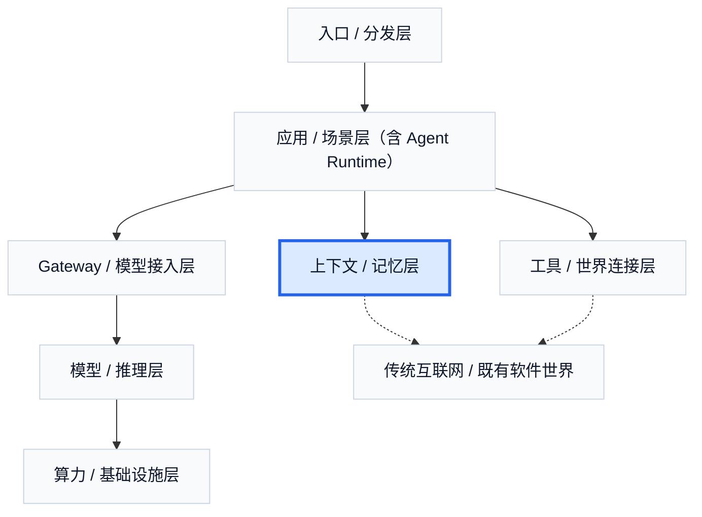

# 8. 上下文 / 记忆层：Agent 每一步到底能看到什么

先看这层最经典的一部分：RAG。它最先解决的问题不是“让模型更聪明”，而是**外部知识太长、太散、太新，不能整段原样塞进上下文**；因此第一步通常是分块，把长文档、网页、知识库记录切成更小、可索引、可复用的片段。第二步通常是 embedding：把这些片段和当前查询都映射到同一个向量空间里，这样系统就不必只靠关键词匹配，而能先按语义相近做一轮召回；常见方案的差别，主要在切块策略、向量模型、索引结构，以及是偏关键词检索、偏向量检索，还是两者混合。第三步是检索：先用便宜的粗排从大库里召回一小批候选，再用更贵的精排或 reranker 把真正最相关的片段排到前面，最后再交给模型阅读、压缩和生成。

如果模型层决定能力上限，工具层决定它能不能碰到世界，那么上下文 / 记忆层决定的就是：**Agent 在每一步到底能看到什么、记住什么、调回什么。** 很多 agent 看起来像“会思考”，但它真正能做对事情，很大程度上取决于它眼前拿到了哪些信息，过去保留了哪些状态，以及需要时又能从哪里把这些东西找回来。

因此，这一层最容易被误解，也最容易被包装。它常常被说成“AI 终于有记忆了”，但更准确的表达是：它在解决参数外知识如何接进来、会话外状态如何留住、长任务上下文如何压缩，以及历史信息何时被重新取回。它不是在创造人格，而是在创造连续性。

如果把这层再拆开看，最典型的两半是 RAG 和 Memory。RAG 解决的是参数外知识接入，也就是给模型外挂一个知识定位系统。它的底层并不神秘：搜索、索引、向量检索、重排、切片、压缩，这些技术很多早就存在。新的地方在于，它们现在开始服务生成模型和长任务系统。Memory 则解决另一件事：跨轮次保留对任务有价值的状态，例如偏好、历史、工作中间状态、长期上下文和个体画像。它听上去很新，但底下也还是摘要、标签、实体抽取、向量检索、策略过滤和重排这些成熟技术的重新组合。

也正因为如此，这一层最重要的判断之一是：它并不是新问题，而是在新范式下重新组织旧技术。RAG、memory、context engineering、profile、session state、long-term memory，这些名字不完全相同，但争的都是同一个位置：哪些信息会被保留，怎么保留，什么时候被调出来，以及调出来之后会不会污染当前任务。

从商业上看，这一层卖的不是模型能力本身，而是给模型“补眼睛”、给任务“补短期记忆”、给用户“补长期连续性”。企业知识接入、enterprise RAG、knowledge assistant、memory layer、personal memory、context engineering，这些方向表面不同，本质上都在争“信息进入 Agent 的那一层组织权”。谁能控制企业知识入口，谁能控制个人长期上下文，谁就更接近控制 Agent 的视野。

这也是为什么这一层很容易被高估。一方面，它直接关系到产品体验里的连续性、新鲜度和个性化；另一方面，它非常容易被包装成“更像人”的叙事。但真正值钱的，不是“叫 memory”，而是能不能稳定地把新鲜信息、历史状态、个体偏好和当前任务组织进同一套体验里。

如果只接一点聊天记录，这层还像“助手记忆”；但一旦它开始接入连续现实数据流，它的性质就会改变。把会议室 24 小时录音接进 memory，它会从记录工具变成组织语音记忆层；把桌面截图和文件操作历史接进 memory，它会从聊天上下文变成个人工作记忆层；把可穿戴健康数据接进去，它会开始形成身体上下文；把大规模监控流、行为流甚至脑机接口接进去，它的性质就更不再是“记忆”，而更像观察基础设施、定位基础设施和行为建模基础设施。

这也是为什么这一层应当和入口层、Personal AI 一起理解。入口层负责采集，记忆层负责存和调，Personal AI 则把这两件事做成一个持续可托付的系统。没有入口层，memory 没有稳定来源；没有记忆层，personal AI 很容易退化成一次次失忆的聊天产品；没有 personal AI 这种产品形态，入口和记忆又很难在个人侧形成真正可感知的价值。

从产业格局看，这一层最典型的三个方向是：企业知识 / enterprise search / enterprise RAG，personal memory / personal context，以及 memory layer / context layer。Glean 代表企业知识入口；Perplexity 代表“检索 + 推理 + 上下文组织”被产品化后的市场想象力；Rewind 代表 personal memory；Mem0 则代表另一条更工程化的路线：把长期状态管理从“聊天产品里的附属 feature”，做成独立的 memory pipeline。真实市场已经开始按这层的重要性定价：Glean 在 `2025-06` 的估值约为 `72 亿美元`，Perplexity 在 `2025-09` 的报道估值约为 `200 亿美元`。对 Mem0 这类系统来说，真正要解决的问题不是“让 AI 更会记”，而是怎样把原始交互压缩成少量值得保留的状态，再在以后低成本、低延迟地取回来。它所使用的技术也并不神秘：记忆抽取、去重与归并、实体识别与实体链接、多信号检索、可选的图结构，以及选择性注入上下文。2026 年以来，这个方向开始越来越像一个独立工程子领域，而不只是 RAG 的附属变体。

上下文 / 记忆层最重要的，不是让 AI 看起来更像人，而是决定一个 Agent 会不会在长任务里持续失忆。它既是很多热门概念争夺的位置，也是整个 Agent 世界里最容易从“助手附属功能”长成“长期观察和上下文基础设施”的一层。

## 本章事实核查引用

- Glean 代表企业知识入口，`2025-06` 报道估值约 `$7.2B`：TechCrunch, [Enterprise AI startup Glean lands a $7.2B valuation](https://techcrunch.com/2025/06/10/enterprise-ai-startup-glean-lands-a-7-2b-valuation/).
- Perplexity 代表“检索 + 推理 + 上下文组织”的产品化，`2025-09` 报道估值约 `$20B`：TechCrunch, [Perplexity reportedly raised $200M at $20B valuation](https://techcrunch.com/2025/09/10/perplexity-reportedly-raised-200m-at-20b-valuation/).
- Mem0 作为 memory pipeline / long-term memory layer 的工程化例子：Mem0, [Docs](https://docs.mem0.ai/); GitHub, [mem0ai/mem0](https://github.com/mem0ai/mem0).
- Rewind 作为 personal memory / personal context 例子：Rewind, [Product site](https://www.rewind.ai/).
- Codex `2026-04-16` 的 memory preview、自动继续任务和跨工具上下文，用于支撑“记忆层与入口层、Personal AI 拉动”的产品趋势：OpenAI, [Codex for (almost) everything](https://openai.com/index/codex-for-almost-everything/).

---

## 图片生成 Prompts

先继承这份全局风格控制文档中的所有要求：  
[agent_business_world_slide_image_style.md](/Users/timzhong/msc202604/agent_business_world_slide_image_style.md)

### 图 10.1 Agent 每一步到底能看到什么

在此基础上，为这一部分生成一张横版 slide like image，风格优先做成 **context visibility dashboard**。主题是：**这层决定 Agent 每一步看到什么、记住什么、调回什么**。页面中央是 current task step，周围是 active context, retrieved knowledge, remembered state, filtered history。整体像真实 AI workspace。

### 图 10.2 RAG 与 Memory 的两半结构

在此基础上，为这一部分生成一张横版 slide like image，风格优先做成 **technical comparison interface**。主题是：**RAG 解决参数外知识接入，Memory 解决跨轮次状态保存与召回**。左右对照 two systems with different flows and storage types。适合教学解释。

### 图 10.3 这层不是魔法，而是旧技术重组

在此基础上，为这一部分生成一张横版 slide like image，风格优先做成 **retrieval-and-memory systems canvas**。主题是：**搜索、索引、向量检索、摘要、重排和状态管理在新范式下重新组合**。画面像现代软件架构页，模块化清楚。

### 图 10.4 记忆层为什么会变得可怕

在此基础上，为这一部分生成一张横版 slide like image，风格优先做成 **continuous data memory map**。主题是：**一旦接上会议室、桌面、可穿戴、监控或行为流，memory 就会从助手记忆变成观察基础设施**。画面是多个 continuous data sources 流入 memory substrate，再进入 agent。保持专业克制，不做科幻恐怖风。

### 图 10.5 入口、记忆与 Personal AI 的三层关系

在此基础上，为这一部分生成一张横版 slide like image，风格优先做成 **layered personal AI systems diagram in realistic product style**。主题是：**入口负责采，记忆层负责存和调，Personal AI 负责把它做成持续托付的系统**。画面是三层 stacked relationship，像高质量产品架构页。
