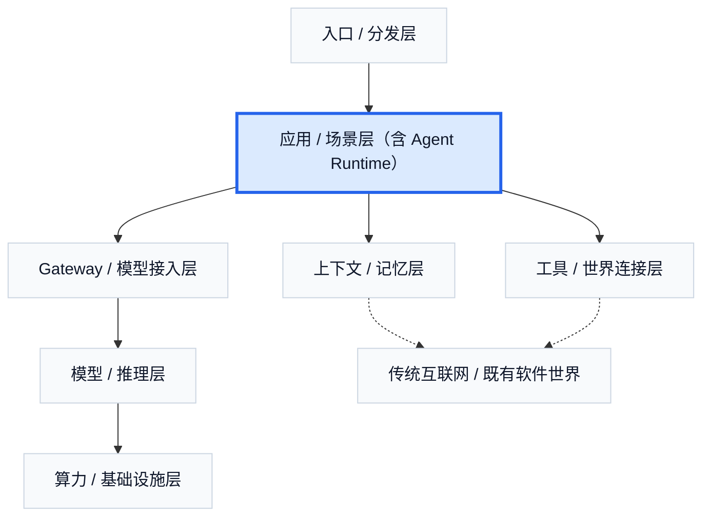

# 9. 应用 / 场景层：Agent 商业世界最先被看见的地方

如果入口层回答的是“用户在哪里遇到 Agent”，那么应用层回答的就是“用户为什么愿意持续使用它，甚至愿意为它付钱”。在现实世界里，大多数人最先接触到的并不是模型层、协议层或记忆层，而是某个非常具体的产品形态：coding agent、research agent、meeting agent、enterprise workflow agent、personal AI。也就是说，Agent 商业世界最先露出来的外壳，不是底层技术，而是可以被直接感知、被反复托付的产品。

这也是应用层最重要的作用：它把底下复杂的能力结构，翻译成一个用户愿意购买的结果。用户通常并不为“模型更强”这件事本身付钱，而是为“事情做完了”付钱。代码被改好，调研被整理好，会议被沉淀成行动项，一段内部流程被接管，客服响应更快，销售跟进更完整。这一层真正卖的不是模型，而是结果。

应用层之所以值得单独讲，还有一个原因：它和 Agent Runtime 在现实里往往耦合得很深。很多强应用并不是薄薄一层 UI，而是往下吃进了状态推进、多步执行、tool coordination、checkpoint、sandbox 与 execution environment。这意味着应用层表面上在卖结果，内部却往往装着半个 runtime，两者更接近同一个系统的不同表面。

从任务特征看，最先跑出来的 Agent 应用通常并不是最炫的，而是最容易形成闭环的。它们通常具备几个共同特点：任务边界比较清楚，数字化程度足够高，工具链已经存在，反馈可见，而且 ROI 容易被用户直接感知。也正因为如此，最先成熟的赛道并不是随机出现的，而是天然集中在那些本来就已经高度软件化的工作里。

最典型的一类是 coding agent。这条赛道之所以最容易被看见，是因为开发工作本来就发生在高度数字化环境里：代码、命令、文件、测试、错误日志、版本控制都在同一个系统中。模型一旦具备了足够强的编码能力，再叠上工作区、工具调用和执行环境，就很容易从“帮你写一段代码”走向“围绕目标完成一段功能开发”。Cursor、Claude Code、OpenAI Codex、Replit Agent 都可以被放进这一类。它们共同说明的一件事是：Coding agent 的价值，不在于生成一段漂亮代码，而在于围绕一个工程目标推进连续工作。

第二类是 research 与 information agent。这类产品把搜索、阅读、整理、比对、引用和输出整合成一个连续任务。它们特别容易成为用户最早愿意托付的一类 Agent，因为信息工作本来就是高频、耗时、重复而又高度数字化的。ChatGPT Deep Research、Perplexity Deep Research、Gemini Deep Research 都可以被看成这一类的代表。它们卖的并不是单次检索，而是把“我需要理解一个问题”这件事组织成一段更完整的研究流程。

第三类是 meeting 与 communication agent。早期产品主要做记录和总结，但这一层的真正方向并不止于此。它正在向行动项提取、后续跟进、跨平台沉淀和持续组织记忆延伸。Zoom AI Companion、Otter、Plaud 代表的不是单点总结工具，而是会议入口、环境入口和记忆层开始互相拉动的产品形态。Zoom 作为公开公司，在 FY2026 的整体毛利约为 `77%`，经营利润率约为 `23%`；会议入口一旦被平台化和软件化，商业上可以非常扎实。

第四类是 enterprise workflow agent。对企业来说，真正愿意买单的方向往往不只是“一个会聊天的助手”，而是一段被稳定接管的工作流。客服、销售、服务台、内部审批、知识查询、CRM、员工支持系统，这些都属于这一类。Sierra、Intercom Fin、Zendesk AI、Glean、Moveworks、Salesforce Agentforce 都可以被放进这一类。企业真正购买的，不是一个更会说话的机器人，而是一个能接进真实组织流程、减少人工切换和重复劳动的系统。

第五类是通用任务代理，也就是更接近 “generalist work agent” 的产品形态。它们不只解决一个垂直任务，而是围绕某个目标，试图完成一整段完整工作。Manus、Perplexity Computer、OpenAI Codex 的部分形态都可以被看成这一类。它们说明的一点很直接：Agent 应用不一定是“某个垂直工具”，也可能是一个把多种能力封成单一任务体验的系统。Manus 在 `2025-04` 的融资报道估值约为 `5 亿美元`，到 `2025` 年底相关交易报道里已经到 `20-25 亿美元`量级，这种跳升本身就说明市场在为“通用任务代理”叙事付高溢价。

第六类是 personal AI / personal agent。就商业规模而言，这类产品未必已经最大，但就传播力和想象力而言，它们极强。OpenClaw、Hermes、Lindy、Rewind 这类方向，第一次让很多普通用户直觉地感受到：AI 可以不是一次性对话产品，而是一个常驻、持续、有上下文、有记忆、可被长期托付的软件体。它们的意义不只是产品新鲜，而是让“AI 常驻在我身边”从抽象概念变成了非常可感知的体验。

从商业判断看，应用层真正的竞争，不是谁先把模型塞进产品，而是谁先把一个高频任务做成“用户愿意反复托付”的东西。也正因此，应用层公司表面上卖的是 coding、research、support、meeting、personal AI，底下依赖的却普遍是模型与推理、gateway、工具连接、上下文与记忆，以及入口层本身。它们真正的价值判断逻辑，也不只是“功能能不能做出来”，而包括：能不能占住高频任务入口，能不能形成稳定闭环，能不能降低对底层模型成本的被动暴露，以及能不能把一部分软件预算甚至人工预算收上来。

这也是为什么应用层今天的高估值，很多并不是基于已兑现净利，而是基于一种更长的预期：如果推理成本继续下降，如果用户托付持续增强，如果 AI 产品开始从软件预算走向劳动预算，那么谁先占住任务入口，谁就可能拿到极大的商业杠杆。具体数字已经很夸张：Cursor 在 `2025-11` 融资后估值约 `293 亿美元`，`2026-03` 年化收入据报道超过 `20 亿美元`，`2026-04` 又传出正在谈 `500 亿美元` 估值；Perplexity 在 `2025-09` 的报道估值约 `200 亿美元`；Glean 在 `2025-06` 估值约 `72 亿美元`；Sierra 在 `2025-09` 估值约 `100 亿美元`；Moveworks 在 `2025-03` 被 ServiceNow 以 `28.5 亿美元` 收购。这些数字说明，市场已经在按“任务入口”和“工作替代潜力”给应用层重新定价。

应用层不是一个薄薄的展示层，而是 Agent 商业世界最先被看见、也最先被高估的一层。它表面上在卖结果，内部却不断向下吞 runtime、记忆、工具和推理能力；它今天的估值，也不是因为它已经特别赚钱，而是因为市场在赌：谁先被托付任务，谁就更可能成为下一轮软件世界的默认工作界面。

---

## 图片生成 Prompts

先继承这份全局风格控制文档中的所有要求：  
[agent_business_world_slide_image_style.md](/Users/timzhong/msc202604/agent_business_world_slide_image_style.md)

### 图 5.1 应用层是商业世界最先被看见的地方

在此基础上，为这一部分生成一张横版 slide like image，风格优先做成 **AI product landscape dashboard**。主题是：**用户先看到的是具体产品，不是底层技术层**。画面上方是 coding, research, meeting, enterprise, personal AI 这些产品卡片，下方淡化显示 model, memory, tools, gateway 作为支撑结构。整体像真实产品市场地图。

### 图 5.2 应用层卖的是结果

在此基础上，为这一部分生成一张横版 slide like image，风格优先做成 **result-oriented product comparison UI**。主题是：**用户付钱不是为了模型，而是为了任务结果**。画面左侧是抽象模型能力说明，中间是应用层产品界面，右侧是完成后的结果卡片，例如 code merged, research report, action items, workflow completed。重点表现“能力被翻译成结果”。

### 图 5.3 六类应用赛道

在此基础上，为这一部分生成一张横版 slide like image，风格优先做成 **category-rich product matrix**。主题是：**coding, research, meeting, enterprise workflow, generalist work agent, personal AI**。画面用 6 个清晰类别卡片，每类下有代表性 UI 缩略图或产品风格占位。页面像真实市场分布图，不要过多文字。

### 图 5.4 应用层与 runtime 的耦合

在此基础上，为这一部分生成一张横版 slide like image，风格优先做成 **cutaway software architecture UI**。主题是：**很多强应用内部吃进了半个 runtime**。画面上层是 polished AI app 界面，下层透视显示 task state, orchestration, sandbox, tool coordination, checkpoint 这些系统模块。重点表现“不是薄 UI，而是厚应用”。

### 图 5.5 为什么应用层会被高估

在此基础上，为这一部分生成一张横版 slide like image，风格优先做成 **venture-style product economics dashboard**。主题是：**市场在赌任务入口、用户托付和劳动预算转移**。画面有 valuation panel, task frequency, trust, cost-down curves, software budget to labor budget arrows。整体像高端投资分析产品页。
