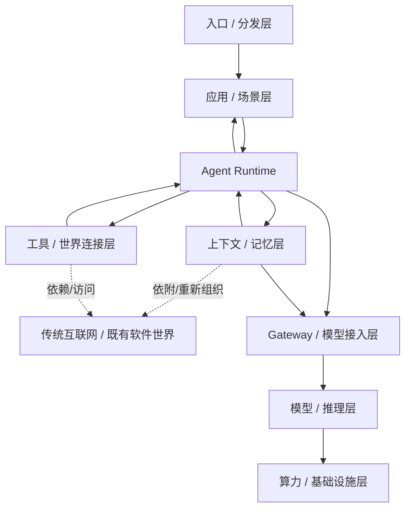
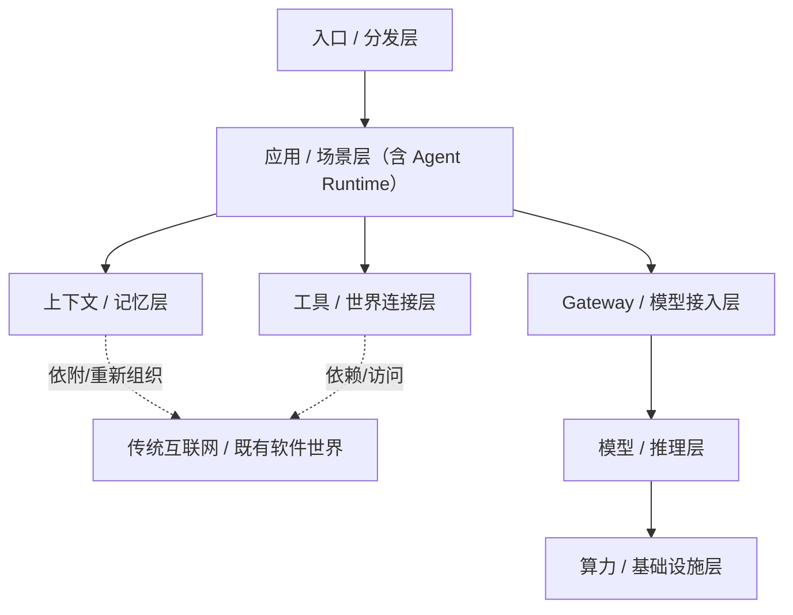

# 《Agent 正在长出怎样的商业世界》分享大纲草稿

副标题备选：从基础能力、系统结构到新机会的整体理解

说明：
- 这不是最终讲稿，也不是最终 PPT 目录；目前只整理已经确定“值得讲”的方面。各节之间暂时相对独立，后续可以按听众反馈、时间分配、风格偏好重新组合。整场分享希望避免做成职业规划讲座，更偏向建立对 Agent 商业世界的基础认知。

## 0. 开场问题 / 总体主线

- Agent 到底带来了什么新的产业结构和分工？为什么现在值得重新理解 Agent，而不是只理解“大模型”？对学生来说，怎样建立对 Agent 世界的基础判断，而不是只追热点名词？

可反复出现的主线句：
- Agent 的价值，不在于它像不像人，而在于它能不能进入真实任务、真实系统和真实组织。
- 名字总是在变，但很多时候，变的是封装方式、产品体验和商业位置，不是底层内核。

## 1. 大语言模型的抽象基础能力

这一节可以聚合成 5 个块来讲，不求细，但要有骨架。

### 1.1 从钱切进去：为什么模型的价格结构能反映技术结构

- 可以直接从 OpenAI 的 `input / cached input / output` 计费开始，这样更贴“商业世界”，也更容易让听众接受后面的推理流程。这里的核心不是背价格，而是建立一个直觉：模型不是一个黑箱，它内部有不同阶段，不同阶段的成本结构不一样。也可以提早埋一句后文主线：用户体验不只是“模型强不强”，还包括排队、prefill、decode、cache 命中这些工程因素。

### 1.2 输入侧：文本不是直接喂给模型，而是先被编码

- 不从传统中文分词讲起，直接讲 tokenizer，可以拿 OpenAI 的 `cl100k_base` 做具体例子。`cl100k_base` 的重点是：它把原始文本映射成 token id 序列，而 `100,256` 可以直觉地讲成 `256 个 byte 基础单位 + 约 100,000 个高频片段`，这说明 tokenizer 是工程系统，不是语言学词典。token 不等于“一个词”或“一个字”，token 数会直接影响成本、context window 和 cache 命中。输入完 token id 后，再过渡到 embedding：token id 本身只是编号，真正进入模型计算的是 embedding 向量。可以先假设 embedding 只有 2 维，方便后面讲投影、RoPE 和注意力。

### 1.3 一层 Transformer 在推理时到底做什么

- 这一段只讲推理，不讲训练。可以直接声明：假设这一层参数都已经训练完成，我们只看前向计算里的信息流动。QKV 不要用“我要找什么 / 我有什么”这套故事，更适合讲成：同一个 token 向量乘上三组不同矩阵，得到三组不同投影。

- 这里最好给一个最小 2 维例子，不然“乘矩阵”还是太抽象。假设两个 token 的 embedding 分别是 `苹果 = [1, 0]`、`芯片 = [0, 1]`，再假设三组 `2x2` 矩阵已经训练好：`W_X = [[1, 1], [0, 1]]`、`W_Y = [[1, 0], [1, 1]]`、`W_Z = [[2, 0], [0, 1]]`。先别叫 Q / K / V，直接叫 `X / Y / Z`；如果要和传统名字对应，`X` 对应 `Q`，`Y` 对应 `K`，`Z` 对应 `V`，但讲法上仍然建议先弱化这些名字的故事性。

- 这里要顺手说明白：到目前为止，这一小段基本都是线性计算。token 向量乘矩阵是线性变换，两个向量做点积打分本质上也是线性代数操作。所以 QKV 这一段不神秘，它首先只是“把向量换个坐标系，再做比较”。

- 在这个例子里：`苹果_X = [1, 0] * W_X = [1, 1]`，`苹果_Y = [1, 0] * W_Y = [1, 0]`，`苹果_Z = [1, 0] * W_Z = [2, 0]`；`芯片_X = [0, 1] * W_X = [0, 1]`，`芯片_Y = [0, 1] * W_Y = [1, 1]`，`芯片_Z = [0, 1] * W_Z = [0, 1]`。

- 接着只看“苹果”这个位置如何更新自己：它会拿自己的 `X` 去和所有 token 的 `Y` 做相似度比较。这里可以用一句更直观的话来降理解难度：`X / Q` 是“我拿什么视角去看别人”，`Y / K` 是“我以什么方式等别人来和我比较”。所以算出 `Q`，是为了主动拿去和别人的 `K` 比相似；算出 `K`，是为了让别人的 `Q` 来和自己比相似。这比直接说“相关性计算”更容易让人形成画面。

- `Z / V` 这里也要补一句更硬的说法：`Q / K` 这一段负责生成权重，`V` 这一段负责提供被这些权重线性组合的向量。所以 attention 的后半段，本质上就是“用算出来的权重去组合一组 `V`”。换句话说：`Q / K` 定义组合系数，`V` 定义被组合的基底向量；最后的输出不是 `Q`，也不是 `K`，而是对 `V` 做完加权线性组合之后得到的新表示。

- 这里还要补一句非常关键的话：不是 embedding 不能直接互相比较，而是原始 embedding 更像一个通用起点，它承载了很多混在一起的信息。如果直接拿 embedding 两两算相似，比较标准会过于固定。做 `Q / K` 线性变换的目的，可以更直白地讲成：它在改写一个 token 的“注意模式”，也就是这个 token 要怎么去注意别人，以及它会被别人以什么方式注意到。这个模式不是天然存在的，而是模型通过参数学出来的。换句话说：embedding 是“通用表示”，Q / K 是“改写过注意模式之后的表示”；这样模型就不必总用同一种模式处理所有 token，不同头、不同层可以学出不同的比较方式。

- 在这个例子里，`score(苹果, 苹果) = [1, 1] · [1, 0] = 1`，`score(苹果, 芯片) = [1, 1] · [1, 1] = 2`。也就是说，“苹果”会更强地关注“芯片”。如果不想现场算 softmax，可以直接说：分数 1 和 2 归一化后，大概会变成 `0.27` 和 `0.73`。这里也可以顺手点一下边界：真正开始出现明显非线性的地方，是 softmax 归一化，以及后面的 FFN 激活函数。所以前面这段更适合讲成：Transformer 先用大量线性代数把信息搬运、比较和重组起来，再在关键位置加入非线性，提升表达能力。

- 然后用这两个权重去加权聚合 `Z`，新的“苹果”表示大概就是 `0.27 * [2, 0] + 0.73 * [0, 1] = [0.54, 0.73]`。这个结果很适合现场解释：原来“苹果”的初始向量更偏 `[1, 0]`，和“芯片”交互后，它的新表示被明显拉向了第二个方向，这就可以直觉地讲成：它吸收了“芯片”提供的上下文信息。这一小段的重点不是数值多精确，而是让听众第一次看见：token 向量不是神秘地“懂了”，它只是先做投影，再算相关性，再做加权聚合。attention 也不要神秘化：它本质上是“相关性计算 + 归一化 + 对一组向量做加权聚合”。输出可以讲得非常直：每个位置会得到一个新的向量，这个新向量是它和其它 token 交互过后的结果。

- attention 之后不要漏掉 FFN：attention 负责 token 间的信息混合，FFN 负责每个 token 在拿到上下文之后，再做一次逐位置表示变换。一个好讲的例子是“苹果发布了新芯片”：attention 让“苹果”看到“发布”“芯片”等线索，FFN 则把这些线索真正写进“苹果”的内部表示，把它推向“公司 / 品牌 / 科技发布者”而不是“水果”。一句口语化总结：attention 是“听别人讲话”，FFN 是“听完以后改主意”。

- MoE 在这里可以非常轻地提一句：它可以看作 FFN 的扩展，dense FFN 像“大家都进同一间加工厂”，MoE 像“按 token 分流到不同加工厂”。

### 1.4 为什么能叠层，以及位置是怎么进来的

- 多层网络为什么有效：不是某一层突然理解世界，而是每一层都在重新校正 token 在当前上下文中的含义和作用。初始 embedding 只是粗起点，一层层叠加后，token 的内部表示越来越像“它在当前上下文中的角色”。“苹果很好吃”和“苹果发布了新芯片”可以继续复用，说明同一个 token 会在不同上下文中走向不同内部表示。

- RoPE 建议放在这一块讲：attention 如果只看 token 向量，会更像在处理无序集合，但语言和代码强依赖顺序，所以位置必须进入计算路径。可以用二维旋转讲教学直觉：不同位置的 token 在某个二维平面里旋转不同角度，所以同一个 token 出现在不同位置时，相关性计算会不同。然后主动抛一个问答：如果这个圆转一圈怎么办？比如 4 个 token 转一圈，第 1 个位置和第 5 个位置不就撞上了？

- 这时顺势揭开真实 RoPE：真实 RoPE 不是一个圆，而是很多组二维维度对按不同频率旋转。可以把高维向量想成很多小圆的组合，某一个圆会重复，但很多不同周期叠在一起后，整体位置状态还能继续区分。这样也能自然把听众从二维带到高维。高维这个转折还可以顺手轻轻揭开多模态本质：文本、图像、音频并不是靠不同“脑子”处理，它们最终都会被投影成某种可计算的向量表示，再在统一或可对齐的高维空间里做相关性计算和信息混合。

### 1.5 推理路径、缓存与服务系统

- 这里把“模型会算”切回“系统怎么跑”。prefill 是一次性处理整段输入，更偏计算密集，因为很多 token 可以并行做大矩阵计算；decode 是一个 token 一个 token 往外吐，更偏访存密集，因为每步都要频繁读取模型参数和历史状态。这正好可以解释为什么 output token 往往更贵。

- 这里要顺手讲清两类缓存：单次请求里的 KV cache 主要帮助 decode，避免每步重算旧 token 的 K / V；跨请求 / 跨轮次的 prefix cache 或 prompt cache 主要帮助下一轮 prefill，避免共享前缀反复重算。再非常浅地补一层 PD 分离：把 prefill 和 decode 放到不同 worker 或资源池，收益是提高吞吐、提高资源利用率、减少长 prefill 阻塞 decode，代价是排队、调度、KV 传输和系统复杂度。

- 最后可以用一个非常适合整场分享的工程总结收束：一次模型响应时间，更合理地看成 `排队时间 + prefill 时间 + decode 时间`。前缀缓存命中时，prefill 可以被显著缩短；在真实系统里，排队时间有时比“模型本身有多强”更影响体验。

这一节总收束：
- 大模型可以被讲成一种“把离散输入编码成高维表示，再通过层层信息混合与表示重写，最终逐 token 生成输出”的系统。它看起来像在“理解”，但更准确地说，是在做高维表示上的结构化计算。从这里过渡到 Agent 会很自然：大模型先提供了统一表示和统一计算，Agent 则是在这个底座上，把“会回答”组织成“会做事”。

## 2. 从 Chatbot 到 Agent：变化到底发生在哪

- Chatbot 更像内容生成器或问答接口，Agent 更像任务推进系统。这里要解释的不只是“会聊天”和“会做事”的差别，而是目标、状态、工具、反馈、多步执行这些系统维度。更明确地说：Chatbot 的基本单位更像“回复”，Agent 的基本单位更像“任务推进”。

- 二者的根本差别，不只是上下文更长，而是 Agent 开始把模型接到外部工具上，并进入一个持续循环：`observe -> reason -> act -> observe ...`。即使现场不讲 `ReAct` 这个词，也可以讲清这条闭环：一旦闭环成立，模型就不再只是回答问题，而是开始观察外部世界、调用外部能力，并根据结果继续推进下一步。这里很适合放一个单轮问答和多步任务执行的对比。

这一节可以顺接前面的 serving / cache 视角，补一些比较反直觉的系统坑点：Chatbot 和 Agent 都不是“每轮只算新增那一句话”，多轮对话里系统常常需要把之前的大量上下文重新带上。这意味着如果没有 prefix / prompt cache，多轮对话会让 prefill 时间和成本增长得很快；而 Agent 比普通聊天更容易触发这个问题，因为它往往上下文更长、工具调用更多、中间状态更多、system prompt 更重、工作记忆更多。

- 可以强调几个反直觉点：对话轮数一多，真正拖慢体验的未必是“模型思考慢”，而可能是越来越长的 prefill；在高并发系统里，长上下文请求还会抬高排队时间；到后面用户体感上，排队时间甚至可能比 decode 时间更显著。所以 Agent 不是只要模型更强就行，还必须非常依赖工具接入、状态管理、上下文管理、cache 命中、workflow、状态压缩和调度策略。

- 这一节适合引出的判断是：从 Chatbot 走向 Agent，不只是“能力增强”，也是“系统负担显著加重”。如果想给这个最基本抽象挂一个名字，可以轻轻提一下 `ReAct`，不需要讲论文细节，只要讲清楚：Agent 最经典的基本抽象，就是在 `reason -> act -> feedback` 的循环里持续推进任务。它不是先想完再做，也不是只做不想，而是在思考、行动和反馈之间不断循环。Agent 的本质，不是更会说话，而是模型开始拥有“调用外部能力并根据反馈继续行动”的闭环；很多 Agent 产品的工程竞争力，并不体现在 prompt 上，而体现在工具接入、状态管理、上下文控制、cache、workflow 和 serving 策略上。

### 2.1 第二章精简提纲版（适合 2-5 分钟即兴发挥）

- 中心句：Chatbot 输出的是回复，Agent 推进的是任务。
- 第一层对比：Chatbot 更像 `input -> reply`，Agent 更像 `observe -> reason -> act -> observe`。
- 如果想补一个更经典的名字，也可以说 Agent 的最小抽象就是 `ReAct`，也就是在 `reason / act / feedback` 之间持续循环。
- 第二层对比：Chatbot 的基本单位是单次回答，Agent 的基本单位是状态持续推进。

- 这一章一定要说出来的一句判断：
- 从 Chatbot 到 Agent，真正增加的不是一点点智能，而是大量系统负担

- 系统负担具体长成什么：
- 工具接入
- 状态管理
- 上下文控制
- cache
- workflow
- serving 策略

- 这一章最后的过渡句：
- 也正因为这样，后面我们看到的 tool use、memory、workflow，以及 Agent 商业世界的分层，其实都是从这里长出来的

- 这里还可以轻轻埋一个后面“去魅/批判叙事”的伏笔：
- Agent 本身就是一个好例子
- 它没有神秘到变成一种全新物种
- 更本质地看，它只是把 AI 的基本单位从“回答一个问题”推进到了“借助工具完成一件事情”
- 如果后面要批判某些新叙事，比如 `Harness`
- 这里就可以先埋一句：
- 很多新名词看起来像范式突变，本质上往往只是任务封装层级继续上移
- 例如：
- 早期更多是在让 AI 干一件事，比如写一段代码、查一条信息
- 后来变成让 AI 完成一个完整功能，也就是先给出目标，再让系统自己拆解和推进
- 这当然是重要变化，但不一定意味着出现了一个和 Agent 完全不同的新本体
- 这条伏笔很适合服务于后面的判断：
- 在 AI 热潮里，很多概念的变化首先是“任务包装方式”和“产品封装层级”的变化，其次才是底层本质的变化

## 3. Agent 商业世界的整体层次

这一章最好先有一个自然切入点：

- 不要一上来就讲分层
- 先问一个更像商业世界的问题：
- 当用户说“我在用一个 Agent 产品”时，他实际买到的到底是什么？
- 是一个模型？
- 一个聊天框？
- 一个自动化流程？
- 还是一个能帮他完成任务的完整系统？

这个问题一抛出来，分层就会自然很多。

可用的切入判断：

- 用户表面上看到的是一个会做事的 Agent
- 但它背后并不是单一产品，而是一层层能力叠起来的结果
- 所谓 “Agent 商业世界”，本质上就是这些层开始分化、组合、专业化，并形成各自的公司、产品和机会

这一章的分层建议改成更像价值链，而不是企业系统图：

- 入口 / 分发层：
- 用户最先接触到 Agent 的地方
- 可能是聊天界面、IDE、浏览器侧边栏、办公入口、企业内部工作台、消息入口
- 很多产品的优势首先不在模型，而在入口位置

- 应用 / 场景层：
- 真正面向用户卖结果的地方
- 比如 coding agent、research agent、客服、销售、内容、教育、企业流程助手
- 这一层卖的通常不是模型本身，而是“某类任务完成得更快、更省心”

- Agent Runtime：把模型、上下文、工具、状态、工作流组织成一个可持续运行的系统，比如任务拆解、状态推进、回合控制、多步执行、工作流编排。这一层更接近“把大模型封装成真正可用的 Agent”，也很适合接前面第二章：Agent 的本质不是更会说话，而是进入 `observe / reason / act` 的循环。
- 上下文 / 记忆层：RAG、memory、session state、context engineering、长期状态保存都可以放进来。这一层不只是“存东西”，更像是在决定 Agent 每一步到底能看到什么；2025-2026 很多新概念，本质上都在争这个位置。
- 工具 / 世界连接层：搜索、数据库、知识库、浏览器、代码执行、文件系统、企业 API、SaaS 接口，以及 MCP、A2A、各种 connector / skill / CLI 都可以放在这里看。这一层决定 Agent 能不能真正碰到外部世界，也最适合和前面“工具接入是学生最容易切入的一层”接起来。
- Gateway / 模型接入层：这一层值得单独拉出来，因为现在已经出现很多“模型中间商 / gateway / router / inference control plane”。它们不自己训练最强模型，但在模型和应用之间拿走了一层价值：统一多家模型入口、做路由、fallback、缓存、预算控制、统一 billing、统一日志与 tracing。很多应用团队并不是直接接 OpenAI / Anthropic / Qwen，而是先接这一层，所以它很适合解释为什么现在会出现很多新的“中间商”。
- 模型 / 推理层：提供底座模型、推理服务、上下文窗口、价格、推理速度和能力边界。这一层决定了整个世界的能力上限和成本结构，也适合和前面第一章的 prefill / decode / cache 接起来。
- 算力 / 基础设施层：GPU、TPU、集群、部署、推理优化都在这里。这一层在这场分享里建议一笔带过，只要让听众知道 Agent 世界不是飘在空中的，它下面还有非常重的算力与基础设施底座；这场不展开电力、机房、集群和更深的 infra 细节，只保留一个商业判断：底座很重，所以能力、价格、速度和供给约束会不断向上传导，影响上面的每一层。

核心判断：
- 用户买的通常不是模型，而是任务结果。
- Agent 不是一个孤立技术点，而是一条正在形成的产业链和分工结构。
- 很多看起来是“同一个 Agent 行业”的公司，其实站在完全不同的层上。
- 真正理解 Agent 商业世界，不只是知道有哪些名词，而是知道这些名词分别长在哪一层、靠什么赚钱、依赖谁。

关于 `Agent Runtime`，可单独补一个判断：
- 这一层重要，但今天还没有特别稳固的“绝对巨头”。它解决真实问题：状态、编排、多步执行、checkpoint、human-in-the-loop；但独立价值捕获偏弱，一方面容易被开源，一方面容易被模型厂商、云厂商和应用厂商向中间吃掉，所以它更像一个真实存在、但相对容易被做薄的中间层。也正因此，旁边的应用层和 gateway 层，反而更容易长出更强的商业抓手。

另外可单独补一句，不并入主 stack：
- 交付 / 集成不是主 stack 里的单独一层，更像一种穿透多层的现实力量。很多 Agent 商业化并不是靠一个通用产品就直接成立，而是要把上面多层能力一起接进具体组织、具体数据、具体流程。这一点很适合后面在讲 Palantir、企业落地、服务与产品混合形态时再展开。

还可以再补一个“图外背景”，也不并入主 stack：
- 传统互联网 / 既有软件世界不是 Agent stack 里的单独一层，更像整个 Agent 世界所依附的外部环境。尤其是：上下文 / 记忆层很多时候是在重新组织既有网页、文档、数据库、知识库；工具 / 世界连接层本质上也是在访问传统互联网、传统 SaaS、传统企业系统、传统 API。换句话说，Agent 世界很多看似“新”的能力，并不是凭空长出来的，而是在旧互联网与旧软件系统之上，加了一层新的调用、组织和封装方式。这一点很适合服务于后面的去魅主线：名字在变，但很多底层资产和现实依赖并没有变。

### 3.1 第三章精简提纲版（适合即兴发挥）

- 切入问题：用户说自己在用一个 Agent 产品时，他到底买到了什么？
- 中心判断：用户表面上看到的是一个 Agent，背后其实是一层层能力叠起来的结果。
- 可以快速带过的 8 层：入口 / 分发层、应用 / 场景层、Agent Runtime、上下文 / 记忆层、工具 / 世界连接层、Gateway / 模型接入层、模型 / 推理层、算力 / 基础设施层。
- 如果想补一层商业现实：交付 / 集成更适合单独讲，它不是 stack 上的一个方块，而是一种穿透多层的现实工作。
- 这一章最后一句：Agent 商业世界不是一个点，而是一整条价值链；后面很多热点和机会，其实都只是这条链上不同位置的重新包装和重新分工。

### 3.2 可引用文章（第三章参考）

这一组文章适合给第三章做“现成外部支撑”，不一定要逐篇展开，但可以在讲到对应层次时顺手点一下。

- [Sequoia: AI 50 2025 — AI Agents Move Beyond Chat](https://www.sequoiacap.com/article/ai-50-2025/)：适合引用“Agent 正在从聊天走向完成工作流”“市场关注点从单纯模型能力转向真正交付结果的应用”，用来支撑“应用 / 场景层”和“用户买到的是结果不是模型”。
- [Sequoia: AI in 2026: A Tale of Two AIs](https://sequoiacap.com/article/ai-in-2026-the-tale-of-two-ais/)：适合引用“一边是基础设施和数据中心建设的现实约束，一边是应用层和 Agent 使用的快速扩张”，用来支撑“模型 / 推理层”和“算力 / 基础设施层”并不是抽象背景，而是商业世界的一部分。
- [a16z: Notes on AI Apps in 2026](https://a16z.com/notes-on-ai-apps-in-2026/)：适合引用“AI 应用会越来越厚，不只是一个薄薄的聊天界面”“coding agent 等应用正在把组织里的很多职能重新软件化”，用来支撑“Agent 产品层”和“应用 / 场景层”。
- [a16z: Big Ideas 2026, Part 1](https://a16z.com/newsletter/big-ideas-2026-part-1/)：适合引用“agent-native infrastructure 会成为独立问题”“传统为人类请求设计的系统，不一定适合 agent-speed、recursive、bursty 的负载”，用来支撑“工具 / 数据连接层”往下延伸到“模型 / 推理层”和“算力 / 基础设施层”。
- [McKinsey: Seizing the Agentic AI Advantage](https://www.mckinsey.com/capabilities/quantumblack/our-insights/seizing-the-agentic-ai-advantage)：适合引用“企业真正的价值，不在把 AI 塞进某个单点任务，而在重写 end-to-end 流程”，用来支撑“交付 / 集成层”以及为什么很多 Agent 商业化最后会落到真实流程改造。
- [McKinsey: The State of AI 2025](https://www.mckinsey.com/capabilities/quantumblack/our-insights/the-state-of-ai)：适合引用“企业里对 Agent 的实验很多，但真正规模化和形成显著利润影响的比例还有限”，用来给第三章降温：商业世界已经长出来了，但还远没有完全定型。
- [Menlo Ventures: 2025 State of Generative AI in the Enterprise](https://menlovc.com/perspective/2025-the-state-of-generative-ai-in-the-enterprise/)：适合引用“企业花钱最多的仍然是应用层，其次才是基础设施”“很多所谓 agent 其实还是较简单的 workflow 或 routing”，用来支持第三章里的一个重要判断：Agent 商业世界确实在长出来，但很多概念仍处在重新包装和重新分工阶段。

如果只留 3 篇，最推荐：Sequoia `AI 50 2025`、a16z `Notes on AI Apps in 2026`、McKinsey `Seizing the Agentic AI Advantage`。如果想保留一个“去魅”引用，再加 Menlo `2025 State of Generative AI in the Enterprise`。

### 3.3 分层 / Stack 相关资料索引（先收集，不展开）

这一组先作为资料池放着，不要求现场逐条讲。

明确提出自身分层 / stack 的材料：

- [AIMultiple: The 7 Layers of Agentic AI Stack in 2026](https://research.aimultiple.com/agentic-ai-stack/)
- [StackOne: 120+ Agentic AI Tools Mapped Across 11 Categories [2026]](https://www.stackone.com/blog/ai-agent-tools-landscape-2026)
- [StackAI: The 2026 Guide to Agentic Workflow Architectures](https://www.stackai.com/blog/the-2026-guide-to-agentic-workflow-architectures)
- [StackAI: Enterprise AI Platforms in 2026: Options, Landscape & How to Choose](https://www.stackai.com/insights/enterprise-ai-platforms-in-2026-options-landscape-how-to-choose)

更接近“松散共识”而不是明确统一分层的材料：

- [a16z: Notes on AI Apps in 2026](https://a16z.com/notes-on-ai-apps-in-2026/)
- [a16z: Big Ideas 2026, Part 1](https://a16z.com/newsletter/big-ideas-2026-part-1/)
- [Sequoia: AI 50 2025](https://www.sequoiacap.com/article/ai-50-2025/)
- [Sequoia: AI in 2026: A Tale of Two AIs](https://sequoiacap.com/article/ai-in-2026-the-tale-of-two-ais/)
- [McKinsey: Seizing the Agentic AI Advantage](https://www.mckinsey.com/capabilities/quantumblack/our-insights/seizing-the-agentic-ai-advantage)
- [McKinsey: The State of AI 2025](https://www.mckinsey.com/capabilities/quantumblack/our-insights/the-state-of-ai)
- [Menlo Ventures: 2025 State of Generative AI in the Enterprise](https://menlovc.com/perspective/2025-the-state-of-generative-ai-in-the-enterprise/)

补充学术 / 协议视角资料：

- [A Layered Protocol Architecture for the Internet of Agents](https://arxiv.org/abs/2511.19699)
- [A Framework for the Adoption and Integration of Generative AI in Midsize Organizations and Enterprises (FAIGMOE)](https://arxiv.org/abs/2510.19997)

### 3.4 各层之间的依赖关系（有向图草稿）

这一张图不是要表达严格的软件架构，而是表达：用户看到的是上层，能力依赖会一路往下传，成本、速度、供给约束又会一路往上传，中间很多层不是简单上下级，而是彼此耦合；此外，整张图默认还依附在“传统互联网 / 既有软件世界”之上，只是没有单独画进主 stack。

可先用这版：

如果要讲这张图，最适合强调的关系是：入口层把用户和任务送进应用层；应用层真正卖结果，但要依赖 Agent 运行时来组织任务；Agent 运行时同时依赖上下文层、工具层和模型接入层；Gateway / 模型接入层位于应用世界和模型世界之间，已经形成新的中间层；模型 / 推理层继续依赖底下的算力 / 基础设施层。交付 / 集成更适合放在图外单独说明，不作为主依赖链上的一个方块。现场还可以补一句：价格、速度、供给约束当然也会从下往上传导，但这张图里的箭头优先表达“上层依赖下层”，不把两种含义混在一起。也可以再补一句：上下文层和工具层很多能力，本质上仍然是在重新访问和重新组织旧互联网世界；工具 / 世界连接层大多数时候并不直接依赖 gateway，更常见的情况是运行时一边接工具层，一边接 gateway / 模型接入层，再把两边组织进同一个任务循环里。

这张图最适合传达的一句判断：Agent 商业世界不是静态分层，而是一个“上层卖结果、下层供能力、中间做组织和转译”的依赖网络。

### 3.5 按当前分层重组后续模块（索引，不改原内容）

这一节的目的不是重写后面的章节，而是给出一个新的“按分层阅读 / 讲述”的顺序。也就是说：后面的内容目前还是按主题池展开，但如果按照第三章现在这套分层往下讲，可以先把它们重新挂到各层上，这样后面不容易讲串层，也更方便决定哪些先讲、哪些后讲。

可先这样归类：

- 入口 / 分发层：目前还没有专门展开；后面如果要补，可以放 Bing / ChatGPT / Claude / IDE / 浏览器 / 消息入口，以及为什么入口位置会直接影响 Agent 的采用方式和产品形态。
- 应用 / 场景层：`15. Personal AI / Personal Agent 热潮`、`16. AI 转型的故事：以 Replit 和 Palantir 为例`、`18. 行业内的赛道、依赖与资本叙事`。这一层更适合讲：用户到底买什么结果、哪些场景先跑出来、为什么 coding / research / enterprise workflow 会先爆发。
- Agent Runtime：`11. Workflow / Orchestration：Agent 为什么又像传统软件系统`、`14. 2026 春天容易让人 FOMO 的热点概念` 里和 harness / deep research / runtime 相关的部分、`17. 一个可选的批判视角：把成熟计算机技术包装成新哲学术语`。这一层更适合讲：任务怎么被拆解、推进、回退、重试、持续执行，以及为什么很多新叙事本质上是在重新包装 runtime / workflow / 封装层级。
- 上下文 / 记忆层：`5. RAG / 检索：名字在变，内核未必在变`、`6. Memory：从检索延伸出的新包装`、`14. 2026 春天容易让人 FOMO 的热点概念` 里和 memory / deep research / context 相关的部分、`21A. RoPE 数值参考（备讲，不建议现场细算）`。这一层更适合讲：Agent 每一步到底能看到什么，以及旧搜索技术、向量检索、memory layer、context engineering 是如何重新组合的。
- 工具 / 世界连接层：`7. Tools / 外部系统接入：学生最容易切入的一层`、`8. 外部工具接入的发展史`、`9. 外部工具接入的本质`、`10. 如何设计一个好的 Tool`、`14. 2026 春天容易让人 FOMO 的热点概念` 里和 MCP / A2A / computer use 相关的部分。这一层更适合讲：Agent 怎么碰到外部世界，以及为什么 tools / connector / skill / CLI / MCP 会成为独立问题。
- Gateway / 模型接入层：目前还没有专门章节，但可以从第三章、资料区和口头补充里带出；后面如果要单独展开，可讲 model gateway、routing、fallback、cache、unified billing、tracing / observability，以及为什么这层已经出现新的“中间商”。
- 模型 / 推理层：`1. 大语言模型的抽象基础能力`、`12. Compute / TPU / 推理基础设施` 里偏模型 / 推理的部分、`14. 2026 春天容易让人 FOMO 的热点概念` 里和模型能力包装相关的部分。这一层更适合讲：模型能力边界、prefill / decode / cache、推理价格、速度、上下文窗口。
- 算力 / 基础设施层：`12. Compute / TPU / 推理基础设施`，但按目前计划这一层在这场分享里只一笔带过，不继续深讲电力、机房、训练集群等细节。
- 图外背景：传统互联网 / 既有软件世界，对应 `5. RAG`、`6. Memory`、`7-10. Tools / 外部系统接入`、`16. Replit / Palantir`、`17. 批判视角`。这一层不是 stack 上的一层，但非常适合贯穿提醒：Agent 世界很多“新能力”，本质上仍然在重新访问、重新组织旧互联网和旧软件系统。
- 图外现实：交付 / 集成，对应 `16. Replit / Palantir`、`18. 行业内的赛道、依赖与资本叙事`。这一块适合单独作为“现实落地条件”讲，而不是并入主 stack。

如果后面真要按这套重组讲述顺序，可以优先按下面走：1. 第三章先把分层讲出来；2. 先展开 `应用 / 场景层（含 Agent Runtime）`；3. 再展开 `上下文 / 记忆层`；4. 再展开 `工具 / 世界连接层`；5. 最后轻触 `gateway / 模型 / 基础设施`。这样顺序会比当前章节编号更贴近“用户看到什么 -> 产品怎么成立 -> 底下靠什么支撑”。

### 3.6 最终主图结构（建议 PPT 直接采用）

如果最后只保留一张主图，我会建议用这一版。它有几个明确取舍：`Agent Runtime` 不再单独画成一层，因为在现实里它和应用层往往耦合得太深，更适合讲成很多强应用内部都吃进了 runtime；`交付 / 集成` 不放进主 stack，因为它更像图外的现实力量；`传统互联网 / 既有软件世界` 继续保留成图外背景，因为上下文层和工具层很多能力，本质上都还在重新访问旧世界。主图只保留最值得讲的 7 层：

1. `入口 / 分发层`
2. `应用 / 场景层（含 Agent Runtime）`
3. `上下文 / 记忆层`
4. `工具 / 世界连接层`
5. `Gateway / 模型接入层`
6. `模型 / 推理层`
7. `算力 / 基础设施层`

- 最推荐的主图可以直接用这版：

- 这一版最该讲清的不是“软件架构”，而是：用户最先看到的是入口和应用；应用要想真的成立，必须同时吃进上下文、工具和模型接入；再往下才是模型和算力。
- 如果要给这张图配一句总标题，最适合的是：`上层卖结果，中层做组织和连接，下层供能力与成本边界`。
- 如果要给这张图配一句口头讲法，最适合的是：`入口决定 AI 从哪里碰到你，应用决定它替你做什么，记忆和工具决定它怎么持续做下去，gateway 决定它怎么接到底下的模型世界，而模型和算力最终决定它能做到什么、又要花多少钱。`
- 如果要进一步压成一句记忆点：`Agent 商业世界的核心，不只是分层，更是“谁控制入口、谁组织任务、谁提供能力、谁承担成本”。`

## 4. 每个中间模块都要讲“本质是什么”

这一节不是单独讲，而是作为全场讲法原则，适用于多个模块。

每个概念尽量讲四件事：

- 它本质是什么
- 它解决了什么问题
- 它借用了哪些旧技术
- 它带来了什么代价

希望覆盖的模块：

- RAG / 检索
- Memory
- Tool Use / 外部系统接入
- Workflow / Orchestration
- Compute / TPU / 推理基础设施

## 5. 核心分层展开

### 5.1 入口 / 分发层：用户最先在哪里遇到 Agent

- 这一层之前还没单独展开，建议补上。
- 入口层回答的问题不是“Agent 能做什么”
- 而是“用户最先会在什么地方用到它”
- 很多产品的竞争优势，首先不是模型能力，而是入口位置

为什么入口层重要：
- 谁先占住入口，谁就更容易先拿到用户意图、上下文和使用频率；入口不只是流量位置，也会反过来决定产品形态。同样一个 Agent，放在不同入口里，用户对它的期待会完全不同。

可讲的典型入口：
- 可以先给入口做一个更清楚的分类，避免只剩“软件界面入口”：主动入口（用户主动打开并发起任务）、贴身入口（设备持续跟着用户，随时可接管任务）、环境入口（用户进入一个空间时，AI 已经在场）、沉浸式 / 未来入口（更接近感知通道本身的入口）。

- 通用聊天入口：比如 ChatGPT、Claude、Copilot 这类对话入口，优势是通用、低门槛、启动快，但问题是任务边界往往比较松，用户需要自己组织很多上下文。
- IDE / 开发入口：比如代码编辑器、终端、repo 工作台，这一类入口天然适合 coding agent，因为任务、文件、命令、反馈都已经在同一个工作环境里。
- 浏览器 / 网页入口：比如浏览器侧边栏、网页助手、网页内 agent，适合 research、表单填写、网页操作、computer use，本质上是在用户已经工作的地方“长出一个 agent”。
- 办公 / 企业工作台入口：比如文档、IM、日程、CRM、内部 portal、BI 工作台，更适合企业流程 agent，因为真实工作流本来就在这些系统里发生。
- 消息 / 语音入口：比如 IM、邮件、语音助手、手机入口，优势是贴近用户日常行为，但也更容易受到交互带宽限制，复杂任务常常要再切回别的界面。
- 贴身设备入口：比如智能眼镜、智能手表、智能耳机、手机上的常驻 AI，这一类入口的特点不是更强的界面，而是更贴近用户持续生活流。它们很适合讲成：AI 不再只是“等你打开”，而是开始更持续地待在你身边。
- 环境入口：比如会议室 AI 记录、智能家居、车载助手、办公室空间里的 AI 设备，这一类入口不是“一个 app”，而是用户走进某个环境时，AI 就已经在那个空间里，更接近“环境感知 + 自动记录 + 持续待命”。会议室 24h AI 会议记录、桌面常驻记录、空间感知型助手，本质上都在把“环境”本身变成 Agent 的入口。
- 沉浸式 / 未来入口：比如 VR / AR 眼镜、脑机接口。这一类现在离大规模普及还远一些，但很适合点一下：入口的终局未必是聊天框，而可能是更贴身、更低摩擦、更接近感知通道本身的界面。

这一层最适合强调的判断：
- 入口不仅决定流量，还决定上下文；入口不仅决定上下文，还决定用户愿不愿意把任务交给它。很多 Agent 产品最后不是赢在“模型更强”，而是赢在它待在一个用户本来就愿意交任务的地方。

还可以顺手埋一个很重要的商业判断：
- 入口层很容易和分发、品牌、留存绑定，所以上层产品竞争经常不是单纯拼模型，而是在拼谁先拥有稳定任务入口。

还可以再往前推一句，作为这一层的升级判断：
- 入口正在从“请求式”走向“常驻式”和“环境式”：过去更像用户打开一个聊天框，再临时给 AI 一个任务；现在越来越像 AI 持续待在你工作、沟通、记录、感知现实的地方。

这一点可以顺手挂几个近两年的方向：
- 会议记录 / 会议空间入口：Zoom 在 `2025-07-09` 官方宣布 AI Companion 支持 in-person meetings 的 voice recorder，并支持跨第三方会议平台做记录和总结；DingTalk A1 在 `2026-02` 连续几篇官方文章里都在推“语音直接转行动项 / 工作流”。这说明会议室本身也可以变成 Agent 的入口，而不只是“会议后整理记录”的工具。还可以顺手提一些更轻量的消费级 / 设备化信号：Plaud 这类独立录音硬件、Zoom 的 in-person voice recorder、DingTalk A1 这类会议设备，都说明“记录入口”正在从软件 bot 走向设备和空间。
- 智能眼镜 / 可穿戴入口：Meta 在 `2025-09-17` 展示了带显示和 neural wristband 的 AI glasses 路线，Android XR 也在把 AI 往 glasses / headset 入口推。这一类入口的意义不是多一个屏幕，而是 AI 开始更持续地获得第一人称上下文。智能手表、智能耳机、智能家居也可以并到这里理解：它们不一定都长得像“Agent 产品”，但它们都在争同一个位置：谁离用户的持续上下文最近。
- 桌面持续上下文入口：比如 Codex / desktop agent 这类方向，一个重要趋势是 AI 不再只依赖你手动描述，而是开始直接积累你屏幕、文件、环境里的工作上下文。你提到的自动截图进入记忆，就属于这一类信号。讲的时候可更稳一些：它反映的是“桌面入口 + 被动上下文采集”这条趋势，而不必把单一产品细节讲得太死。

如果想把这一层进一步和后面章节连起来，可以直接落一句：
- 入口层的变化，不只是“用户在哪儿看见 AI”，更是“AI 从哪里持续获得上下文”。这也正是为什么入口层会反过来牵动后面的应用层、记忆层和工具层。

### 5.2 应用 / 场景层（含 Agent Runtime）：Agent 商业世界最先被看见的地方

- 结合总标题，这一层最该讲的不是“有哪些应用”，而是：如果说 Agent 正在长出一个商业世界，那这个世界最先是以什么形态被用户看见的？答案通常不是模型、协议、memory、runtime，而是一些具体产品形态：coding agent、research agent、meeting agent、enterprise workflow agent、personal AI。

这一层最适合先讲一个背景判断：大多数用户不会先接触到模型层、协议层、memory 层，用户最先看到的，一定是某个具体产品形态。所以应用层的作用，就是把底下复杂的能力结构翻译成一个用户愿意托付的结果。

- 这里也可以顺手点明一个很重要的现实：应用层和 Agent Runtime 往往耦合得很深。很多强应用并不是“薄薄一层 UI”，而是往下吃进了状态推进、多步执行、tool coordination、checkpoint、sandbox、execution environment，所以这场分享里，应用层和 runtime 更适合放在一起讲，不必硬拆成两个完全独立世界。

这一层的一个重要判断：
- 最先跑出来的 Agent 应用，往往不是最炫的，而是最容易形成任务闭环的。通常有几个共同特征：任务边界相对清楚、数字化程度高、工具链已经存在、反馈可见、ROI 容易被感知。

可先按下面几个赛道讲：
- Coding Agent：这是最典型、也最容易被学生理解的一类，因为任务天然数字化、反馈极强、工具链完整。头部产品可举：Cursor、Claude Code、OpenAI Codex、Replit Agent。这一类最适合讲：Agent 怎么从“帮你写一段代码”走向“围绕目标完成一个功能”。
- Research / Information Agent：这类应用把搜索、阅读、整理、比对、输出整合成一段连续任务。头部产品可举：ChatGPT Deep Research、Perplexity Deep Research / Perplexity Computer、Gemini Deep Research。这一类最适合讲：为什么 research agent 很容易成为用户最早愿意托付的一类任务。
- Meeting / Communication Agent：这类应用从记录、总结，逐渐走向行动项提取、跨平台沉淀、后续跟进。头部产品可举：Zoom AI Companion、Otter、Plaud。这一类也很适合接前面的入口层变化：会议室、录音设备、桌面记录，都可以成为 Agent 的入口。
- Enterprise Workflow Agent：这类应用更接近企业真正会买单的方向，本质上是在接管或重写一段具体工作流。可以再拆两个典型子类：客服 / customer support、内部知识与员工流程。头部产品可举：Sierra、Intercom Fin、Zendesk AI、Glean、Moveworks、Salesforce Agentforce。这一类最适合讲：企业买的不是一个“更会聊天的机器人”，而是一个能接进流程、减少人工切换和重复劳动的系统。
- 通用任务代理 / Generalist Work Agent：这类产品不只做单一场景，更像“围绕一个目标，帮你完成一段完整工作”。它们往往把 research、execution、browser use、tool use、runtime 封在一个产品里。头部产品可举：Manus、Perplexity Computer、OpenAI Codex 的部分形态。这类产品最适合讲：它们表面上是应用层产品，但往往向下吃了很多 `Agent Runtime`，可以直接讲成一句：“这类产品表面上是应用，肚子里装了半个 runtime”。
- Personal AI / Personal Agent：这一类在商业规模上未必最大，但传播力和想象力很强，让很多普通用户第一次直观感受到“AI 常驻在我身边”。头部产品可举：OpenClaw、Hermes Agent、Lindy、Rewind。这一类最适合讲：为什么 personal AI 很容易带来 FOMO，以及为什么它本质上是在“个人任务闭环”上继续叠层。

如果想把这些赛道再压成一句更高层的分类，也可以讲成：
- 替你生产东西的 Agent，比如 coding / content / design / research。
- 替你处理沟通和协作的 Agent，比如 meeting / email / support / sales。
- 替你接管流程的 Agent，比如 enterprise workflow / service desk / CRM / internal ops。
- 替你长期伴随的 Agent，比如 personal AI / ambient AI / wearable AI。

这一层最后最适合落一句判断：
- 应用层真正的竞争，不是谁先把模型塞进产品里，而是谁先把一个高频任务做成“用户愿意反复托付”的东西。

如果想把“商业判断”补得再实一点，这一层还可以顺手讲：
- 应用层公司表面上卖的是 coding / research / support / meeting / personal AI，但底下普遍依赖模型 / 推理层、gateway / 模型接入层、工具 / 世界连接层、上下文 / 记忆层、入口 / 分发层。所以它们的价值判断逻辑，不只是“功能能不能做出来”，还包括：能不能占住高频任务入口、能不能形成稳定闭环、能不能减少对底层模型成本的被动暴露、能不能慢慢把一部分软件预算甚至人工预算收上来。

毛利 / 净利 / 估值这块，讲法建议偏“结构判断”，不要硬报一堆拿不到的私有财务数字：
- 纯软件、纯 seat 的 Agent 应用，理论上有机会接近传统 SaaS 毛利；但高调用、高推理、长上下文的应用，会先被 inference 成本压毛利；企业 workflow 型应用，软件毛利潜力高，但净利常被销售、交付、客户成功吃掉；硬件混合型入口，毛利通常更低，但入口更强。所以应用层今天的高估值，很多不是因为已经特别赚钱，而是市场在赌：一旦模型成本继续下降，谁先占住高频任务入口，谁就可能把软件预算和一部分劳动预算一起收走。

如果想举几个更有感知的估值 / 收入信号，可作为备讲资料顺手提：
- Cursor：`2025-11` 融资后估值约 `293 亿美元`，`2026-03` 年化收入据报道超 `20 亿美元`，`2026-04` 又传出在谈 `500 亿美元` 估值。
- Perplexity：`2025-09` 报道估值约 `200 亿美元`，`2025` 年末 ARR 接近 / 超过 `2 亿美元`。
- Glean：`2025-06` 估值约 `72 亿美元`，ARR 超 `1 亿美元`。
- Moveworks：`2024-09` ARR 超 `1 亿美元`，`2025-03` 被 ServiceNow 以 `28.5 亿美元` 收购。
- Sierra：`2025-09` 估值约 `100 亿美元`，ARR 到 `1 亿美元` 量级。

这一层最适合落的一句“资本视角”判断：
- 应用层今天的估值，很多不是基于已兑现净利，而是基于未来“推理成本下降 + 用户托付变强 + 劳动预算转移”的预期。

可引用 / 备查产品官网：

- [Cursor](https://www.cursor.com/)
- [Claude Code](https://www.anthropic.com/claude-code)
- [OpenAI Codex](https://openai.com/codex/)
- [Replit Agent](https://blog.replit.com/introducing-agent)
- [Manus](https://manus.im/)
- [ChatGPT Deep Research](https://openai.com/index/introducing-deep-research/)
- [Perplexity](https://www.perplexity.ai/)
- [Gemini Deep Research](https://blog.google/products/gemini/google-gemini-deep-research/)
- [Zoom AI Companion](https://www.zoom.com/en/products/ai-assistant/)
- [Otter](https://otter.ai/)
- [Plaud](https://www.plaud.ai/)
- [Salesforce Agentforce](https://www.salesforce.com/agentforce/)
- [Glean](https://www.glean.com/)
- [Moveworks](https://www.moveworks.com/)
- [Sierra](https://sierra.ai/)
- [Intercom Fin](https://www.intercom.com/fin)
- [Zendesk AI](https://www.zendesk.com/ai/)
- [OpenClaw](https://github.com/openclaw/openclaw)
- [Hermes Agent](https://hermes-agent.nousresearch.com/)
- [Lindy](https://www.lindy.ai/)
- [Rewind](https://www.rewind.ai/)

### 5.3 算力 / 基础设施层：Compute / TPU / 推理基础设施

- 这一层在这场里不适合讲成“硬件课”，更适合讲成：底下那层很重，而这份重量会不断向上传导，影响 Agent 商业世界里的价格、速度、毛利和供给。

这一层最该传达的不是器件细节，而是 3 个商业判断：

1. 底座不是无限的
- 模型能力、推理速度、上下文长度、调用价格，都不是凭空来的；它们后面都站着真实的算力、网络、机房、调度和供给约束。

2. 成本会沿价值链往上传
- 应用层卖的是结果，但毛利会被底下的模型调用成本、推理成本和基础设施成本牵引；gateway、推理优化、缓存、模型路由，本质上都在重新分配这部分成本和控制权。

3. 供给约束会塑造产品形态
- 如果底层算力昂贵、稀缺或不稳定，上面就更容易长出短链路产品、更强缓存、路由层、便宜模型 + 贵模型混用，以及 seat / credit / usage 的混合定价模式。

这一层的切入建议：
- 不从 GPU、TPU 名词开始，先从一个商业问题开始：为什么上层应用估值很高，但毛利不一定天然漂亮？然后顺势回答：因为它底下压着一整套很重的推理与基础设施成本。

如果要给一条最简公式，可讲成：
- 应用层毛利 ≈ 用户付费 - 模型调用成本 - 工具 / 执行成本 - 交付成本。
- 而模型调用成本背后，大致又可以拆成：能源成本、计算卡折旧、机房 / 网络均摊、运维与调度成本、空转 / 缓存 / 利用率损耗、供应商毛利。

这里不建议展开成电力、机房、PUE、集群架构细节，因为这场重点不是教听众怎么建一个 data center。只要让他们知道：Agent 商业世界不只是功能分层，也是成本分层；很多商业模式的本质，就是看谁承担成本、谁转嫁成本、谁吃到成本下降带来的利润。

TPU / GPU 可以保留成一个轻例子：
- TPU 本质上是针对特定张量 / 矩阵计算优化过的专用加速器，GPU 仍然更通用、生态更成熟。这一层不用深讲，点到为止即可，重点还是那句：底层技术选择最后会影响上层价格、速度和可得性。

如果想把这一层再补得更扎实，但仍不变成硬件课，可以按下面 4 个点讲：

- PD 分离为什么会出现
- prefill 更偏 compute-bound，decode 更偏 memory-bound，所以把两者拆到不同 worker 池，是在让不同资源画像匹配不同阶段的负载。一个很适合现场讲的说法：Prefill 要“算得猛”，Decode 要“装得下、喂得动”。

- PD 分离对卡的要求不一样
- Prefill 池更看重 Tensor 算力、大矩阵吞吐、批处理能力、TTFT / 首 token 时延；Decode 池更看重 HBM 容量、HBM 带宽、KV cache 容量与管理、稳定 token/s。所以 PD 分离不是单纯“拆集群”，而是在重新匹配不同卡、不同池、不同调度策略。

- 网络在这里不是配角
- 机柜内网络负责把 GPU 绑成高带宽、低延迟的近场域，机柜间网络负责把很多 rack 继续拼成大集群。对 PD 分离来说，网络还额外承担在 prefill 池和 decode 池之间传状态 / KV / 中间结果，所以 PD 分离不是把计算切开就行，它本质上是在把“算力问题”变成“算力 + 网络 + 调度”的联合问题。

- 这也是为什么底层会反过来塑造上层产品形态
- 如果底层算力昂贵、稀缺、供给不稳定，上面就更容易长出 gateway、cache、model router、便宜模型 / 贵模型混用、短链路产品，以及 credits / seat / usage 混合定价。

如果要轻轻对比 NVIDIA CUDA 和 Google TPU，可讲成：
- NVIDIA CUDA / GPU：优势是灵活、生态成熟、部署形态多、适合快速迭代；劣势是成本和功耗通常更高，大规模时会更早暴露网络、调度和成本问题。
- Google TPU：优势是更专用，在 hyperscale 训练 / 推理里经常有更好的 perf / $ 和 perf / W；劣势是灵活性弱于 CUDA，更依赖 XLA / JAX / Google Cloud 体系。
- 一句收束：CUDA / GPU 赢在灵活和生态，TPU 赢在专用和 hyperscale 效率。

如果要给一个当前顶级 NVIDIA 拓扑的直觉图景，可以直接讲：
- 今天 NVIDIA 最有代表性的模式，不是一张卡，而是 rack-scale NVLink domain。以 GB200 NVL72 为例：18 个 compute nodes、9 个 NVLink switch trays、72 块 GPU，在一个 72-GPU NVLink 域里工作；先在机柜内做极高带宽的“近场互联”，再通过 InfiniBand / Ethernet 把多个 rack 拼成更大集群。

如果想丢几个“惊人数字”增强冲击力，可作为备讲：
- NVIDIA GB200 NVL72：72 GPU、1.44 exaFLOPS（FP4 sparse）、13.4 TB HBM3e、576 TB/s HBM 带宽、130 TB/s NVLink 带宽。
- Google TPU v5p cube（可视作一个机柜级单元）：64 chips，单 chip 459 TFLOPS BF16，一 cube 约 29.4 PFLOPS BF16，一 cube 大约 6.1 TB HBM。
- Google TPU v6e / Trillium：918 TFLOPS BF16 / chip、32 GB HBM / chip、800 GB/s ICI / chip、单 pod 最多 256 chips、单 pod 234.9 PFLOPS BF16。

讲的时候最适合落的一句判断：
- 底层约束今天已经不是“有没有模型”，而是“能不能把模型以足够便宜、足够快、足够稳定的方式持续跑起来”。这就是为什么基础设施虽然离用户最远，但仍然是 Agent 商业世界的一部分。

这一节如果只讲 2-3 分钟，最适合的收束是：
- 底层算力和推理基础设施很重，所以上面的应用、gateway、runtime 看起来在做产品创新，实际上也一直在和成本结构博弈；谁能更好地吸收、转嫁或压缩这部分成本，谁的商业模式就更容易成立。

### 5.4 模型 / 推理层：能力边界、价格表与产品形态

- 这一层不要再重复前面的大模型原理，更适合讲成：Agent 商业世界里，模型层真正提供的不是“神秘智能”，而是能力边界、延迟与吞吐、context window、工具调用能力、价格表和稳定性。

这一层最适合先抛一个问题：当应用层在卖结果时，它真正向下买到的是什么？很多时候不是“一次模型调用”，而是一整套能力包：多大上下文、多快首 token、多稳输出质量、多强推理能力、支不支持 tool use / structured output / multimodal，以及 input / output / cached input 分别怎么计费。

这一层最该传达的几个判断：

1. 模型层决定能力边界
- 应用层和 runtime 可以组织任务，但模型层仍然决定很多上限：能不能处理长上下文、能不能稳定调用工具、能不能做复杂推理、多模态能不能真的可用。所以上层很多产品差异，最后都会回到模型能力边界。

2. 推理层决定体验边界
- 同一个模型，放在不同推理系统里，体验会差很多。因为真正被用户感知到的，不只是 benchmark，而是首 token 速度、每秒 token 速度、长上下文下的退化、tool call 往返延迟、失败率 / 超时率。所以“模型强”不等于“产品体验强”。

3. 价格表本身就是产品的一部分
- input / output / cached input 的定价结构，会直接塑造上层产品怎么设计：是偏长上下文还是偏短链路，是偏高频 copilot 还是偏低频高价值 deep research，是卖 seat 还是卖 credits / usage。所以模型层不是纯技术底座，也是在向上输出商业约束。

4. 为什么会长出多模型和路由
- 没有一家模型在所有任务上都同时最强、最便宜、最快、最稳定，所以上层会自然长出多模型混用、gateway / router、便宜模型做筛选、贵模型做关键步骤、小模型跑高频、大模型跑难题。这一层最适合接到 gateway 层去讲。

这一层可以轻轻拆成两个视角：

- 模型市场视角
- 闭源 frontier model
- 开源 / 开权重 model
- 垂直优化 / coding / reasoning / multimodal model
- 这里适合讲：
- 模型层并不是“一个统一市场”，而是已经分化出不同能力包和不同供给方式

- 模型厂 / 训练侧视角
- 这一块也属于商业世界的一部分，而且非常重
- 但这场不适合深讲训练技术，只适合讲它在商业上意味着什么
- 可以先讲一个最直白的判断：
- 模型厂卖的不是“一个文件”
- 而是一种极重资本、极重人才、极重供给链支撑下的能力供给
- 训练模型这件事本身，意味着：
- 大量前期资本投入
- 长周期研发和试错
- 数据、算力、人才、infra 的高度集中
- 所以这一层天然更像：
- 少数大厂 / 大实验室 / 巨额融资玩家的游戏

- 这一层最适合讲 3 个商业特征：

- 第一，前置投入极重
- 真正训练 frontier model，不像做一个普通 SaaS 产品
- 它在产品出来之前，就已经消耗了大量 GPU、研究人员、数据管线和实验成本
- 所以模型厂天然会更强调：
- 规模效应
- 先发优势
- 融资能力
- 供给链控制

- 第二，模型厂卖的是“能力批发”
- 上面的应用层、runtime 层、gateway 层，很多时候是在零售或再封装
- 模型厂更像在卖底层能力包：
- 推理能力
- 多模态能力
- coding 能力
- reasoning 能力
- context window
- tool use 支持
- 所以模型层的每一次能力进步，都会向上重新改写很多层的产品边界

- 第三，模型厂的商业化不只是一种方式
- 有的卖 API
- 有的卖云服务
- 有的卖开源 / 开权重生态影响力
- 有的卖企业私有化部署或联合解决方案
- 有的甚至更像在卖一个标准入口或开发者生态
- 所以这一层不是“谁模型最强”那么简单
- 还包括：
- 谁的开发者生态更强
- 谁的企业接入更顺
- 谁的价格策略更 aggressive
- 谁更能把训练出来的能力变成长期分发优势

- 这一层也很适合和资本叙事连起来：
- 模型厂天然更容易拿到“大故事”估值
- 因为它们看起来像整个价值链的源头
- 但它们也最容易面对：
- 高资本开支
- 高不确定性
- 价格战
- 能力被快速追平
- 上层价值外溢到应用和入口

- 讲的时候最适合点到为止的一句：
- 模型厂是 Agent 商业世界里的“能力源头”，但不一定是最后把最多利润留住的层
- 因为能力一旦被商品化，上层的入口、应用和工作流封装就会开始重新分配价值

- 如果要单独压成 2-3 分钟提纲，可以直接这样讲：

- `模型厂在卖什么`
- 模型厂更像这个世界里的“能力制造业”
- 它卖的不是一个界面，也不是一个单独功能
- 而是一整包可被上层反复调用、再封装、再零售的能力：
- 推理
- 生成
- 编码
- 多模态理解
- 长上下文
- tool use

- `模型厂的商业模式`
- 主要有四种：卖 API；卖托管推理 / 云服务；卖生态和标准入口；卖开源 / 开权重影响力，再去云托管、企业版、微调、推理服务、品牌和开发者生态等别处变现。

- `模型厂到底创造了什么`
- 它创造的不是一个具体产品，而是一种上层可以批量复用的“智能原料”或“能力上限”；上面的 coding agent、research agent、workflow agent，很多边界最后都受它约束，所以模型厂更像上游能力供应商，或者说“认知能力的批发商”。

- `模型厂的成本在哪`
- 第一是人才：顶级研究员、系统工程师、基础设施工程师、数据与评测团队都很贵。
- 第二是数据：数据采集、清洗、标注、合成、后训练偏好数据和评测数据，都不是零成本。
- 第三是算力：训练 GPU / TPU、推理集群、存储、网络、能耗、调度、折旧，都是重成本。
- 所以模型厂不是典型的轻资产软件公司，更像“研究 + 制造 + 基础设施”的混合体。

- `这一层的商业判断`
- 模型厂天然容易讲大故事，因为它看起来像整个价值链的能力源头；但它也最容易被高资本开支、价格战和能力追平拖住利润。所以一个适合收尾的判断是：模型厂最像“能力源头”，但不一定最像“利润终点”。

- `可举的头部模型厂`
- 这里更适合先说明分类口径：不是按公司整体业务来分，而是按它在 Agent 价值链里“主要靠哪种能力赚钱”来分。所以即便是超级大厂，到了这场分享里，也可以只把它的某一层角色单独拿出来看。

- `纯模型厂`
- 主要靠模型能力
- `模型厂兼推理厂`
- 既造能力，也直接卖运行能力
- `纯推理厂`
- 不主打自研 frontier model，主打把模型跑得更好

- `可举的头部纯模型厂`
- `OpenAI`：闭源 frontier 模型代表，适合讲“能力源头”与上层入口的双重拉力。
- `Anthropic`：强在 Claude 系列、长上下文、agent / coding / enterprise 叙事。
- `Meta`：Llama 路线最适合讲“开权重 + 生态影响力”。
- `阿里 / Qwen`：中国开源 / 开权重模型头部代表，HF 生态和开发者采用度很高。
- `智谱 / GLM`、`MiniMax`、`Moonshot / Kimi`：中国头部模型系列，分别适合讲自研模型能力 + 商业 API、多模态和 ToC / ToB 延展、长上下文与研究型助手叙事。
- `Mistral`：欧洲最有代表性的模型厂之一，适合讲“开源 / 商业化混合路线”。
- `DeepSeek`：适合讲“能力快速追平 + 开源权重 + 对整个价格体系的冲击”。

- `可举的头部模型厂兼推理厂`
- `OpenAI`、`Anthropic`、`xAI`：都属于既造 frontier model，也直接通过 API 和产品入口把能力跑出来卖。
- `Google / Google DeepMind`：从模型、推理到云分发都覆盖；如果后面单独讲云平台，也可以把 Google Cloud 那部分拆去纯推理厂。
- `阿里 / Qwen`、`智谱 / GLM`、`MiniMax`、`Moonshot / Kimi`、`DeepSeek`：如果强调开放平台、商业 API、企业接入和产品入口，都可以放到模型厂兼推理厂。

- `按当前讲法，几家中国模型更稳的放法`
- `Qwen` 更适合先放纯模型厂，因为按业务块拆开讲，`Qwen` 更像模型能力品牌，云上推理与企业接入更适合单独算到 `阿里云 / 百炼`。
- `GLM / 智谱`、`MiniMax`、`Kimi / Moonshot`、`DeepSeek` 更适合放到模型厂兼推理厂，因为它们都已明确直接卖模型 API、Agent API、开放平台或推理服务。
- `阿里云 / 百炼`、`火山云 / 火山引擎` 放到纯推理厂。
- 所以讲中国玩家时，更稳的总原则是：`Qwen` 和 `阿里云 / 百炼` 拆开讲，`Seed` 和 `火山云 / 火山引擎` 拆开讲，`GLM / MiniMax / Kimi / DeepSeek` 先统一放在“模型厂兼推理厂”。

- 如果要顺手把“推理厂”也一起讲出来，可以按和模型厂平行的方式介绍：

- `推理厂在卖什么`
- 推理厂更像这个世界里的“能力搬运和交付工厂”。它卖的不是模型本身，而是把模型以更便宜、更快、更稳、更好接的方式交付出去，所以它卖的是吞吐、延迟、稳定性、可扩展性、成本优化和多模型统一接入。

- `推理厂的商业模式`
- 主要有四种：卖托管推理，按 token、调用量、吞吐或实例收费；卖推理基础设施软件，如 serving engine、batching、cache、router、调度系统；卖企业部署能力；卖“模型接入后的控制平面”，如统一路由、fallback、监控、预算控制、日志与 tracing。

- `推理厂到底创造了什么`
- 它创造的不是新模型能力，而是把已有模型能力变成可规模化供给、可接受成本、可接受延迟、可接受稳定性；所以模型厂更像“发明能力”，推理厂更像“把能力工业化、商品化、规模化”。

- `推理厂的成本在哪`
- 第一是基础设施工程：serving、batching、cache、router、调度、容灾、观测系统都要大量工程投入。第二是算力资源：不管自己买卡还是向上游租卡，推理厂都要承担很重的 GPU / TPU、网络和机房成本。第三是利用率管理：难点不只是“把模型跑起来”，而是让卡不空转、batch 能排好、prefill / decode 能拆开、cache 能命中，所以这一层的成本很大一部分来自调度能力、利用率损耗、网络开销、冗余和稳定性建设。

- `推理厂的商业判断`
- 模型厂决定能力上限，推理厂决定这些能力能不能被大规模、低成本地卖出去，所以推理厂更像 Agent 商业世界里的“能力加工厂”或“能力物流层”。它不像模型厂那么会讲“智能突破”的故事，但非常容易成为成本下降的主要受益者、多模型时代的重要中间层，以及 gateway / router / inference platform 自然长出来的土壤。

- 如果要用一句话区分：
- 模型厂更像在“造能力”，推理厂更像在“把能力跑得动、跑得便宜、跑得稳”。

- `可举的头部纯推理厂`
- `AWS / Bedrock`、`Google Cloud / Vertex AI`、`Azure / Azure AI Foundry`、`阿里云 / 百炼`、`字节火山云 / 火山引擎`：都更适合按“云平台型纯推理厂”来理解，重点不是自研 frontier model，而是把各种模型接进来、跑起来、卖给企业。
- `Together AI`：最适合讲“开源模型云 + 训练 / 推理一体化平台”。
- `Fireworks AI`：很典型的“高性能 open-model inference cloud”玩家。
- `Baseten`：适合讲“推理平台 + compound AI / chains + 企业部署”。
- `Groq`：最适合讲“自研芯片 + 极致低延迟推理”的路线。
- `Cerebras`：适合讲“超高速推理 + 专用架构 + 自建推理云”。
- `SambaNova`：适合讲“全栈推理 / 数据中心 / 企业私有化”路线。

- 如果要把整节压成 5 分钟，可按这个顺序讲：

1. `先抛问题：应用层到底在向下买什么`
- 用户表面上看到的是 Cursor、Perplexity、Codex、会议记录、企业 Agent，但这些产品往下买到的，不只是“一次模型调用”，而是一整包能力：能力边界、速度、上下文长度、tool use、稳定性、价格表。

2. `模型层决定上限，推理层决定体验`
- 模型层决定能不能做复杂推理、能不能稳 tool call、多模态有没有真价值；推理层决定首 token 快不快、每秒 token 稳不稳、长上下文会不会退化，所以模型强，不等于产品体验强。

3. `模型厂的商业模式是什么`
- 模型厂更像“能力制造业”，卖的不是一个界面，而是一整包可批发的能力；商业模式大概有四种：API、托管推理 / 云服务、生态和标准入口、开源 / 开权重影响力再去别处变现。

4. `模型厂到底创造了什么，成本又在哪`
- 它创造的是可被上层批量复用的“智能原料”或“能力上限”，但成本也很重，主要压在三件事上：人才、数据、算力；所以模型厂不是典型轻资产软件公司，更像研究、制造和基础设施的混合体。

5. `为什么这一层会继续长出多模型和 gateway`
- 没有一家模型同时最强、最快、最便宜、最稳，所以上层自然会长出多模型混用、router、gateway：小模型做高频，大模型做难题，便宜模型做筛选，贵模型做关键步骤。

6. `最后收一句`
- 模型厂最像这个世界的能力源头，但不一定最像利润终点，因为一旦能力被商品化，价值就会继续往入口、应用和工作流封装层重新分配。

- 推理产品视角
- API、hosted inference、self-hosted inference、gateway 后的统一调用；这里适合讲：同样一个模型，卖法、接法、成本结构和可控性都可以完全不同。

如果想把这一层和前面的大模型原理区分开，可以直接讲：
- 前面讲的是模型内部怎么工作；这一层讲的是模型在商业世界里怎么被卖、被接、被感知。

这一层还可以顺手埋几个后面可展开的问题：
- 为什么 cached input pricing 会改变产品设计；为什么长上下文不是免费午餐；为什么 reasoning model 不一定适合所有高频任务；为什么很多应用层公司会被模型层价格战牵着走；为什么多模型策略会越来越常见。

如果只讲 3-5 分钟，最适合收束的一句是：
- 模型层向上输出的，不只是智能能力，还包括价格、速度、稳定性和可组合性；这些因素一起决定了上层产品到底能长成什么样。

### 5.5 Gateway / 模型接入层：多模型时代自然长出来的中间商

- 当模型越来越多、推理厂越来越多、价格差异越来越大时，上层应用不会愿意自己逐个去接、逐个去控、逐个去切，所以 gateway / 模型接入层就自然长出来了。也可以直接抛问题：当应用层想同时用 OpenAI、Anthropic、Vertex、Bedrock、DeepSeek、Groq 时，它到底是自己一套套去接，还是会希望中间有一层统一入口、统一规则、统一路由？

- 这一层最该传达的判断：

1. gateway 不只是“转发请求”
- 它更像模型时代的控制平面，决定请求发给谁、什么时候 fallback、什么时候缓存、用哪把 key、走哪个区域、花多少钱，以及工具调用和参数兼容怎么处理。

2. gateway 是多模型时代的自然产物
- 没有一家模型同时最强、最快、最便宜、最稳，也没有一家推理厂同时覆盖所有区域、所有数据策略、所有 SLA，所以上层自然会需要 router、fallback、BYOK、unified billing、tracing、sticky routing；这一层不是“高级配件”，而是多模型时代的日常基础设施。

3. gateway 在重新分配三样东西
- 成本、控制权、可替换性；也就是说，谁掌握 gateway，谁就更能决定上层最终接哪家模型、哪家推理厂、哪种价格策略。

- `这一层在卖什么`
- 它卖的不是模型能力本身，也不是底层推理算力本身；它卖的是统一接入、统一路由、统一策略、统一观察、统一结算，所以更像“模型世界的 API 网关 + 控制平面 + 成本控制层”。

- `这一层的商业模式`
- 第一种是公共模型路由器，给开发者一个统一 API，背后去接很多模型和 provider；第二种是企业 AI gateway，给企业统一做路由、fallback、预算、日志、区域策略；第三种是开源 / 自托管 gateway，让团队自己掌握控制平面，再在上面叠企业功能或托管服务；第四种是嵌在云平台里的 gateway，虽然不总是单独卖，但本质上也在吃这一层。

- `这一层到底创造了什么`
- 它不创造新模型能力，它创造的是更低的切换成本、更高的可替换性、更好的稳定性、更细的成本控制、更统一的开发体验；所以模型厂更像“卖能力”，推理厂更像“把能力跑出来”，gateway 更像“决定今天到底用哪份能力、怎么用、出了问题怎么切”。

- `这一层的成本在哪`
- 第一是兼容成本：各家模型的 API、参数、tool use、response format、地区策略都不完全一样。第二是路由与状态成本：fallback、sticky routing、BYOK、cache、retries、provider health 都需要持续维护。第三是观测与企业化成本：日志、审计、预算、分项目计费、团队管理、区域控制都不是免费功能。所以这一层虽然看起来“比模型轻”，但并不是一个很薄的转发层。

- `这一层最适合分成三类玩家`
- `公共模型路由器`：更像开放市场，把很多模型和 provider 聚合到一个入口。
- `企业 AI gateway`：更像控制平面，重点是策略、观测、预算和企业接入。
- `开源 / 自托管 gateway`：更像底层基础组件，重点是统一协议、可迁移和自控。

- `可举的头部玩家`
- `OpenRouter`：最适合讲“公共模型路由器”，统一 API、provider routing、BYOK、prompt caching、按价格/吞吐/延迟排序都是这一层的典型能力。
- `Portkey`：最适合讲“企业 AI gateway”，强在 configs、conditional routing、fallback、预算、观测、Remote MCP、Agent Gateway。
- `LiteLLM`：最适合讲“开源 / 自托管 gateway”，一开始更像统一 SDK，现在已经非常明确地长成 LLM gateway / proxy server。
- `Cloudflare AI Gateway`：最适合讲“云厂商把 gateway 吃进平台”，统一 billing、dynamic routing、caching、rate limiting、provider-native 和 OpenAI-compatible endpoint 都在同一层。

- `如果要和上面两层区分`
- 模型厂在问：我能造出什么能力；推理厂在问：我能把能力跑得多快、多便宜、多稳；gateway 在问：我今天到底把请求发给谁，以及怎么把这一切统一起来。

- `这一层的商业判断`
- gateway 很像传统互联网里的网关、负载均衡、控制平面、流量调度，但它面对的是模型、provider、数据策略和成本表，而不是普通 HTTP 服务。它未必总是最性感的一层，但一旦多模型成为常态，就非常容易变成高粘性的基础设施层。

- 可直接收成一句：多模型时代，gateway 不是配件，它是在重新组织模型供给、推理供给和上层应用之间的控制权。

- 如果只讲 3 分钟，可压成：

1. `为什么会长出来`
- 模型太多、推理厂太多、价格和稳定性差异太大，上层不可能自己逐个接，所以自然长出 gateway。

2. `它卖什么`
- 统一接入、统一路由、fallback、cache、BYOK、预算和日志。

3. `它创造什么`
- 不创造新能力，但创造可替换性、稳定性和成本控制。

4. `头部玩家`
- OpenRouter、Portkey、LiteLLM、Cloudflare AI Gateway。

5. `一句话收束`
- gateway 是多模型时代的控制平面。

#### 5.5.1 墙、灰产与跨境价差：为什么会长出小作坊中转站

- 这一节不要讲成“怎么绕”
- 更适合讲成：当模型供给、地域限制、计费方式和拉新补贴叠在一起时，就会自然长出一层灰色套利市场。

- 先讲一个背景判断：
- OpenAI、Anthropic、Google Gemini 这三条主线，官方面向 API / Claude.ai / Google AI Studio 的支持地区列表里都没有中国大陆，所以对中国开发者和用户来说，很多最强模型天然存在地域门槛、支付门槛、账号门槛、企业合规门槛。

- 这时市场就会自然长出两类中间人：

1. `低价会员 / 额度套利中转`
- 有些人会利用 coding plan 自带额度、拉新补贴、邀请奖励、区域定价差、促销 credits，甚至某些时期出现过的计费漏洞或风控漏洞，低价拿到会员、credits 或 token，再转手卖给真正有需求但拿不到官方入口的人。

2. `跨境 token 搬运 / 账号中转`
- 在“官方不直接向中国大陆开放”的背景下，一部分人开始做的，本质上就是把境外能合法买到或能接到的模型额度重新包装成境内镜像站、小作坊 API 中转站、代充 / 代开 / 代调用；表面上像“服务”，本质上更像信息差和地域差形成的套利。

- 这一节最适合点出的判断：

1. 本质不是创新，而是套利
- 这些站点大多并没有创造新的模型能力，也没有真正解决模型层或推理层的核心问题；它们主要吃的是供给受限、信息不对称、地域限制、支付障碍、风控漏洞、补贴价差。

2. 价差从哪来
- coding plan 自带额度、漏洞期或异常计费、拉新故意给的补贴、地区之间的价格差、provider 之间的价格差，再加上中国用户拿不到官方入口带来的溢价；这些因素叠在一起，就会形成“倒一手还有利润”的空间。

- 这里可以顺手借一个不需要讲深的 DeFi 类比：
- 在虚拟货币市场里，最经典的一类套利不是发明了新币，而是发现同一个资产在不同交易所价格不一样，或者不同平台的流动性和补贴不一样，于是有人专门做“搬砖”，低处买、高处卖，吃中间的价差。很多时候赚的不是技术创新的钱，而是市场还不够统一时的摩擦成本和信息差。现在很多模型中转站、本地镜像站、小作坊 API 站，本质上就在做类似的事情，只不过被搬运的不是 token，而是会员额度、API credits、境外 token，以及不同 provider、不同区域、不同计划之间的价格差。这句类比很适合帮听众去魅：他们未必在创造新能力，很多时候只是在做“AI 世界里的搬砖套利”。

3. 为什么会长出“小作坊中转站”
- 因为这一层的门槛其实不高，不需要训练模型，也不需要真的造推理系统；很多人只要能接几家 provider、搭个 gateway、做个收款和转售页面，就能吃一部分价差，所以会长出大量镜像站、套壳站、转售站、小代理。

4. 这一层不稳定，而且风险极高
- 一旦官方修补漏洞、收紧风控、调价格、封中转、改 credits 规则，很多套利空间会迅速消失，所以这一层很像流量灰市、账号灰市或补贴驱动的短期搬运生意，而不是稳态商业模式。

- 这一节最适合和前面的商业世界主线连起来：
- 这说明 Agent 商业世界不只有正向分层，也会伴随监管边界、地域边界、灰色分发、补贴套利；有时候一个市场里最活跃的“创新”，其实只是价差没有被抹平。

- 可直接收成一句：很多所谓“模型中转生意”，本质上不是在创造能力，而是在搬运能力；它的利润，不来自技术突破，而来自墙、价差、补贴和漏洞还没有被系统彻底抹平。

- 如果只讲 2 分钟，可压成：

1. 中国大陆不在 OpenAI、Anthropic、Gemini 官方支持区里
- 所以最强模型和本地用户之间天然有一道地域和支付鸿沟。

2. 一旦有鸿沟，就会长出套利层
- 有人搬会员，有人搬 token，有人做小作坊中转 API。

3. 这些生意的本质
- 不是技术创新，而是利用 coding plan、补贴、区域价差、provider 价差。
- 漏洞窗口

4. 一句话收束
- 这层赚的不是模型钱，赚的是信息差和制度缝隙的钱。

### 5.6 工具 / 世界连接层：Agent 真正碰到世界的地方

- 如果模型层提供的是“会想、会说”的能力，那工具 / 世界连接层提供的就是“它到底能碰到什么世界”。换一种更贴商业世界的说法：Agent 真正开始有商业价值，往往不是因为它会回答得更漂亮，而是因为它开始能接：
- 搜索
- 浏览器
- 文件系统
- 数据库
- SaaS
- 企业 API
- CLI
- 所以这一层其实决定了：
- Agent 到底能不能进入现实任务

- 这一层最该传达的判断：

1. 一个不接外部世界的 Agent，仍然是相对封闭的系统
- 它可以推理、总结、规划
- 但一旦要查外部信息、改真实数据、操作真实系统
- 就必须通过工具层进入现实世界

2. 工具层不是配角，而是能力兑现层
- 模型决定上限
- 但工具层决定：
- 它能不能真的做事
- 能做多深
- 能做到多接近业务结果
- 所以很多 Agent 的“行动能力”
- 本质上不是模型自己长出来的
- 而是通过工具接入获得的

3. 这一层也是学生最自然的入局点
- 因为它最接近真实价值
- 又不要求先训练模型
- 你只要认真做过几个工具接入
- 就会很快理解：
- 状态
- 权限
- 参数
- 失败处理
- 回退
- 观测
- 这些才是 Agent 真正的地面问题

- `这一层的历史演化`
- 最适合讲成一句：
- 外部工具接入的发展，某种意义上就是一部“能力封装形式变化史”

- `Tool Call / Function Call`
- 最早的核心思路很直接
- 让模型别直接回答
- 而是先选函数、填参数、再由外部系统执行
- 本质上是把开放世界压缩成若干可调用 endpoint

- `MCP`
- 当工具越来越多，大家发现每个平台都自己接一遍太重
- 于是开始需要标准化协议
- MCP 本质上解决的不是“更聪明”
- 而是“更统一地暴露工具、资源和上下文”

- `ACP`
- 这一层也可以顺手提一下 ACP
- 对这场分享来说，不需要把缩写展开得太复杂
- 抓住一个直觉就够了：
- 如果 MCP 更偏“模型怎么接工具和资源”
- 那 ACP 更偏“agent 怎么接客户端、IDE、CLI、harness 这一类外部操作壳”
- 所以它更适合放在：
- coding agent
- IDE agent
- CLI agent
- 外部 harness 互通
- 这些场景里理解

- `MCP 动态加载`
- 再往后，工具不再只是静态配置
- 而是开始走向：
- 按需发现
- 按需连接
- 按权限加载
- 重点不是协议名字
- 而是接入方式从“写死”走向“动态”

- `Skill + CLI`
- 单个 tool 往往不够
- 模型不仅要知道怎么调用 endpoint
- 还要知道什么时候用、怎么组合、失败了怎么办
- 所以 skill 开始把：
- prompt
- tool
- 约束
- 流程经验
- 打成一个包
- CLI 则成为很强的执行面
- 因为大量真实系统本来就已经能通过命令行访问

- `Skill`
- 最适合讲成“把 prompt、tool、约束、经验一起打包的能力包”
- 它不是单个 endpoint
- 而是一段可复用的做事方式
- 所以 skill 往往站在：
- tool 之上
- workflow 之下
- 非常适合做团队复用、场景沉淀和 agent 能力模板

- `CLI`
- CLI 不是旧时代残留
- 反而是 Agent 时代特别自然的世界接口
- 因为它天然：
- 可脚本化
- 可组合
- 可观测
- 边界清晰
- 很多时候，一个足够强的 CLI，本身就已经是很好的 agent surface

- `All in CLI`
- 再往前走，有人会发现
- 如果一个统一 CLI 足够强，它本身就可以成为 Agent 的外部世界入口；很多复杂系统被重新包装成命令，而不是零散 API，这不是倒退，而是在重新寻找最稳的工程抽象。

- 所以这一层也可以顺手讲成四种抽象并存：
- `tool`：最小能力单元。
- `skill`：更高一层的能力打包。
- `CLI`：非常稳的执行与世界接口。
- `protocol`：比如 MCP / ACP / A2A，负责把这些能力以更统一的方式暴露出来。

- `这一层的本质`
- 外部工具接入，本质上是在组织一个能力接口，以及这个接口被模型正确使用所必需的语义；也就是说，它总有两部分：endpoint 和 semantic contract。

- `endpoint`
- 代表能力本身：能查什么、改什么、创建什么、删除什么。

- `semantic contract`
- 代表这个能力该什么时候用、输入怎么组织、输出怎么解释、失败怎么处理、边界在哪。

- 这一层最适合讲一个很关键的判断：
- 这些年变化最大的，不是“要不要接工具”，而是“如何封装能力给模型使用”。

- 也正因为这样，工具接入一直在经历：
- 分离、耦合、再分离：一开始大家以为 endpoint 和 prompt 可以分开，后来发现模型要真正会用工具，很多语义信息必须耦回去，再后来系统又把这些语义重新拆进 schema、metadata、skill、protocol、policy。所以这条线不是线性进步，而是在反复寻找平衡：接口要足够独立，语义又必须足够贴近模型。

- `什么是一个好的 Tool`
- 最适合压成几条原则：

1. 能力边界要窄
- 一个 tool 最好只做一类明确动作，不要又查又改又推理。

2. 输入输出要清晰
- 参数名、类型、必填项、默认值、返回结构都要明确，不要让模型猜字段含义。

3. 结果要可验证
- 结构化输出、明确状态、可判断成败，比一大段模糊文本更适合 Agent 系统。

4. 副作用要可控
- 读写分离、先预览再执行、支持 dry run，都会大幅提高系统可靠性。

5. 语义描述要够用
- 不要只给 endpoint，还要告诉模型什么时候该用、什么时候别用、典型参数怎么传。

6. 为失败设计
- 超时、权限不足、空结果、参数错误，都要让模型能接住。

- 最适合台上讲的一句：
- 好 tool 不是“功能强”，而是“模型不容易用错”。

- 如果想把 `tool / skill / CLI / protocol` 的关系讲得更顺
- 可以直接压成一句：
- tool 是能力点，skill 是能力包，CLI 是执行面，protocol 是统一连接方式。

- `如果想单独回答：怎么做好 tool`
- 最适合压成七条：

1. `先把边界收窄`
- 一个 tool 只做一类明确动作，不要又查、又改、又判断、又生成；tool 越窄，模型越不容易用错。

2. `输入输出要结构化`
- 参数名、类型、必填项、默认值要清楚，返回值尽量结构化，不要只给一大段散文式输出。

3. `为失败而设计`
- 超时、空结果、权限不足、参数错误都要有明确返回；真正的 tool 设计能力，很多时候体现在失败路径。

4. `副作用要可控`
- 能读写分离就读写分离，能 preview / dry run 就先 preview / dry run，高权限、高副作用操作要格外谨慎。

5. `语义描述要比功能说明更完整`
- 不只是“它能干什么”，还要告诉模型什么时候该用、什么时候别用、参数怎么传最典型；很多 tool 不是功能不行，而是模型不知道该怎么稳定使用。

6. `结果要可验证`
- 最好有状态码、日志、回执、产物路径、变更摘要，否则 Agent 很难形成闭环。

7. `先把程序做好，再把它接进 AI`
- 最好的 tool 往往不是“专门为 AI 发明”的，而是一个本来就能稳定工作的程序或接口，再被包装成 AI 可调用能力。

- 最适合收束的一句：
- 好 tool 不是“功能强”，而是边界清楚、结果可验证、失败能处理，而且模型不容易用错。

- `如果想单独回答：怎样做好工具`
- 最适合压成三个标准：

1. `先做窄，不要做大`
- 新手最容易犯的错，是上来做一个“万能工具”，结果又查又改又判断又生成，最后模型很容易用错。更好的做法是先做一个能力边界非常清楚的小工具，例如 `search_docs`、`list_files`、`run_test`、`create_issue`，让模型每次只做一种明确动作。

2. `先做可验证，不要做玄学输出`
- 一个好工具，最好让调用结果可以被快速判断成败，所以比起一段模糊自然语言，更适合给结构化输出、明确状态、标准错误码、可复现结果；这会直接决定后面 Agent 能不能稳定重试、回退和继续执行。

3. `先做低副作用，再做高权限`
- 对学生来说，最适合先做读多写少、可回滚、可 dry run、可预览的工具；因为一旦一上来就做高副作用工具，你还没学会设计，就先把系统做得很脆。

- `如果想单独回答：学生怎么从工具层入场`
- 这里最重要的一句，不是“先学 MCP / CLI”，而是：作为计算机学生，首先应该具备写一个完整程序去和世界交互的能力，其次才是把这个程序接进 AI。

1. `第一步：先会写普通程序，不要先学协议名词`
- 先把这些最基本的能力练出来：发 HTTP 请求、调第三方 API、读写文件、查数据库、跑 shell / CLI、做基本异常处理、记录日志、管理状态；如果这些都没做过，那你学 MCP、ACP、skill，最后很容易只是在学新名词。

2. `第二步：先做“程序如何碰到世界”，再做“AI 如何调用程序”`
- 最好的练习，不是一上来做 Agent，而是先做几个完整的小程序：一个会抓网页、清洗信息、存进数据库的程序，一个会读目录、批量处理文件、输出报告的程序，一个会调用校园或实验室系统 API、拉数据、做汇总的程序。这一阶段最重要的是让程序先能稳定工作，先把世界接口、状态、失败处理、边界条件搞明白。

3. `第三步：再把这些程序封成 AI 可调用的能力`
- 到这一步，再去做 function call、MCP server、skill、CLI surface 就会非常顺，因为你不是从零发明一个“AI 工具”，而是在把一个已经能工作的程序重新包装成 Agent 可调用的接口。

4. `第四步：从单个程序升级到一组能力`
- 真正的 Agent 场景里，往往不是一个工具解决问题，而是一组程序能力一起工作，所以接下来可以练搜索 + 抓取 + 存储、文件读取 + 分析 + 输出、浏览器操作 + 表单提交 + 结果校验。你会第一次真正理解：不是“AI 接了工具”就够了，而是程序系统本身要先设计得足够稳定。

5. `第五步：最后再理解 protocol`
- 到这时再看 MCP、ACP、A2A、skill、CLI，你会更容易看出：这些东西本质上是在解决“怎么统一连接和封装程序能力”，而不是在凭空创造能力。

- 最适合给学生的落点：
- 如果今天要入局 Agent，最稳的一条路，不是先追协议和热点，而是先练到：能写一个完整程序去接世界，再把这个程序接进 AI；这会比直接学很多 Agent 名词更扎实。

- `什么程序值得写，什么不值得写`
- 这里最重要的判断，不是“AI 能不能很快把代码写出来”，而是：这个问题本身，是不是已经属于“大模型直接解决更划算”的问题。

1. `值得写的程序`
- 当问题的价值主要在和真实世界交互、管理状态、控制流程、处理失败、处理权限、保证结果可验证时，这类程序就值得写，因为这里的难点，不在“生成一段代码”，而在把系统稳定地接进现实世界。例如抓网页并清洗后入库、调多个 API 做状态同步、批量处理文件并生成结构化结果、自动提交表单并校验回执；这些程序即使 AI 能帮你写一部分，你仍然必须理解系统边界和工程约束。

2. `不太值得优先写的程序`
- 如果一个问题本质上更像：
- 文本分类
- 信息抽取
- 多分类判断
- 自由文本改写
- 开放式总结
- 语义匹配
- 而且复杂度足够高、规则又不稳定
- 那它往往不值得你先写成一套传统程序逻辑
- 因为这类问题很可能直接接现成大模型更合适
- 否则你很容易在造一个：
- 脆弱的规则系统
- 很快过时的分类器
- 或者一层没有长期壁垒的业务逻辑

- 这里可以顺手给几个直观例子：
- 复杂多分类器
- 规则堆出来的信息抽取器
- 通用改写 / 润色 / 总结服务
- 语义匹配 / 相似度打分的小业务逻辑
- 纯 Prompt 套壳站
- 万能“AI 助手”式应用
- 这些东西的问题，不在于“代码写起来快不快”
- 而在于它们解决的很多核心问题，本来就更适合直接交给现成大模型
- 如果还额外重造一层传统逻辑，往往只是在制造脆弱性和维护成本

3. `最好的问题长什么样`
- 最值得做的，往往不是“AI 替你把程序写完”
- 而是：
- AI 负责解决开放性认知问题
- 你写的程序负责解决结构化世界交互问题
- 也就是：
- 大模型管“理解、判断、生成”
- 程序管“状态、流程、接口、校验、落库、回执”
- 这两者拼起来，才最像真实 Agent 系统

- 最适合台上讲的一句：
- 不要把时间花在“本该直接交给大模型”的问题上
- 要把时间花在“大模型解决认知，程序解决世界交互”的那条分工线上

- `这一层的商业判断`
- 工具 / 世界连接层看起来不像最性感的层
- 但它非常接近现实价值
- 因为很多企业真正买的不是“模型”
- 而是：
- 谁能把模型接进我现有的系统
- 谁能让 AI 真的碰到我的流程和数据
- 所以这一层会不断长出：
- connector
- browser use
- computer use
- MCP server
- A2A
- skill layer
- 企业集成能力

- `这一层在哪里赚钱`
- 最容易赚钱的，不一定是“单个 tool”
- 而是把接入世界这件事产品化、平台化、企业化
- 所以这一层常见的赚钱方式是：

1. `Connector / 集成平台`
- 帮企业把 AI 接进内部系统、SaaS 和工作流
- 赚的是企业集成的钱

2. `Browser / Computer Use 平台`
- 帮 Agent 可靠地操作网页和 GUI
- 赚的是浏览器基础设施、会话、身份、反检测、观测的钱

3. `MCP / 工具协议生态`
- 单个协议本身未必收费
- 但围绕它会长出：
- server hosting
- tool marketplace
- 企业接入
- 观测和权限层

4. `Skill / CLI / 工作流封装`
- 把复杂的工具组合打包成可复用能力
- 赚的是更高层的任务封装和团队效率

- `这一层的估值逻辑`
- 这层公司的估值，通常不是按“模型有多强”来给
- 而是按：
- 它卡住了哪个现实世界入口
- 这个入口有多高频
- 多难替换
- 能不能变成长期接口税
- 所以它更像在卖：
- 现实世界入口控制权
- 接口层 take rate
- 或 usage-based infra multiple

- 最值得讲的几个判断：

1. `看它控制了哪个世界入口`
- 支付入口
- 金融数据入口
- 浏览器入口
- 办公 SaaS 入口
- 企业系统入口
- 哪个入口越刚需、越高频、越难替换
- 估值想象力就越强

2. `看它卖的是单点工具，还是平台层`
- 单个 tool 往往不值大钱
- 但 connector platform、browser infrastructure、integration platform、agent control plane
- 更容易拿平台估值

3. `看能不能随着 agent 使用量一起抽成`
- 如果它不是一次性卖软件
- 而是每次浏览器会话、每次支付、每次数据访问、每次 workflow 运行都能抽一层
- 那它更容易被看成基础设施税，而不是普通功能

4. `看会不会被上下游吃掉`
- 这层有价值
- 但也很容易被：
- 上游 SaaS 自己做掉
- 下游 Agent 平台自己吃掉
- 所以估值不只看功能有用
- 还看它能不能独立站住

- 最适合收束的一句：
- 这层最值钱的，不是“又多了一个工具”
- 而是“谁拿到了 AI 进入现实世界时必须经过的那道口子”

- `可举的估值 / 经营信号例子`
- `Browserbase`
- 这是这一层里比较纯粹的 AI 公司例子
- 2025-06 的 Series B 融资，公开报道和多方资料普遍指向约 `3 亿美元估值`
- 这个估值本质上是在给：
- 浏览器入口
- browser-as-infrastructure
- agent web session usage
- 这几个东西定价

- `Portkey`
- 这也是更纯的 AI 基础设施例子
- 2026-02-19 完成 `1500 万美元 Series A`
- 官方没有公开估值
- 但官方披露它已经在管理超过 `1.8 亿美元 annualized LLM spend`
- 这个数字很适合说明：
- gateway / control plane 这类公司，即便估值不公开，市场也会按“控制了多少 AI spend”来重新定价

- `Plaid`
- 虽然不是纯 AI 公司，但非常适合做现实世界接口层的估值例子
- 2026-02 的员工股份交易把它估到约 `80 亿美元`
- 这个估值本质上是在给“金融数据入口”定价
- 也能帮助听众理解：
- 一旦某个世界入口足够刚需，Agent 时代会重新抬升这类公司的故事

- `可举的代表玩家 / 产品`

- `Anthropic MCP`
- 最适合讲“协议层”
- 它不一定是单独赚钱的公司层
- 但它在重新定义工具和上下文怎么被标准化暴露给模型

- `A2A`
- 最适合讲“agent 与 agent 之间的互操作协议”
- 更像生态层标准，而不是单家公司产品

- `ACP`
- 最适合讲“agent 与 IDE / CLI / harness 之间的适配协议”，更接近客户端表面，而不是工具资源表面。

- `Browserbase`
- 最适合讲“browser as infrastructure”，它卖的不是模型，而是让 Agent 可靠访问真实网页的生产级浏览器底座。

- `Browser Use`
- 最适合讲“browser automation framework / browser use platform”，它适合作为“把网页变成 Agent 可操作世界”的代表例子。

- `Playwright MCP / browser-use / computer-use 这一类`
- 适合讲“网页和 GUI 正在重新变成 AI 可调用接口”。

- `Stripe`
- 很适合讲“支付世界的工具接入层”。Stripe 不只是支付公司，在 agent 时代，它也在把支付、账单、退款、订阅这些现实交易能力重新封成 AI 可调用接口；MCP server、agentic commerce、payment token 这些动作，都说明支付公司也可以成为工具连接层的重要玩家。

- `PayPal`
- 也很适合讲“支付接口如何进入 agent 生态”，它在 agentic commerce 方向的 MCP / payment protocol 动作很适合拿来做现实世界交易接口的例子。

- `Plaid`
- 很适合讲“金融数据世界的工具接入层”，它卖的不是模型，而是把银行账户、交易、负债、投资这些现实金融数据稳定、安全地暴露给应用和 agent。

- `支付宝 / Alipay`
- 很适合讲“中国金融与支付世界的工具接入层”，它代表的是支付、账单、交易、商户服务以及更广义的数字金融能力；一旦这些能力开始变成 agent-friendly interface，它就不只是支付公司，也是现实交易世界的接口层玩家。

- `飞书 / Lark`
- 很适合讲“传统 SaaS 世界的工具接入层”，它连接的是文档、表格、消息、日历、工作流、多维表格、企业协同；这类产品一旦把自己的能力标准化暴露给 agent，本质上就在把传统办公 SaaS 重新变成 AI 可调用世界的一部分。

- `企业 SaaS 本身`
- 很多真正的工具连接层玩家，不一定是独立创业公司，也可能是 Salesforce、Stripe、Plaid、Notion、GitHub 这类已经掌握某个世界入口的 SaaS 自己下场；它们一旦把自己的服务做成 agent-friendly interface，就会直接吃掉这层的一部分价值。

- `企业 connector / integration 玩家`
- 这一层不一定只有一家特别统一的巨头，很多价值会被企业集成厂商、SaaS 厂商自己、Agent 平台、MCP server 提供方一起吃掉。

- `这一层的一个关键判断`
- 工具 / 世界连接层，往往不是单点大一统市场，更像一片持续被重组的接口经济；哪个世界最难接、最值钱、最刚需，那一小块接口层就更容易长出独立生意。

- `最适合和前面主线连起来的一句`
- 模型内部靠 attention 在 token 之间做动态读取，模型外部靠工具层在系统之间做动态调用；一个发生在向量空间里，一个发生在真实软件世界里。

- 如果想轻轻带一句具身智能，也可以这样讲：
- 如果 MCP、CLI、Browser Use 是数字世界里的工具接入，那具身智能可以看成工具 / 世界连接层在物理世界里的延伸版本，VLA 里的 `A` 本质上也是“把能力真正作用到世界上”的那一层；这里只点到为止，不展开机器人控制和具身系统细节。

- `如果只讲 5 分钟，可压成`

1. 为什么这一层重要
- 因为 Agent 要进入现实任务，就必须碰到真实世界。

2. 为什么这层不是配角
- 模型决定上限，工具层决定它能不能真的做事。

3. 这一层怎么演化过来
- Tool Call、MCP、动态加载、Skill + CLI、All in CLI。

4. 它的本质是什么
- endpoint + semantic contract。

5. 什么是好 tool
- 边界清晰、输出可验证、失败可处理。

6. 一句话收束
- 这层决定 Agent 能不能从“会说”变成“会做”。

### 5.7 上下文 / 记忆层：Agent 每一步到底能看到什么

- 如果模型层决定上限，工具层决定它能不能碰到世界，那上下文 / 记忆层决定的就是：Agent 在每一步，究竟能看到什么、记住什么、调回什么。换一种更直白的说法：很多 agent 看起来像“会思考”，但它真正能做对事情，很大程度上取决于：它眼前拿到了哪些信息，过去保留了哪些状态，现在能从哪里再把这些东西找回来。

- 这一层最该传达的判断：

1. 这层不是“让 AI 真有记忆”
- 更准确地说，它是在解决：参数外知识怎么接进来，会话外状态怎么留住，长任务上下文怎么压缩，历史信息怎么在需要时被重新取回。

2. 这层不是新问题，只是在新范式下重新组合
- 搜索、检索、索引、摘要、标签、向量相似度、重排序、策略过滤这些技术很多都不新；新的地方在于，它们现在开始服务生成模型和长任务 agent。

3. 很多新名词争的其实都是这一个位置
- RAG、memory、context engineering、profile、session state、long-term memory、personalized memory 这些名字不完全一样，但都在争：哪些信息被保留、以什么形式保留、什么时候拿出来。

- `这一层可以先拆成两半`

- `RAG / 检索`
- 本质上是在给模型外挂一个参数外的知识定位系统。搜索本质上是在大量信息里快速找候选，向量搜索本质上是把文本映射到向量空间，再做近邻查找，所以 RAG 真正解决的问题是模型参数里不够新、不够全、不够贴当前任务；但它的局限也要顺手点出来：召回不等于理解，切片、索引、排序、压缩都会影响结果，上下文污染也很常见。

- `Memory / 状态保存`
- 本质上不是“AI 有了人格”，而是系统开始跨轮次保留对任务有价值的状态。它解决的是上下文窗口有限、会话断裂、偏好和个性化丢失、长任务中间状态容易丢；常见实现其实也还是老技术重新组合：摘要、标签、向量检索、实体抽取、重排序、策略过滤。

- `这一层到底在卖什么`
- 它卖的不是模型能力本身，而是给模型“补眼睛”、给任务“补短期记忆”、给用户“补长期连续性”，所以更像信息定位层、上下文组织层、记忆取回层。

- `这一层的商业模式`
- 第一种是知识接入 / enterprise RAG，帮企业把文档、知识库、数据库接进 agent；第二种是 memory layer，帮产品做跨会话、个性化、长期状态保留；第三种是 context engineering / retrieval platform，卖的是检索、压缩、重排、策略和上下文管理；第四种是直接被应用吃掉，很多应用不会单独买 memory 产品，而是把它内生进自己的 agent 体验里。

- `这一层创造了什么`
- 它不创造新能力，但它创造了连续性、个性化、新鲜度、上下文适配；也就是说，没有这层，agent 很容易只是一段短会话里的聪明模型，有了这层，agent 才开始像一个能持续工作的系统。

- `这一层的成本在哪`
- 第一是索引和存储，第二是检索和重排，第三是上下文压缩和污染控制，第四是错误记忆、过度记忆、隐私和状态污染。所以这一层不是“多存一点东西”那么简单，真正的难点在记什么、丢什么、什么时候拿出来、拿出来以后怎么不干扰当前任务。

- `这一层的商业判断`
- 这层看起来很性感，因为“memory”这个词天然容易带想象力；但它的底层并不神秘，很多时候是在把旧的检索和状态管理技术重新打包。真正值钱的，不是“叫 memory”，而是你能不能把新鲜信息、历史状态、个体偏好、当前任务稳定地组织进同一套体验里。

- `这一层为什么会突然变得很强、也很可怕`
- 如果 memory 只接一点聊天记录，它还只是“助手记忆”；但一旦它开始接连续现实数据流，它的性质就变了：它会从“帮你记住事情”，变成“帮系统持续观察、检索、定位和建模现实”。

- 最适合用来点醒听众的几个想象例子：

1. `把全国监控接进一个 mem`
- 这时候 memory 就不再只是会话记忆，而更像一个全国尺度的视频检索和行为定位层；agent 能做的，不只是回答问题，而是快速定位某个人、某个事件、某段轨迹。

2. `把全部学生的 SNI / 网络行为痕迹接进一个 mem`
- 这时候它做的就不只是“保存记录”，而是在快速形成群体行为画像、兴趣分布、异常模式和社交关联；也就是说，memory 一旦接入行为流，就会变成行为侧写基础设施。

3. `把会议室 24h 录音接进一个 mem`
- 它就不只是会议纪要工具，而会变成组织级语音记忆层；谁说过什么、哪个话题反复出现、哪个承诺一直没落地，都会被持续结构化。

4. `把脑机接口接进 mem`
- 那这层再往前一步，就不只是保存外部世界上下文，而是开始保存更细颗粒度的意图、注意力和认知状态；这时候 memory 不只是“外部历史”，而更像“内部状态接口”。

5. `把智能穿戴设备健康数据接进 mem`
- 它会开始长期积累心率、睡眠、运动、压力、生理波动；这时候 agent 看到的就不只是你的任务上下文，而是你的身体上下文。

- 所以这一层真正值得点一句的，不只是“记得更久”
- 而是：一旦 memory 接上连续、海量、现实世界的数据流，它就会从助手的附属功能，长成一种观察基础设施、定位基础设施，甚至行为建模基础设施。

- 这也解释了为什么这一层会反复被高估
- 因为它争的已经不只是“AI 是否会记住你”，而是：谁控制长期上下文入口，谁控制持续现实数据入口，谁就更可能控制 agent 的观察能力和行动起点。

- `这一层和入口层、Personal AI 的关系`
- 这层如果单独讲，容易被听成“只是存储和检索”；但一旦和前面的 `入口 / 分发层` 连起来，它的意义就会一下变清楚。

- 前面的入口层讲的是：AI 从哪里最先碰到用户，又从哪里持续拿到上下文，比如聊天框、IDE、浏览器、智能眼镜、智能耳机、智能手表、会议室、车载和家居环境。
- 而上下文 / 记忆层讲的是：这些入口不断采进来的东西，最后怎么被保存、怎么被压缩、怎么被组织、怎么在需要时重新取回。

- 所以最适合压成一句话的是：
- `入口层负责采，记忆层负责存和调`；两层合起来，才会形成真正持续的 agent 体验。

- 这也正好把它和 `Personal AI / Personal Agent` 串起来
- Personal AI 真正想争的，往往不是一个单点能力，而是：在个人侧占住入口，再把这些入口源源不断带来的上下文沉淀成长期记忆和可调用的个人状态。

- 所以你可以把三层关系讲成：

1. `入口层`
- 决定 AI 从哪里看到你。

2. `上下文 / 记忆层`
- 决定 AI 如何把看到的东西长期组织起来。

3. `Personal AI`
- 决定这些长期上下文最后是不是被做成一个可持续托付的个人系统。

- 换句话说：
- 没有入口层，memory 没有稳定来源；没有记忆层，personal AI 就很容易退化成一次次失忆的聊天产品；没有 personal AI 这种产品形态，入口和记忆又很难在个人侧形成真正可感知的价值。

- 这也是为什么：
- 智能眼镜、会议室录音、桌面自动截图、OpenClaw、Hermes、Rewind、Mem0 这些东西表面上分散，但本质上都在同一条线上，只不过有人争的是入口，有人争的是 memory substrate，有人争的是最终个人产品形态。

- `这一层的头部方向 / 玩家`
- 这一层不太像模型层那样有特别统一的头部名单，更常见的是三种方向：

1. `企业知识 / enterprise search / enterprise RAG`
- 这是最成熟、也最容易被企业买单的一块，代表方向可以想到 Glean、enterprise knowledge assistant、internal search + agent。

2. `personal memory / personal context`
- 这一类更偏个人侧和常驻上下文，代表方向可以想到 Rewind、personal memory assistant、持续上下文记录。

3. `memory layer / context layer`
- 这一类更偏基础组件，不一定直接面向终端用户，而是给应用或 agent 提供长期记忆、profile、memory retrieval、context organization；代表名字可以提 Mem0。

- `这一层的估值模式`
- 这层通常不是按“模型能力”来估，而更像按知识入口、用户上下文控制权、长期留存、企业搜索预算、个人记忆入口来定价。

- 最值得讲的几个判断：

1. `企业知识入口很值钱`
- 如果一家公司掌握了企业内部文档、知识、邮件、表格、系统记录的统一入口，它就很容易拿到高估值，因为它不只是“做检索”，而是在卡住企业知识的进入口。

2. `personal memory 很有想象力，但商业化还没完全定型`
- 这类产品很容易带来 FOMO，因为它在争你的长期上下文、偏好、工作和生活轨迹；但这类产品的估值里，想象力通常大于已兑现利润。

3. `memory layer 更像基础设施倍数`
- 如果它能成为很多 agent / app 的默认 memory substrate，它就更像 infra company；但如果只是一个薄薄的 memory feature，就很容易被上层应用吃掉。

- `可举的估值 / 经营信号例子`
- `Glean`：虽然不只是 memory 公司，但它很适合代表“enterprise knowledge / context 入口”；`2025-06` 估值约 `72 亿美元`，`2026-04` 前后市场分析里常用它来代表“企业知识入口值钱”。

- `Perplexity`
- 它也不只是这层，但很适合代表“检索 + 推理 + 组织上下文”的产品化方向；`2025-09` 公开报道估值约 `200 亿美元`，很适合说明：一旦搜索、检索、上下文组织长成默认入口，市场给的是非常高的想象力。

- `Rewind`
- 更适合代表 personal memory / personal context 方向；即便不一定总有最新公开估值，也很适合作为“为什么这条线会不断被重估”的例子。

- `Mem0`
- 更适合代表 memory layer / context substrate 这条线，不一定要硬讲估值；重点是它说明：memory 已经开始从 feature 变成独立产品叙事。

- `Mem0 最近这波值得补的信号（2026 上半年）`
- 如果想让听众感受到这层还在快速演化，Mem0 是一个很好的现实例子；它最近这波更新，说明 memory 正在从“一个 feature”往“独立工程学科 + 独立基础层”走。

- `2026-04-01`
- Mem0 发了 `State of AI Agent Memory 2026`，很值得用来传达一个判断：memory 在 2026 已经不只是产品宣传词，而开始有 benchmark、评测框架、集成生态、latency / token / accuracy 的明确 tradeoff。

- `2026-04-16`
- Mem0 发了 `Token-Efficient Memory Algorithm`，重点不是记住算法细节，而是记住这件事说明：这一层已经开始像真正的工程优化层，大家在争的不是“有没有 memory”，而是准确率、token 成本、延迟、多跳查询效果。

- `2026-04`
- Mem0 明显在强推 OpenClaw integration，连续发了多篇 OpenClaw memory system / setup / management 文章；这说明 memory layer 正在往 personal agent、local agent、常驻 agent 这些新场景里下沉。

- `2025-2026`
- Mem0 还在往更完整的 memory substrate 走，比如 graph memory、multi-scope memory、actor-aware memory、procedural memory、OpenMemory MCP；这些都很适合你用来讲一句：memory 现在已经不只是“存点偏好”，而是在长成一整套上下文工程基础设施。

- 如果想压成一句最新判断：
- Mem0 最近这波更新最值得强调的，不是某一个功能，而是它说明：memory layer 正在从“AI 产品里的一个 feature”长成“Agent 工程里的独立子领域”。

- `可举的代表方向 / 产品`
- `RAG / enterprise knowledge`：更适合举企业知识接入、企业搜索、知识助手这一类。
- `Mem0`：很适合讲 memory layer 热潮。
- `Rewind / personal memory`：很适合讲“个人上下文被持续保存”的方向。
- `Deep Research`：很适合讲“检索 + 推理 + 整理”的产品化。

- 可直接收成两句：这一层最值钱的时候，不是它“存了多少东西”，而是它开始控制企业知识入口、个人长期上下文，以及 agent 每一步到底能看到什么。上下文 / 记忆层最重要的，也不是让 AI 看起来更像人，而是让 Agent 在长任务和多轮交互里，不至于每一步都重新变成“失忆的模型”。

- 如果只讲 5 分钟，可压成：

1. 这层在解决什么
- Agent 每一步到底能看到什么、记住什么、调回什么。

2. 两半结构
- RAG 解决参数外知识接入，Memory 解决跨轮次状态保存和召回。

3. 本质判断
- 不是新魔法，是检索、索引、摘要、状态保存这些旧技术的新组合。

4. 商业内容
- enterprise RAG、memory layer、personal memory、context engineering。

5. 一句话收束
- 这层决定 Agent 会不会在长任务里“持续失忆”。

## 6. 备讲细节 / 旧主题池

### 6.1 RAG / 检索：名字在变，内核未必在变

- RAG 本质上是什么，搜索增强生成的结构如何理解，“搜索”本质上是什么，为什么向量搜索会在这一波重新流行。
- 向量搜索本质上是什么：把文本或对象映射到向量空间，在空间中做近邻查找；它和传统信息检索之间是什么关系。
- 这一类技术早就存在，为什么在生成模型时代重新被大量组合使用；RAG 真正解决了什么问题。
- RAG 的局限：召回不等于理解，切片与索引设计影响很大，上下文污染，排序与压缩的代价。

### 6.2 Memory：从检索延伸出的新包装

- Memory 本质上是不是“AI 真有记忆了”；更准确地说，Memory 是跨轮次状态保存与召回机制。
- 它解决了哪些痛点：上下文窗口有限、会话断裂、个性化和长期偏好丢失。
- Memory 的常见实现与旧技术关系：摘要、标签、向量检索、实体抽取、重排序、策略过滤；像 Mem0 这类产品热起来的原因是什么。
- Memory 的代价：错误记忆、过度记忆、隐私问题、状态污染。

### 6.3 Tools / 外部系统接入：学生最容易切入的一层

- 对计算机学生来说，为什么这是最自然的入局路径。
- 为什么一个不接外部世界的 Agent，仍然是一个相对封闭的系统；为什么接上搜索、数据库、浏览器、CLI、企业 API 后，Agent 才真正开始进入现实世界。
- 为什么这一层既接近真实价值，又不要求先做模型训练；为什么做过工具接入的人，更容易从系统能力理解 Agent。

可强调的判断：

- 模型决定上限，工具接入决定它能不能真的做事。

### 6.4 外部工具接入的发展史

希望重点展开，可能单独占一节。

可讲的演化线：

- Tool Call / Function Call、MCP、MCP 动态加载、Skill + CLI、All in CLI。

每一阶段都可以讲：

- 它是怎么封装能力给模型使用的，它解决了前一阶段的什么痛点，它牺牲了什么。

一些可能的核心判断：

- 变化最大的不是“要不要接工具”，而是“如何封装能力给模型使用”。
- 外部工具接入的发展，某种意义上是一部“能力封装形式的变化史”。

### 6.5 外部工具接入的本质

- 外部工具接入，本质上是在组织一个能力接口，以及这个接口被模型正确使用所必需的语义。
- 这一层至少包含两部分：endpoint / capability，prompt / semantic contract。

需要重点讲清：

- 为什么 endpoint 和 prompt 一开始看起来可以分离，为什么后来又会重新耦合，为什么再后来又试图重新拆分到 schema、metadata、skill、protocol、policy 等结构里。
- 这不是简单的线性进步，而是在“独立性”和“可理解性”之间反复找平衡。

可提炼为一句话：

- 工具设计的核心，不只是暴露一个能力，而是暴露一个模型能稳定理解并可靠调用的能力。

### 6.6 如何设计一个好的 Tool

这部分适合偏方法论。

可讲的原则：

- 能力边界要窄、输入输出要清晰、结果要可验证、副作用要可控、语义描述要够用、隐藏状态要少、要为失败设计。

可以进一步扩展的角度：

- 读写分离、dry run、明确错误类型、结构化返回、什么时候不应该调用这个 tool、tool description 应该写到什么程度。

一句收束：

- 好 tool 不是“功能强”，而是“模型不容易用错”。

### 6.7 Workflow / Orchestration：Agent 为什么又像传统软件系统

- 为什么多步任务需要状态机、路由、重试、人类接管、日志、回放。
- 为什么链路越长，错误越容易累积。
- 为什么很多所谓 agent 框架问题，本质上还是工作流和系统工程问题。
- 这一层和传统软件工程、分布式系统的关系是什么。

### 6.8 评测 / 安全 / 权限 / 可靠性

- 这些问题不一定是全场重点，但应该被提到：为什么 Agent 一进入真实系统，就不能只看 demo 漂不漂亮；为什么评测是整个系统成立的基础；为什么权限控制、日志、回放、失败恢复都很关键；为什么“会调用工具”不等于“可以放心上线”。

### 6.9 Agent Runtime（备讲：更适合并入应用层一起讲）

- 应用层卖的是结果，但运行时层卖的是“这个结果为什么能被持续做出来”。也可以换一种更直白的说法：应用层决定“做什么”，运行时层决定“怎么持续做、怎么别崩、怎么做完”。

- `这一层是怎么长出来的`
- 最适合讲成一条很自然的演化线：

1. `最早是 automation / workflow`
- 一开始大家解决的是流程自动化、规则编排、状态机、定时任务、SaaS 之间的连接。那时候还没有 agent 这个词，但“把一个目标拆成一串可执行步骤”这件事早就存在。

2. `后来加上了 LLM`
- 大模型进来以后，系统不再只是执行预先写死的规则，而是开始能在中间做理解、判断、生成、路由，所以 workflow 开始从“固定流程”变成“部分步骤由模型动态决定”。

3. `再后来长出 tool use 和长任务`
- 一旦模型开始接工具，问题就从“回答一段话”变成“推进一件事”；这时自然会长出多步执行、状态推进、checkpoint、回放、human handoff、execution environment。到这一步，传统 workflow 已经不够描述它，于是 runtime 这个词开始成立。

4. `再往下，就会自然长出 sandbox`
- 一开始大家只是让模型调用一些低风险工具，但一旦它开始跑代码、改文件、装依赖、开浏览器、操作桌面、保持长会话，问题就不再只是“怎么调用工具”，而变成这些动作在哪儿执行、状态怎么保留、风险怎么隔离、出错怎么回退。所以 sandbox / execution environment 就会自然长出来；它不是一个额外花哨层，而是高副作用、长任务 agent 必须有的执行底座。

5. `今天的 Agent Runtime`
- 本质上不是凭空冒出来的新物种，而是 workflow、状态机、orchestration、execution environment、tool coordination 再叠上一层 LLM 决策；所以它看起来新，但内核里有大量旧的软件系统思想。

- 可直接记一句：Agent Runtime 不是突然发明出来的，它更像是传统 workflow 系统，在接上大模型和工具之后长出来的新形态。

- `如果想直接按时间轴讲，可以压成这样`

- 0. `2022 之前：只有零件，没有今天这个名字`
- 更准确地说，那时已经有了 runtime 的前身零件：workflow / automation、RPA / UI automation、sandbox / code execution environment、CI runner / notebook / container，只是它们还没有被大模型统一接起来。

1. `2022：先有概念拐点，再有框架起点`
- `2022-10-06` ReAct 论文提出 reason + act 的经典抽象；同月前后，LangChain 启动，开始把 chain / tool / memory / agent executor 框架化。

2. `2023：第一波 agent 热潮出现`
- `2023-03` 的 LangChain + Zapier NLA、BabyAGI，以及 `2023-03-30` 前后的 HuggingGPT、AutoGPT，让大家第一次大规模把“长任务、task list、tool use、autonomous agent”讲成一件事。

3. `2024：从 chain 走向 stateful orchestration`
- LangGraph 代表这一阶段，重点不再只是 chain，而是 graph、state、long-running agents；这说明 runtime 开始真正从“prompt chaining”走向“任务系统”。

4. `2024：hosted app agent 开始产品化`
- `2024-09-16` Replit 发布 Replit Agent，这是很早一批把“从描述目标到生成并部署应用”做成产品的例子；这一阶段的特点是 agent 先长在托管环境里，环境、依赖、部署都由平台控制。

5. `2025 上半年：CLI agent 开始先跑在个人电脑上`
- `2025-03-27` Anthropic 已经公开把 Claude Code 当作“first AI agent”对外讲。这条路线的关键不是 sandbox，而是先借用你的终端、代码仓库、shell 和本地开发环境；也就是说，早期强 agent 往往先拥有比 sandbox 更大的本地权限。

6. `2025 上半年：cloud agent 也开始成立`
- `2025-05-16` OpenAI 发布 Codex research preview，明确把 coding agent 往 cloud-based software engineering agent 推；这说明另一条路线也同时成立：agent 不一定只借用你的本地环境，也可以开始拥有自己独立的远程执行环境。

7. `2025 下半年：sandbox 开始从可选项变成刚需`
- `2025-10-20` Anthropic 专门发文讲 Claude Code sandboxing。这个时间点很关键，它说明行业已经从“先让 agent 能跑”走到了“必须把它跑在边界更清楚的环境里”；也就是说，本地高权限 agent 先跑起来，但随着任务变长、动作变重、风险变高，sandbox 才逐渐成为硬需求。

8. `2025 下半年到 2026：cloud agent / parallel agent / command center 继续成熟`
- `2025-10-06` Codex GA，开始更明确地讲 cloud agent、Slack integration、Codex SDK、admin tools；`2026-04-16` OpenAI 再把 Codex 推到 “for (almost) everything”。背后反映的是：agent 不再只是一个 terminal helper，而是在往多 agent、长任务、后台常驻、跨工具协作发展。

9. `2025 末到 2026：personal agent 重新把执行权拉回个人环境`
- `2025-11` Clawd / Clawdbot 出现，`2026-01-27` 改名 Moltbot，`2026-01-29` OpenClaw official release。这条线说明：在 cloud agent 之外，另一股力量又把 runtime 拉回个人设备、消息入口和本地环境，只是这次不是单纯脚本，而是常驻、跨渠道、带记忆、带工具层的 personal runtime。

- 如果要把这条线压成一句：
- Agent Runtime 的历史，不是“突然发明出来”，而是先有 workflow、RPA、sandbox 这些旧零件，2022-2023 被 ReAct、LangChain、AutoGPT、BabyAGI 这些东西统一点燃，再在 2024-2026 长成今天我们看到的 hosted、CLI、cloud、sandboxed 和 personal runtime 几条分支。

- 这一层最该传达的判断：

1. 这一层解决的不是“模型更聪明”
- 而是：任务怎么拆、状态怎么存、工具怎么调、出错怎么退、中间怎么接人、最后怎么交付；所以它本质上更接近工作流系统、状态机、编排系统、分布式任务系统。

2. Agent 一旦进入多步任务，就天然会长出传统软件问题
- 状态推进、路由、重试、checkpoint、回放、human-in-the-loop、日志、幂等都会出现；链路一长，错误就会累积，所以很多所谓 “agent runtime” 的难点，本质上还是软件系统工程。

3. 这一层并不神秘
- 很多新叙事看起来像突然出现了一个新物种，但更本质地看，它只是把 prompt、tool use、状态、workflow、checkpoint、retry、human handoff 这些东西重新封装成了一个产品层。

- `这一层在卖什么`
- 它卖的不是模型能力本身，也不是单个工具；它卖的是任务拆解、状态推进、多步执行、编排与回退、工具协调、运行稳定性，所以它更像“把模型和工具组织成可持续任务系统”的那一层。

- `这一层的商业模式`
- 第一种是 agent runtime / orchestration platform，卖的是工作流编排、多步执行、状态推进、回放和接管；第二种是深度嵌入应用的 runtime，表面上卖应用，但底下 runtime 很重；第三种是 framework / platform 化，先给开发者和团队一个运行时抽象，再叠托管、企业功能和观测。

- `这一层到底创造了什么`
- 它不创造新的模型能力，它创造的是任务连续性、执行闭环、可恢复性、可交付性；也就是说，模型会回答，不代表系统能做完，runtime 的价值，就是把“会回答”组织成“能完成”。

- `这一层的成本在哪`
- 第一是状态成本：多步任务意味着要维护中间状态、上下文、结果和回退点。第二是链路成本：一个步骤错，后面都可能错，所以要有 retry、checkpoint、日志、回放。第三是产品化成本：你不只是让它跑通一次，还要让它能稳定给用户反复使用，所以这一层比 demo 难得多。

- `这一层的商业判断`
- 这一层很重要，但今天还没有特别稳固的超级巨头；它更像一个真实存在、但容易被做薄的中间层，上面会被应用吃，下面会被模型厂、云厂商、Agent 平台往上吃，所以它的独立价值捕获不一定最强，但它仍然是 Agent 产品成立所必须的组织层。

- `为什么 Harness 适合放在这里去魅`
- Harness 不是一个完全不同的新物种，更像是任务封装层级继续上移：以前是让 AI 干一件具体小事，现在是给一个更高层目标，让系统自己拆、自己跑、自己交付。这当然重要，但它本质上仍然属于运行时 / 编排 / 任务组织层的问题。

- `可举的代表玩家 / 产品`
- `LangGraph`：最适合讲“runtime / orchestration 平台”。
- `CrewAI`：最适合讲“multi-agent runtime / enterprise agent platform”。
- `OpenAI Agents SDK`：最适合讲“模型厂把 runtime 往上吃”。
- `Vertex AI Agent Engine`：最适合讲“云厂商把 runtime 吃进平台”。
- `Manus`：最适合讲“表面是应用，肚子里装了半个 runtime”。
- `Codex / Claude Code / Deep Research` 这一类，也很适合拿来说明：很多看起来是应用的东西，实际上往下吃了很重的 runtime 能力。

- `这一层的估值逻辑`
- 这层公司不太像模型厂那样讲“能力源头”，也不像应用层那样直接讲“用户结果”；它更像在讲任务系统抽象、团队生产力基础设施、agent control plane。所以它的估值想象力通常来自：能不能变成平台、能不能卡住多步任务执行的核心控制点、能不能向上吃应用、向下保持中立；但它也天然面临一个问题：很容易被做薄、被开源、被平台顺手吃掉。

- `这一层在哪里赚钱`
- 这一层最容易赚钱的，不是“一个 agent demo”，而是长任务运行、状态托管、回放与日志、人类接管、企业策略、观测与控制平面；也就是说，它真正卖的是：让 agent 从一次性演示变成可反复运行的系统。

- `这一层的估值模式`
- 这层通常不会像模型厂那样按“能力上限”估，也不会像应用层那样按“结果入口”估；它更像 orchestration platform multiple、AI infrastructure multiple、team productivity control plane，所以市场会重点看：

1. `能不能平台化`
- 如果只是一个单点 runtime 库，估值想象力有限；如果变成团队默认的 agent engineering / orchestration 平台，想象力就会高很多。

2. `能不能吃到运行中的 usage`
- 如果每次长任务运行、每次状态持久化、每次 workflow 编排都能抽一层，它就更像 usage-based infra，而不是普通开发工具。

3. `能不能保持中立`
- 这层的一个难点是：往上容易被应用吃掉，往下容易被模型厂、云厂商、Agent 平台吃掉；所以越能跨模型、跨工具、跨云保持中立，越容易形成独立平台价值。

4. `能不能卡住开发者心智`
- 这层很容易开源，也很容易被替代，所以估值会非常看重：默认框架位置、开发者生态、社区采用、企业迁移成本。

- `可举的估值 / 经营信号例子`
- `LangChain / LangGraph`：这是运行时层最典型的代表之一；2025-10，LangChain 融资后估值约 `12.5 亿美元`，这个估值本质上是在给 agent engineering 默认框架位置、LangGraph 的长任务 / 状态化 agent 平台叙事、开发者生态这些东西定价。

- `Manus`
- 这不是纯 runtime 公司，但很适合说明“runtime 往上长成应用”的想象力；2025-04 的融资报道里，估值约 `5 亿美元`，到 2025 年底，围绕其并购 / 收购报道，交易价值被报到 `20-25 亿美元`量级。这很适合拿来说明：一旦运行时能力和应用入口长到一起，市场给的就不再只是中间层估值。

- 可直接收成一句：运行时层最值钱的时候，不是它看起来像一个框架，而是它开始变成团队和产品默认依赖的任务系统底座。运行时层的价值，不在于“听起来更智能”，而在于它把模型、工具和状态真正组织成了一个能持续推进任务的系统。

- 如果只讲 5 分钟，可压成：

1. 为什么会长出来
- 因为多步任务一出现，状态、重试、回放、接管这些软件问题就都会出现。

2. 它卖什么
- 任务拆解、状态推进、多步执行、工具协调、回退和交付。

3. 它创造什么
- 不创造新能力，但创造任务连续性和执行闭环。

4. 为什么它又不那么神秘
- 很多 runtime / harness 新叙事，本质上还是 workflow 和系统工程。

5. 一句话收束
- 运行时层是把“会回答”组织成“能完成”的那一层

## 7. 行业观察 / 去魅 / 收束

### 7.1 2026 春天容易让人 FOMO 的热点概念

这一节希望作为“去魅”而不是“吐槽”。目标是：承认这些热点各自解决了真实痛点，但要帮助听众看懂，它们不是凭空出现的新世界；很多概念的成功，也包含命名、包装和营销因素。

候选热点：

- MCP
- A2A
- Deep Research
- Computer Use / Browser Use
- Memory

讲法原则：
- 每个热点都回答：它到底解决了哪一个具体痛点？它的底层内核是什么？它为什么会在这个时间点爆红？

### 7.2 Personal AI / Personal Agent 热潮

这一节适合放在 FOMO 相关部分中，作为一个具体案例线。目的不是盘点产品，而是借这条线说明：为什么 personal AI 会在 2025-2026 形成强烈 FOMO，它真正解决了哪些体验断层，以及很多看起来“全新”的 personal agent，本质上是在已有个人代理形态上继续叠层。

可讲的主线：

- Clawdbot -> Moltbot -> OpenClaw 的改名过程
- 它为什么会火
- 它到底解决了什么问题
- 后来 Hermes 又是怎么借“memory / learning / growth”这套叙事继续放大热度
- 从本质上看，这些产品之间有哪些连续性

关于 OpenClaw 这条线：
- 这条线最早可以被理解为“把个人 AI 助手放回你自己的设备、消息入口和工具环境中”。它解决的不是模型更聪明，而是：Agent 可以常驻、可以跨聊天入口存在、可以调用本地或远程工具、可以更像一个“随时可触达的个人执行层”；Clawdbot / Moltbot / OpenClaw 这一串改名过程，本身也很适合讲 FOMO、社区传播、品牌冲突和生态爆发。

关于 Hermes 这条线：
- Hermes 的爆点之一，是把 memory / self-improving / the agent that grows with you 这套叙事推到了更前面。它更强调跨会话记忆、用户画像、技能沉淀、代理自我改进；这套说法非常容易击中“AI 终于不再失忆了”的大众痛点。

这里最值得强调的批判性判断是：从产品体验上看，Hermes 确实把 memory 这件事推到了更中心的位置；但从结构上看，它仍然属于 personal agent 的延长线，而不是凭空开辟了一个完全不同的物种。某种意义上，它是在现有 personal agent 之上，再叠一层更强的记忆、技能和身份持续性包装。

这一节可以帮助听众理解：personal AI 真正吸引人的，不只是“更强模型”，而是“终于开始像一个持续存在的个人软件体”；很多 FOMO 产品不是发明了一个全新的底层结构，而是第一次把旧能力组织成了足够诱人的体验和叙事。

可选收束句：

- Personal AI 的爆发，并不意味着底层逻辑被彻底改写；很多时候，是个人代理这个老问题第一次被包装得足够完整、足够可感知、也足够会传播。

### 7.3 AI 转型的故事：以 Replit 和 Palantir 为例

这一节适合短讲，不适合展开成公司研究。目的不是介绍两家公司本身，而是借它们说明：不是所有公司都以同一种方式“转向 AI”；AI 转型既可能发生在产品入口层，也可能发生在平台/系统层；Agent 不是凭空出现，而是嵌入原有产品、数据、工作流与分发能力里。

可用的两条故事线：
- Replit：从在线编程环境，逐步转向“用 Agent 帮用户生成、修改、测试、部署软件”的构建体验。
- Palantir：从数据平台与本体/工作流系统，逐步转向“把模型、企业上下文和工具执行能力接进已有平台”的企业操作系统。

希望传达的对比：
- Replit 更像是从“开发工具”走向“AI-native 软件生产入口”。
- Palantir 更像是从“企业数据与决策平台”走向“AI-native 企业操作层”。

可以借此讲清几个判断：
- AI 转型不是简单加一个聊天框；真正的转型通常发生在原有核心能力和 AI 的结合处。一家公司最终能不能做好 Agent，往往取决于它原本就掌握了哪些资产：用户入口、工作流位置、数据上下文、工具执行面、部署和治理能力。

这一节服务于一个主线：Agent 商业世界不是从零长出来的，而是在原有软件世界、数据世界和工具世界上长出来的。

### 7.4 一个可选的批判视角：把成熟计算机技术包装成新哲学术语

这一节适合短讲，作为“去魅能力”的补充，而不是作为主结论。

可引用的观察框架：
- 在 AI 热潮里，很多成熟的计算机技术会被重新包装；包装方式不一定只是技术升级，也可能是叙事升级；一些术语之所以成功，不完全因为底层原理更新，而因为它更适合销售、融资和组织协作。

可引用的中文材料：
- 老冯云数《Palantir 的“本体论”骗局》

这篇文章可作为一种“强批判视角”来用，核心观点大致是：
- Palantir 的 Ontology，从计算机结构上看，可以被理解为对表、字段、关系、操作等成熟概念的重新封装；它的商业成功，未必主要来自某个全新的底层原理，而更多来自产品工程、驻场交付、业务建模能力和叙事包装；把“表 / 外键 / 存储过程 / 数据模型”升级包装为“Ontology / Link / Action / 语义层”，会显著改变非技术决策者对其价值的感知。

这一视角适合引出的更一般判断：
- AI 时代的新名词，很多时候不只是技术名词，也是商业名词；把计算机技术包装成哲学术语、组织术语、认知术语，常常能获得第二次商业成功。对专业学生来说，重要的不是立刻否定这些包装，而是识别：哪些只是命名升级，哪些确实带来了产品形态升级，哪些又进一步带来了组织效率和商业模式升级。

这一节最好讲得克制一些：
- 不把批判性博客当作事实裁决，把它当作一个“反向理解工具”，用来提醒听众区分：底层内核、产品封装、销售叙事、商业模式。

可与 Palantir 例子联动的收束句：
- 一个概念能赚钱，不一定因为它全新；很多时候，是因为它把旧能力重新组织进了新的产品、话语和交付体系。

### 7.5 行业内的赛道、依赖与资本叙事

这一节值得加入，但不希望做成创业八卦或人物关系图。更值得讲的是：Agent 行业内有哪些主要赛道，不同赛道分别依赖什么样的基础设施和能力，为什么有些赛道更容易拿到资本、形成叙事和获得关注，以及为什么“热”不一定意味着“底层更重要”。

可考虑拆分的赛道：
- 垂直应用 Agent
- 通用 Agent 平台 / 编排层
- Tool / 数据 / 权限 / 评测层
- 模型 / 推理 / 算力基础设施层

每条赛道都可以从这些角度解释：
- 它卖的是什么
- 它真正依赖的能力是什么
- 它最难的约束是什么
- 它为什么容易或不容易形成平台效应
- 它为什么容易或不容易形成资本故事

希望传达的判断：
- 不是所有 Agent 公司都在同一层竞争。
- 不同赛道背后的资本密度、技术门槛、交付难度和护城河完全不同。
- 赛道的热度，很多时候同时来自真实需求和叙事包装。

关于创始人与投资人的关系：
- 不建议展开成人物关系梳理，更适合上升成“资本如何塑造 Agent 商业世界”；可以从创始人背景、投资偏好、平台化预期、基础设施稀缺性等角度理解。如果讲具体案例，也应该只服务于结构性判断，而不是服务于八卦兴趣。

### 7.6 学生值得做什么

这一节不想讲成职业规划，而更像“参与这个世界的方式”。

目前确定值得强调的方向：
- 先学会从任务、状态、工具、反馈的角度理解 Agent。
- 多理解系统层，而不只盯着模型层。
- 从外部工具接入开始做一些真实的小系统。
- 找一个自己真正理解的场景去落地。
- 培养对新名词的去魅能力。

可重点强调的一句：
- 对计算机学生来说，最值得先做的，不一定是追逐最前沿模型，而是学会把模型接进真实系统。

### 7.7 可能的收束方式

可选收束句：
- Agent 真正值得关注的，不是它又多了多少新词，而是它正在把大模型、软件系统、行业流程和商业需求重新接起来。
- 看懂这条链，比追每一个热点都重要。
- 学生最值得投入的，不只是学会“使用 AI”，而是学会理解一个 Agent 系统怎样进入现实世界。

## 8. 附录 / 继续补充

### 8.1 后续可继续补充的内容

- 逐页 PPT 提纲
- 开场 5 分钟讲稿
- “Tool Call -> MCP -> Skill/CLI -> All in CLI” 演化图
- “RAG / Memory / MCP / TPU” 的单页讲法
- 热点概念拆解页
- 面向学生的案例页

### 8.2 RoPE 数值参考（备讲，不建议现场细算）

这一节只作为自己备讲时的参考，用来增强对 RoPE 直觉的把握，不建议现场展开推导。

以截至 `2026-04-22` Hugging Face 上较新的官方千问开源模型 `Qwen/Qwen3.6-35B-A3B` 为例：

- `head_dim = 256`
- `partial_rotary_factor = 0.25`
- 所以 `rotary_dim = 256 * 0.25 = 64`
- 即：每个 attention head 里，前 64 维做 RoPE
- 这 64 维可以看作 `32` 对二维旋转平面
- `rope_theta = 10,000,000`
- `mrope_section = [11, 11, 10]`

HF 当前实现下，可把第 `j` 对二维旋转的周期记成：
- `T_j = 2π * rope_theta^(2j / rotary_dim)`

在这个配置下，几个关键旋转对的周期大致为：
- 第 `0` 对：`≈ 6.283` token
- 第 `1` 对：`≈ 10.398` token
- 第 `2` 对：`≈ 17.206` token
- 第 `10` 对：`≈ 967.564` token
- 第 `20` 对：`≈ 148,997.804` token
- 第 `30` 对：`≈ 22,944,567.109` token
- 第 `31` 对：`≈ 37,969,062.003` token

可提炼出的直觉：
- 最快的那一对二维旋转，大约 `6.28` 个 token 就会转一圈。
- 最慢的那一对，大约要 `3797` 万个 token 才转一圈。
- 所以真实 RoPE 不是“一个圆”，而是很多不同周期的小圆组合。
- 某一个小圆会很快重复，但整体组合不会很快整体重合。

和 Qwen 当前原生上下文长度对比：
- `max_position_embeddings = 262,144`
- 相比最慢那一对的周期：`262,144 / 37,969,062 ≈ 0.0069`
- 也就是在原生上下文上限内，最慢那对连 `1%` 的一圈都还没转完。

讲解时可以记住的更稳表述：
- RoPE 的限制不是“到了某个 token 数就突然完全冲突”。
- 更准确地说，是不同频率上的位置分辨能力会逐渐变化，长距离外推会越来越难。

可引用来源：

- [Qwen3.6-35B-A3B config.json](https://huggingface.co/Qwen/Qwen3.6-35B-A3B/raw/main/config.json)
- [HF `modeling_rope_utils.py`](https://raw.githubusercontent.com/huggingface/transformers/main/src/transformers/modeling_rope_utils.py)

### 8.3 第一部分如果压到 15 分钟，可以怎么精简

这一节不替换原大纲，只作为“轻量版讲法”的备选。

精简原则：
- 第一部分只负责建立直觉，不负责讲透 Transformer。
- 目标是让听众知道：输入如何变成向量，向量如何一层层被重写，系统为什么会有 prefill / decode / cache 这些概念。
- 不追求覆盖所有细节，优先保留最能支撑后面 Agent 主线的部分。

可压成 5 段：

#### 8.3.1 从钱切进去（约 2 分钟）

- 直接从 OpenAI 的 `input / cached input / output` 价格开场。
- 只讲一个结论：模型内部不是统一成本的黑箱，而是不同阶段成本不同。
- 这样自然引到后面的 prefill / decode / cache。

#### 8.3.2 tokenizer + embedding（约 3 分钟）

- 直接讲 `cl100k_base`。
- 重点只保留：文本先变 token id；`100,256` 可以直觉讲成 `256 个 byte 基础单位 + 约 100,000 个高频片段`；token id 再查 embedding matrix 变成向量。
- 不展开 tokenizer 家族差异，也不展开更细的编码算法细节。

#### 8.3.3 单层 Transformer（约 4 分钟）

- 只保留最核心的结构：`Q / K` 改写注意模式，`V` 提供被线性组合的基底向量，attention 本质上是“先算权重，再对 `V` 做加权组合”，FFN 是“每个 token 在混合完上下文后，再做一次逐位置表示变换”。
- 2 维例子可以保留，但不要展开太多数字，只让听众看懂一次“向量 -> 投影 -> 打分 -> 加权聚合”的链条即可。
- MoE 可删，或者一句带过。

#### 8.3.4 叠层 + RoPE（约 4 分钟）

- 叠层只讲一句：每一层都在重写 token 在当前上下文中的表示；可继续用“苹果很好吃 / 苹果发布了新芯片”做例子。
- RoPE 只保留二维旋转直觉，“4 个 token 转一圈怎么办”这个问答可以保留，然后顺势说真实 RoPE 是很多不同频率的小圆组合，到这里就收住。
- 不展开多模态，只保留一句：高维表示也为多模态统一计算提供了基础。

#### 8.3.5 prefill / decode / cache（约 2 分钟）

- 只保留：prefill 更偏计算密集，decode 更偏访存密集，prefix / prompt cache 可以减少重复 prefill。
- 最后用一句工程总结收住：一次响应时间 = 排队时间 + prefill 时间 + decode 时间。
- PD 分离建议删掉，或放到问答。

精简时建议删除或降级的点：
- tokenizer 家族对比
- MoE 展开
- 多模态本质展开
- PD 分离展开
- 2 维 attention 数值细算
- RoPE 的高维延展细节

15 分钟版一句总收束：
- 文本先被编码成 token 和向量，Transformer 一层层重写这些向量之间的关系和表示，再通过 prefill / decode 机制生成输出。
